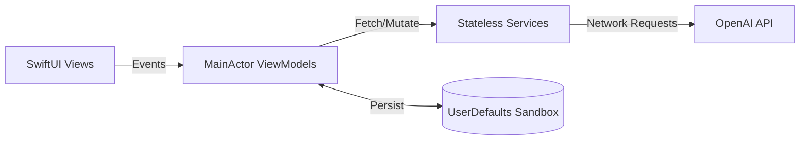

# Case Study: OpenAssistant iOS Client
> **Last updated: May 29, 2026**

  <strong>A technical deep dive detailing the engineering decisions, core constraints, technical challenges, and outcomes of building a native SwiftUI dashboard for the stateful OpenAI Assistants API (v2).</strong>

---

## 📍 1. Problem & Context

The **OpenAI Assistants API** provides developers with a stateful runtime environment to build AI agents equipped with code interpreters and semantic document retrieval (RAG). However, direct integration of this cloud infrastructure into a native mobile iOS application introduces distinct engineering hurdles:
- **Asynchronous Run Execution**: Execution runs are processed asynchronously on OpenAI's servers. Unlike stateless chat completions, mobile clients must maintain active polling loops to discover when runs transition to a completion state before rendering outputs.
- **Payload & Format Limitations**: The API accepts a restricted list of document and image formats. A native app must handle common mobile assets (like `.heic` photographs or `.rtf` rich text files) by translating them to supported types before upload.
- **Data Sovereignty Constraints**: Storing API keys on proxy middleware increases vulnerability risks. The application requires direct client-to-API communication while safeguarding local credentials.

---

## 🛠️ 2. Architectural Design & Constraints

To resolve these constraints, OpenAssistant uses the **MVVM-S (Model-View-ViewModel-Service)** pattern to establish a unidirectional data flow:
1. **Views (Thin SwiftUI Layouts)**: Observe reactive ViewModels.
2. **ViewModels (Reactive Orchestrators)**: Pinned to the `@MainActor` to ensure UI state changes run safely on the main thread.
3. **Services (Stateless APIService)**: Handle network requests and local conversions.
4. **Storage (Local MessageStore)**: Persists threads locally.

---

## 🧠 3. Key Technical Challenges & Solutions

### Challenge 1: On-Device Ingestion & Strategy-Driven File Preprocessing
- **The Problem**: Users take photos in HEIC format and documents in RTF. The OpenAI vector store requires JPEGs/PNGs for visual search and TXT/PDFs for index queries. Transmitting unsupported formats triggers API errors and wastes cellular bandwidth.
- **The Solution**: The app defines a strategy-driven conversion layer using a `FileConversionStrategy` protocol. The `FileProcessor` evaluates extensions and executes conversions off the main thread:
  - **`HEICToJPEGStrategy`**: Instantiates a `UIImage` from HEIC data and extracts JPEG binary data at 80% compression quality.
  - **`RTFToTXTStrategy`**: Decodes RTF data using the native `NSAttributedString` document reader options, stripping formatting tags and compiling plain UTF-8 text data.
- **Code Reference**: [FileUploadService.swift](../OpenAssistant/MVVMs/VectorStores/Files/FileUploadService.swift#L23-L62)

### Challenge 2: Memory-Safe Active Status Polling
- **The Problem**: Querying run status requires active polling (sending GET requests at 2-second intervals). If the user exits the chat window during a long-running execution, strong references in background closures can trigger memory leaks, retaining the ViewModel and View in memory.
- **The Solution**: The polling mechanism captures `[weak self]` in closures and registers the timer on the main run loop. The timer is explicitly invalidated when a status completes, fails, or when the view model is deinitialized.
- **Code Reference**: [ChatViewModel.swift](../OpenAssistant/MVVMs/Chat/ChatViewModel.swift#L320-L365)

### Challenge 3: Decoupled Multi-View State Synchronization
- **The Problem**: Creating or deleting an assistant in the "Manage" tab must update the selector list in the "Chat" tab. Binding these ViewModels directly together creates tight coupling, making testing difficult and increasing initialization complexity.
- **The Solution**: The app registers a notification bus using `NotificationCenter`. When data changes, ViewModels publish notifications (e.g., `.assistantCreated` or `.vectorStoreUpdated`). Subscribing ViewModels listen to these broadcasts, invalidate local caches, and refresh lists asynchronously.
- **Code Reference**: [Extensions.swift](../OpenAssistant/Main/Extensions.swift#L10-L25)

---

## ⚖️ 4. Technical Tradeoffs

### 1. Active Polling vs WebSocket Middlewares
- **Tradeoff**: WebSockets or Server-Sent Events (SSE) would reduce request overhead and battery drain, but require setting up a custom backend proxy. The app connects directly to OpenAI REST endpoints using active polling to guarantee complete data privacy.

### 2. UserDefaults (`@AppStorage`) vs Keychain Services
- **Tradeoff**: `@AppStorage` provides native SwiftUI bindings, which simplified initial prototyping. However, UserDefaults is stored in sandboxed plist files that can be read on jailbroken devices. Key migration to the Keychain API is prioritized on the roadmap.

---

## 📊 5. Outcome & Engineering Metrics

The implementation includes:
- **API Scope**: Mapped 10+ core endpoints of the stateful OpenAI Assistants API (v2).
- **Service Layers**: 4 distinct layers (Views, MainActor ViewModels, API Services, and Local MessageStore).
- **Processing Strategies**: 3 concrete strategies (HEIC to JPEG, RTF to TXT, Audio transcription placeholder) running locally.
- **Privacy Protections**: 3 layers of safeguards (Direct TLS 1.3 endpoints, sandboxed local storage, and pre-commit secret scanners).

---

## 🚀 6. What I Would Improve Next

1. **Keychain Integration**: Store the `OpenAI_API_Key` inside Apple's Keychain instead of UserDefaults to prevent credential exposure on root-accessed devices.
2. **Audio Strategy Implementation**: Integrate OpenAI's Whisper API inside `AudioTranscriptionStrategy` to support transcription of voice memos before vector store uploads.
3. **Unit Test Coverage**: Add unit tests for the strategy conversion classes using sample HEIC and RTF data to guarantee conversion accuracy.
