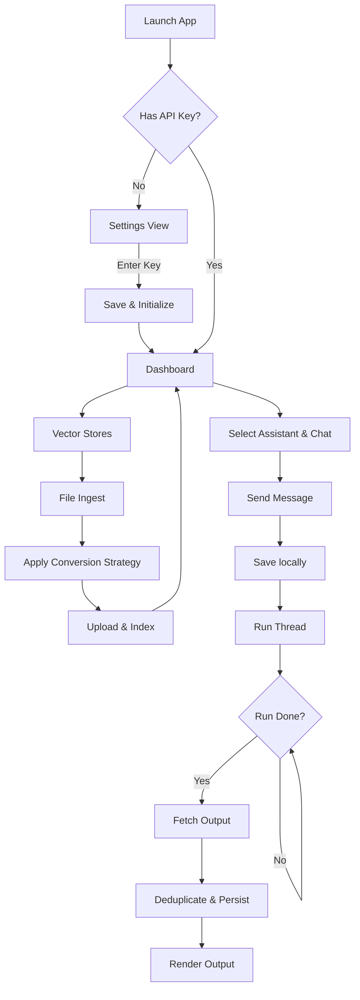
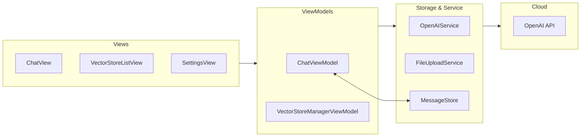
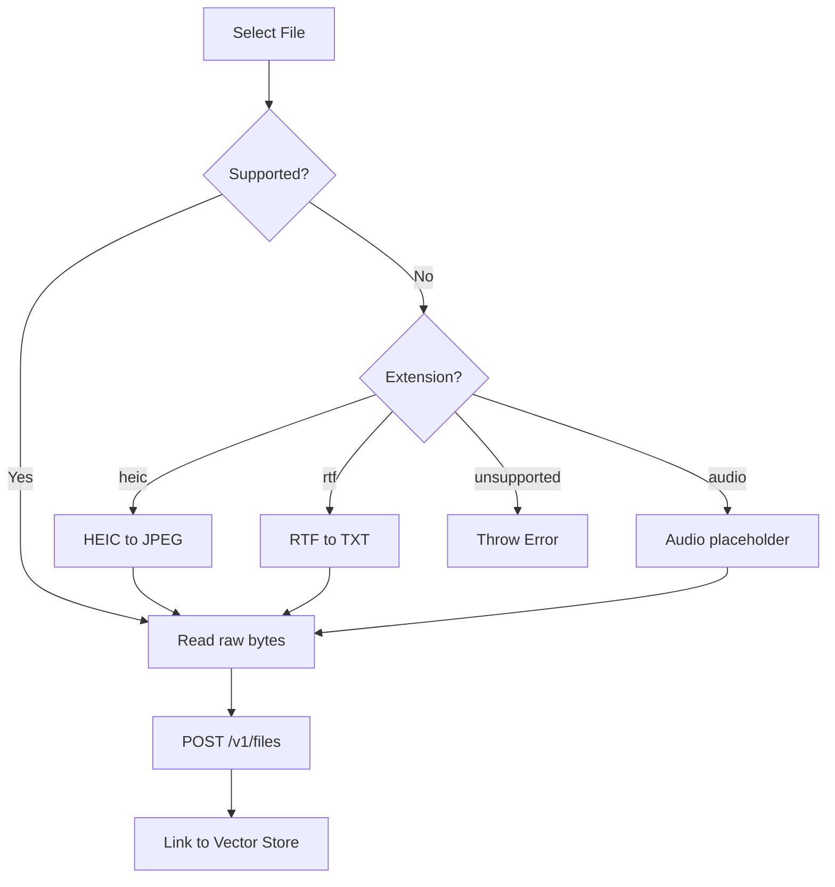
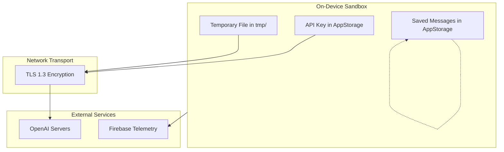

# OpenAssistant
<p align="center">
  
</p>

<p align="center">
  <strong>Native SwiftUI client for the OpenAI Assistants API (v2) with strategy-driven local file preprocessing and memory-safe run polling.</strong>
</p>

<p align="center">
  <a href="https://apps.apple.com/us/app/openassistant/id6692613772">
    
  </a>
  
  
  
</p>

---

## Overview

OpenAssistant is a native iOS client built using **SwiftUI** and the **Combine framework** that provides a mobile dashboard for interacting with the stateful **OpenAI Assistants API (v2)**. The app enables users to manage custom AI assistants, thread histories, and vector store knowledge bases directly from an iPhone or iPad.

### Technical Problem Solved
Unlike simple chat completions that rely on stateless inputs, the OpenAI Assistants API is stateful and asynchronous. OpenAssistant orchestrates the multi-phase lifecycle of thread runs (Queued → In Progress → Completed) using a memory-safe, active timer-based polling system. 

Additionally, because the Assistants API rejects common mobile formats (like HEIC images or RTF documents) directly, OpenAssistant implements an on-device preprocessing pipeline using the **Strategy Pattern** to convert these file formats locally before transmission. This saves bandwidth and prevents server-side failures.

---

## Product Snapshot

| Dimension | Detail |
|---|---|
| Platform | iOS 15.0+ / iPadOS 15.0+ |
| Language | Swift |
| UI | SwiftUI |
| Architecture | MVVM-S |
| Primary APIs | OpenAI Assistants API (v2) / Firebase Core |
| Storage | UserDefaults (via `@AppStorage`) |
| App Store | [Download](https://apps.apple.com/us/app/openassistant/id6692613772) |
| Status | Active |
| License | [MIT](LICENSE) |

---

## Key Capabilities

- **Asynchronous Run Orchestration**: Active polling pipeline (2.0s interval) with memory-safe `[weak self]` captures and explicit timer invalidation to prevent reference cycles.
- **Strategy-Driven File Preprocessing**: Local, on-device conversion strategies (HEIC to JPEG, RTF to UTF-8 plain text, and voice memo transcription routing) executing off the main thread.
- **Decoupled State Synchronization**: Cross-module notifications using `NotificationCenter` to synchronize lists (Assistants, Vector Stores) across tab views without direct ViewModel coupling.
- **Data Sovereignty**: All API credentials reside in local user storage (`UserDefaults`) and connect directly to OpenAI via TLS 1.3, bypassing external proxy servers.
- **Adaptive UI & Design System**: Responsive SwiftUI layouts utilizing dark/light/system appearance modes and custom feedback states (creating thread, running assistant, processing, completing).
- **Security Pre-Commit Hooks**: Automated script verification preventing accidental commits of hardcoded developer API keys.

---

## How It Works

This flowchart maps the user experience from launching the app, through credential verification, and into main chat/vector store interaction pipelines:



---

## Architecture

OpenAssistant utilizes the **MVVM-S** design pattern. The View layer remains thin and declarative, observing reactive ViewModels that inherit from core base classes, which communicate with dedicated Services.



---

## Core Workflows

### Strategy-Driven File Ingestion Pipeline
When a document is picked, the application routes the binary through an on-device conversion processor before packaging the payload:



---

## Data Flow

This diagram illustrates how data passes between the local device sandbox, secure transport layers, and external service boundaries:



---

## File Entry Points

| Concern | Files | Responsibility |
|---|---|---|
| **App Entry** | [OpenAssistantApp.swift](OpenAssistant/Main/OpenAssistantApp.swift) | Bootstrapping, Firebase configuration, and environment object injection. |
| **Main UI Shell** | [MainTabView.swift](OpenAssistant/Main/MainTabView.swift) / [ContentView.swift](OpenAssistant/Main/Content/ContentView.swift) | Primary tab routing and settings layout. |
| **API Client** | [OpenAIService.swift](OpenAssistant/APIService/OpenAIService.swift) | Base networking client, headers, and request execution with backoff retry logic. |
| **API Extensions** | [OpenAIService-Assistant.swift](OpenAssistant/APIService/OpenAIService-Assistant.swift), [OpenAIService-Threads.swift](OpenAssistant/APIService/OpenAIService-Threads.swift), [OpenAIService-Vector.swift](OpenAssistant/APIService/OpenAIService-Vector.swift) | Domain-specific network mappings. |
| **Ingestion** | [FileUploadService.swift](OpenAssistant/MVVMs/VectorStores/Files/FileUploadService.swift) | File conversion, multipart parsing, and vector store upload coordination. |
| **Storage** | [MessageStore.swift](OpenAssistant/MVVMs/Chat/ChatParts/MessageStore.swift) | Chat history JSON serialization, deduplication, and persistence. |

---

## Configuration

The app's environment is parameterized by the following values:

| Setting | Storage | Default | Required | Purpose |
|---|---|---|---|---|
| `OpenAI_API_Key` | `UserDefaults` (via `@AppStorage`) | `""` | Yes | Token for OpenAI API authorization. |
| `appearanceMode` | `UserDefaults` (via `@AppStorage`) | `"System"` | Yes | Dictates dark/light/system styling rules. |
| `savedMessages` | `UserDefaults` (via `@AppStorage`) | `nil` | No | Serialized chat history lists. |
| `enableNewFeature` | Compile-time flag (`FeatureFlags.swift`) | `false` | Yes | Controls the visibility of experimental features. |

---

## Build & Run

### Local Setup Instructions

1. **Clone the Repository:**
   ```bash
   git clone https://github.com/Gunnarguy/OpenAssistant.git
   cd OpenAssistant
   ```
2. **Execute the Setup Helper Script:**
   The script checks prerequisites, runs CocoaPods installation, and installs local Git pre-commit security hooks to safeguard against API key leaks:
   ```bash
   chmod +x setup.sh
   ./setup.sh
   ```
3. **Select Signing Identity:**
   - Open `OpenAssistant.xcworkspace` in Xcode 15+.
   - Navigate to the **OpenAssistant** target.
   - Under **Signing & Capabilities**, select your developer team and modify the Bundle Identifier.
4. **Build and Run:**
   - Select an iOS 15.0+ Simulator or physical device.
   - Press `⌘+R` to build and execute the application.

---

## Testing

The repository does not currently contain automated unit test targets. All validation must be performed manually:

| Validation | Procedure | Expected Result |
|---|---|---|
| **Build verification** | Run `xcodebuild -workspace OpenAssistant.xcworkspace -scheme OpenAssistant -sdk iphonesimulator build CODE_SIGNING_ALLOWED=NO` | Build succeeds with zero errors. |
| **Pre-Commit Scan** | Attempt to commit a file containing `sk-proj-abc123xyz...` | Commit is aborted with a warning. |
| **Manual QA (Onboarding)** | Clear API key in Settings, relaunch app. | Settings sheet automatically opens. |
| **Manual QA (Assistant)** | Create assistant "QA Bot", select model, tap Save. | Assistant appears in picker list. |
| **Manual QA (Chat)** | Type "Hello" inside "QA Bot" thread, send message. | Run lifecycle states progress to completed; text renders. |

---

## Privacy & Security

- **Local Storage Sandbox**: API keys and message histories reside inside the app container's sandbox. Files copied to the app's `tmp/` folder are purged immediately upon upload.
- **Network Protection**: App Transport Security (ATS) rules restrict all API traffic to TLS 1.3 connections directly to OpenAI (`api.openai.com`). Requests are sent directly from the app to the API without a custom proxy server.
- **Pre-Commit Hook**: Scans changed files locally for keys before staging commits to avoid remote exposure.
- For detailed information, review [SECURITY.md](SECURITY.md) and [PRIVACY.md](PRIVACY.md).

---

## Documentation

| Document | Purpose |
|---|---|
| [Architecture](ARCHITECTURE.md) | System design, data flow, and service boundaries |
| [Security](SECURITY.md) | Secret handling, local storage, and release checks |
| [Privacy](PRIVACY.md) | Data storage, API transmission, and user controls |
| [Roadmap](ROADMAP.md) | Current status, planned work, and known gaps |
| [App Store Notes](APP_STORE.md) | App Store metadata, review notes, and release checklist |
| [Case Study](docs/CASE_STUDY.md) | Engineering retrospective and implementation notes |

---

## Roadmap

- `[x]` Strategy-driven file format converters (JPEG, TXT conversions).
- `[x]` Decoupled state notification bus.
- `[ ]` Migrate credential storage from `@AppStorage` to secure Keychain Services.
- `[ ]` Introduce automated unit tests and Mock APIs.
- `[ ]` Implement true Speech-to-Text Whisper transcription in `AudioTranscriptionStrategy`.

---

## License

OpenAssistant is licensed under the MIT License. See [LICENSE](LICENSE) for more details.
