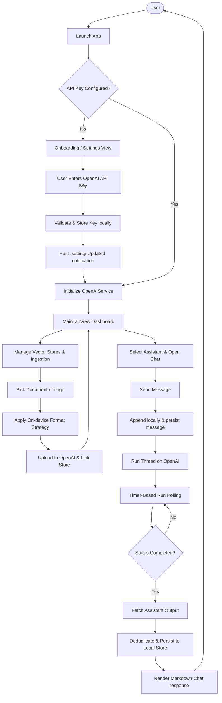
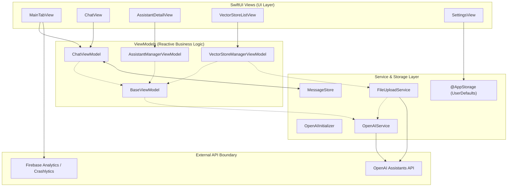
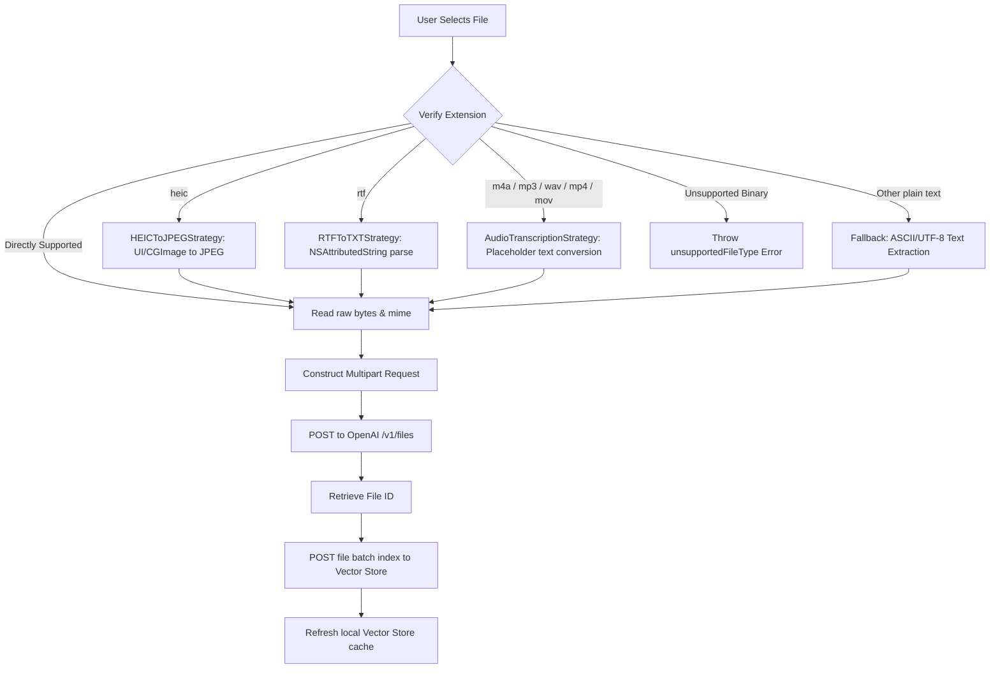
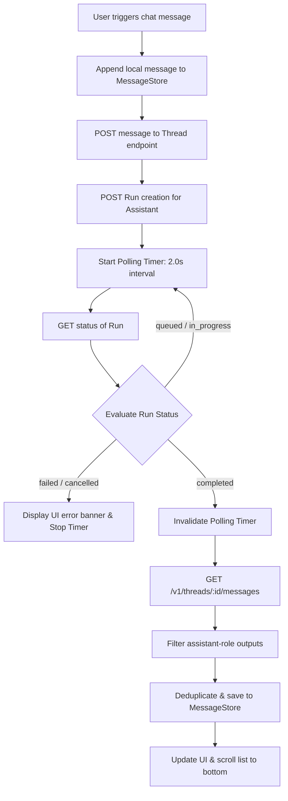

# OpenAssistant
<p align="center">
  <strong>Native SwiftUI client for the OpenAI Assistants API (v2) demonstrating strategy-driven on-device file conversions, reactive resource orchestration, and memory-safe asynchronous run polling.</strong>
</p>

<p align="center">
  
  
  
  
  
</p>

---

## 📍 Overview

**OpenAssistant** is a native iOS client built using **SwiftUI** and the **Combine framework**. It provides a mobile dashboard for interacting with the stateful **OpenAI Assistants API (v2)**. The app enables developers, researchers, and power users to securely manage their custom AI assistants, thread histories, and vector store knowledge bases directly from their iPhone or iPad.

### Why It's Technically Interesting
Unlike simple chat completions that rely on stateless inputs, the OpenAI Assistants API is stateful and asynchronous. OpenAssistant orchestrates the multi-phase lifecycle of thread runs (Queued → In Progress → Completed) using a memory-safe, active timer-based polling system. 

Additionally, the Assistants API rejected common mobile formats (like HEIC images or RTF documents) directly. OpenAssistant implements an on-device preprocessing pipeline using the **Strategy Pattern** to convert these file formats locally before transmission. This saves bandwidth, prevents server-side failures, and provides a seamless mobile user experience.

### Portfolio Distinction
Within Gunnar Hostetler's iOS portfolio, OpenAssistant is the premier demonstration of **RAG (Retrieval-Augmented Generation) infrastructure management** and **asynchronous state polling**. While other apps focus on local inference or stateless playground prompts, this client showcases direct integration with enterprise-grade cloud vector stores and stateful AI run execution models.

---

## 📊 Product Snapshot

| Dimension | Detail |
|---|---|
| **Platform** | iOS 15.0+ / iPadOS 15.0+ |
| **Language** | Swift (Concurrency, Combine) |
| **UI** | SwiftUI |
| **Architecture** | MVVM-S (Model-View-ViewModel-Service) |
| **Primary APIs** | OpenAI Assistants API (v2) / Firebase Core |
| **Storage** | UserDefaults (via `@AppStorage`) |
| **Status** | Active / Portfolio Prototype |
| **App Store** | Not published (Bring-Your-Own-Key client) |
| **License** | [MIT](LICENSE) |

---

## 🧠 What This App Demonstrates

- **Asynchronous Run Orchestration**: Active polling pipeline (2.0s interval) with memory-safe `[weak self]` captures and explicit timer invalidation to prevent reference cycles.
- **Strategy-Driven File Preprocessing**: Local, on-device conversion strategies (HEIC to JPEG, RTF to UTF-8 plain text, and voice memo transcription routing) executing off the main thread.
- **Decoupled State Synchronization**: Cross-module notifications using `NotificationCenter` to synchronize lists (Assistants, Vector Stores) across tab views without direct VM coupling.
- **Strict Data Sovereignty**: All API credentials reside in local user storage (`UserDefaults`) and connect directly to OpenAI via TLS 1.3, bypassing external proxy servers.
- **Adaptive UI & Design System**: Responsive SwiftUI layouts utilizing dark/light/system appearance modes and custom feedback states (creating thread, running assistant, processing, completing).
- **Security pre-commit hooks**: Automated script verification preventing accidental commits of hardcoded developer API keys.

---

## 🗺️ End-to-End User Journey

This flowchart maps the user experience from launching the app, through credential verification, and into main chat/vector store interaction pipelines:



---

## 🏗️ System Architecture

OpenAssistant utilizes the **MVVM-S** design pattern. The View layer remains thin and declarative, observing reactive ViewModels that inherit from core base classes, which communicate with dedicated Services.



---

## 🌊 Core Pipelines

### 1. Strategy-Driven File Ingestion Pipeline
When a document is picked, the application routes the binary through an on-device conversion processor before packaging the payload:



### 2. Thread Run Execution & Status Polling Pipeline
Because thread executions are stateful on OpenAI's servers, the client initiates a secure polling mechanism to check for execution completions:



---

## 📡 Ingestion / Processing / Retrieval Details

### Ingestion
OpenAssistant supports importing documents via the system file picker and photo library. Accepted extensions are routed dynamically:
- **Direct Support**: `.pdf`, `.txt`, `.docx`, `.json`, `.csv`, `.html`, `.jpeg`, `.png`, `.gif` etc.
- **Converted/Processed Support**: `.heic`, `.rtf`, `.m4a`, `.mp3`, `.wav`, `.mp4`, `.mov`.

### Processing
The file conversions execute locally on background threads:
- **`HEICToJPEGStrategy`**: Instantiates a `UIImage` from binary data, extracting JPEG data at 80% compression quality.
- **`RTFToTXTStrategy`**: Instantiates an `NSAttributedString` using the RTF document reader option, stripping styled metadata and returning plain UTF-8 bytes.
- **`AudioTranscriptionStrategy`**: Serves as a placeholder strategy representing transcription routing. (In production, this would route to speech-to-text endpoints).

### Retrieval / Querying
Knowledge retrieval is managed via OpenAI Vector Stores linked to assistants. The client handles the association by updating the assistant's `tool_resources` with the active `vector_store_id` list, enabling OpenAI-managed semantic file searches during runs.

### Generation / Output
Responses are rendered dynamically in the chat layout. Markdown structures are parsed, and the chat supports automatic loading states. Run status updates are reflected in the progress loader.

---

## ⚖️ Key Technical Decisions

| Decision | Rationale | Tradeoff |
|---|---|---|
| **UserDefaults (`@AppStorage`) for Keys** | Avoids external database configuration overhead, keeping storage simple. | Key is stored in plist which can be extracted on jailbroken devices. (Keychain migration planned). |
| **Strategy Pattern for Processing** | Isolates file conversion logic from the uploader, allowing new formats to be added cleanly. | Adds slightly more file overhead structure to the project. |
| **`NotificationCenter` Event Bus** | Prevents tight coupling or direct delegation between tabs (`VectorStores` & `Assistants`). | Direct state tracking is not compile-time guaranteed; relies on string keys. |
| **Active 2.0s Polling** | Standard polling mechanism for OpenAI Assistants API. | Higher mobile battery usage and network request overhead than WebSockets. |
| **Base ViewModel Inheritance** | DRY principle; common loader, error alerts, and action runners are shared. | Strict class hierarchy is less flexible than protocol-oriented patterns. |
| **Combine + async/await Mix** | Combines Swift concurrency for networking with Combine publishers for reactive UI state. | Developer must manage two asynchronous paradigms in the same codebase. |

---

## 🗂️ File Entry Points

| Concern | Files | Responsibility |
|---|---|---|
| **App Entry** | [OpenAssistantApp.swift](OpenAssistant/Main/OpenAssistantApp.swift) | Bootstrapping, Firebase configuration, and environment object injection. |
| **Main UI Shell** | [MainTabView.swift](OpenAssistant/Main/MainTabView.swift) / [ContentView.swift](OpenAssistant/Main/Content/ContentView.swift) | Primary tab routing and settings layout. |
| **API Client** | [OpenAIService.swift](OpenAssistant/APIService/OpenAIService.swift) | Base networking client, headers, and request execution with backoff retry logic. |
| **API Extensions** | [OpenAIService-Assistant.swift](OpenAssistant/APIService/OpenAIService-Assistant.swift), [OpenAIService-Threads.swift](OpenAssistant/APIService/OpenAIService-Threads.swift), [OpenAIService-Vector.swift](OpenAssistant/APIService/OpenAIService-Vector.swift) | Domain-specific network mappings. |
| **Ingestion** | [FileUploadService.swift](OpenAssistant/MVVMs/VectorStores/Files/FileUploadService.swift) | File conversion, multipart parsing, and vector store upload coordination. |
| **Storage** | [MessageStore.swift](OpenAssistant/MVVMs/Chat/ChatParts/MessageStore.swift) | Chat history JSON serialization, deduplication, and persistence. |

---

## ⚙️ Configuration Catalog

The app's environment is parameterized by the following values:

| Setting | Storage | Default | Required | Purpose |
|---|---|---|---|---|
| `OpenAI_API_Key` | `UserDefaults` (via `@AppStorage`) | `""` | Yes | Token for OpenAI API authorization. |
| `appearanceMode` | `UserDefaults` (via `@AppStorage`) | `"System"` | Yes | Dictates dark/light/system styling rules. |
| `savedMessages` | `UserDefaults` (via `@AppStorage`) | `nil` | No | Serialized chat history lists. |
| `enableNewFeature` | Compile-time flag (`FeatureFlags.swift`) | `false` | Yes | Controls the visibility of experimental features. |

---

## 🚀 Getting Started

### Local Setup Instructions

1. **Clone the Repository:**
   ```bash
   git clone https://github.com/Gunnarguy/OpenAssistant.git
   cd OpenAssistant
   ```
2. **Execute the Setup Helper Script:**
   The script checks prerequisites, runs CocoaPods installation, and installs local Git pre-commit hooks to safeguard against API key leaks:
   ```bash
   chmod +x setup.sh
   ./setup.sh
   ```
3. **Select Signing Identity:**
   - Open `OpenAssistant.xcworkspace` in Xcode 15+.
   - Navigate to the **OpenAssistant** target.
   - Under **Signing & Capabilities**, select your developer team and modify the Bundle Identifier.
4. **Build and Run:**
   - Select an iOS 15.0+ Simulator or physical device.
   - Press `⌘+R` to build and execute the application.

---

## 🧪 Testing and QA

The repository does not currently contain automated unit test targets. All validation must be performed manually:

| Validation | Procedure | Expected Result |
|---|---|---|
| **Build verification** | Run `xcodebuild -workspace OpenAssistant.xcworkspace -scheme OpenAssistant -sdk iphonesimulator build CODE_SIGNING_ALLOWED=NO` | Build succeeds with zero errors. |
| **Pre-Commit Scan** | Attempt to commit a file containing `sk-proj-abc123xyz...` | Commit is aborted with a warning. |
| **Manual QA (Onboarding)** | Clear API key in Settings, relaunch app. | Settings sheet automatically opens. |
| **Manual QA (Assistant)** | Create assistant "QA Bot", select model, tap Save. | Assistant appears in picker list. |
| **Manual QA (Chat)** | Type "Hello" inside "QA Bot" thread, send message. | Run lifecycle states progress to completed; text renders. |

### Recommended Minimal Test Plan
- **Mock Service Testing**: Abstract `OpenAIService` behind a protocol to mock API responses and verify ViewModel state changes in isolation.
- **Conversion Strategy Tests**: Create unit tests parsing sample `.heic` and `.rtf` files, verifying that output types match JPEG/TXT expectations.

---

## 🔒 Privacy and Security

- **Local Storage Sandbox**: API keys and message histories reside inside the app container's sandbox. Files copied to the app's `tmp/` folder are purged immediately upon upload.
- **Network Protection**: App Transport Security (ATS) rules restrict all API traffic to TLS 1.3 connections directly to OpenAI (`api.openai.com`). No proxy servers are used.
- **Pre-Commit hook**: Scans changed files locally for keys before staging commits to avoid remote exposure.
- For detailed information, review [SECURITY.md](SECURITY.md) and [PRIVACY.md](PRIVACY.md).

---

## 📖 Documentation Index

| Document | Purpose |
|---|---|
| [README.md](README.md) | High-level system overview, visual pipelines, and developer onboarding. |
| [ARCHITECTURE.md](ARCHITECTURE.md) | Architectural specification, state patterns, and API specifications. |
| [ROADMAP.md](ROADMAP.md) | Project status, active items, and planned milestones. |
| [SECURITY.md](SECURITY.md) | Security assertions, secrets isolation, and commit guards. |
| [PRIVACY.md](PRIVACY.md) | Data handling, sandboxing, and network transmission disclosures. |
| [APP_STORE.md](APP_STORE.md) | Connect listing data, reviewer setup notes, and testing paths. |
| [CONTRIBUTING.md](CONTRIBUTING.md) | Developer guidelines, code standards, and PR workflows. |
| [docs/CASE_STUDY.md](docs/CASE_STUDY.md) | Deep technical breakdown of engineering challenges solved. |

---

## 🗺️ Roadmap

- `[x]` Strategy-driven file format converters (JPEG, TXT conversions).
- `[x]` Decoupled state notification bus.
- `[ ]` Migrate credential storage from `@AppStorage` to secure Keychain Services.
- `[ ]` Introduce automated unit tests and Mock APIs.
- `[ ]` Implement true Speech-to-Text Whisper transcription in `AudioTranscriptionStrategy`.

---

## 📄 License

OpenAssistant is licensed under the MIT License. See [LICENSE](LICENSE) for more details.
