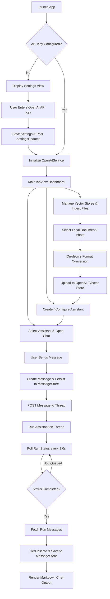
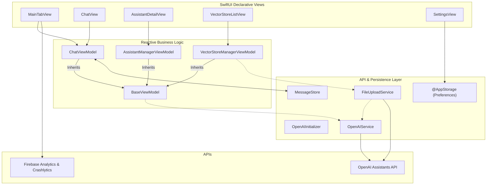
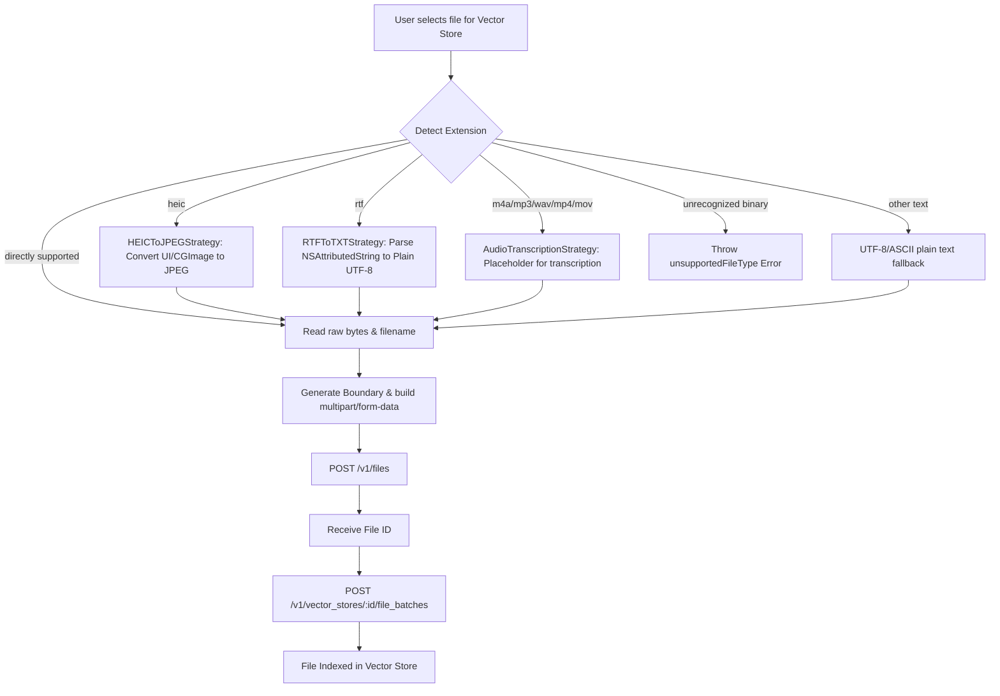
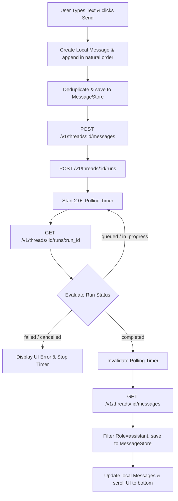

# OpenAssistant (iOS Client)
> **Last updated: 2026-05-29**
> Native SwiftUI client for the OpenAI Assistants API. Optimized for iOS 15.0+.

<p align="center">
  
  
  
  
</p>

---

## 📍 Overview

**OpenAssistant** is a native iOS client built using **SwiftUI** and the **Combine framework**. It provides a mobile dashboard for interacting with the **OpenAI Assistants API (v2)**. The app enables users to securely manage their custom AI assistants, thread histories, and vector store knowledge bases directly from their iPhone or iPad.

By utilizing on-device processing, OpenAssistant performs local file format conversions (HEIC-to-JPEG, RTF-to-TXT, and audio transcription placeholders) before upload, bypassing OpenAI's format limitations and saving bandwidth. It enforces data sovereignty by persisting API credentials exclusively in Apple's local user storage and calling OpenAI's servers directly without intermediate proxies.

---

## 🗺️ End-to-End User Journey

The flowchart below maps the user journey from launching the app, entering credentials, managing resources, to executing runs and retrieving AI outputs.



---

## 🏗️ System Architecture

OpenAssistant utilizes the **MVVM-S (Model-View-ViewModel-Service)** pattern to isolate responsibilities and establish a unidirectional data flow.



---

## 🌊 Core Pipelines

### 1. On-Device File Ingestion & Conversion
The app converts unsupported files locally to standard, OpenAI-compatible types before upload.



### 2. Thread Run Execution & Status Polling
Managing the multi-step lifecycle of OpenAI Assistants thread executions.



---

## 🗃️ Configuration Catalog

The application maintains the following keys and configurations:

| Key | Type | Default | Storage Location | Description |
| :--- | :--- | :--- | :--- | :--- |
| `OpenAI_API_Key` | String | `""` | `UserDefaults` (via `@AppStorage`) | Secure OpenAI Authentication Token. Required to establish connection. |
| `appearanceMode` | String | `"System"` | `UserDefaults` (via `@AppStorage`) | Appearance theme value. Supported values: `"Light"`, `"Dark"`, `"System"`. |
| `savedMessages` | Data | `nil` | `UserDefaults` (via `@AppStorage`) | JSON-serialized message history list mapped by thread IDs. |
| `enableNewFeature` | Boolean | `false` | Compile-time constant (`FeatureFlags.swift`) | Gatekeeper flag to isolate incomplete experimental structures in production builds. |

---

## 🛠️ Developer Onboarding

### Local Environment Setup
To build and run OpenAssistant locally, complete the following steps:

1. **Clone the Repository:**
   ```bash
   git clone https://github.com/Gunnarguy/OpenAssistant.git
   cd OpenAssistant
   ```
2. **Execute the Setup Helper Script:**
   The script checks prerequisites, configures local dependencies, and installs Git pre-commit hooks to safeguard OpenAI keys:
   ```bash
   ./setup.sh
   ```
3. **Select Development Team:**
   - Open `OpenAssistant.xcworkspace` in Xcode 15+.
   - Navigate to the project settings, select the **OpenAssistant** target.
   - Under **Signing & Capabilities**, select your Apple Developer Team and customize the Bundle Identifier.
4. **Build and Run:**
   - Connect an iOS 15.0+ physical device or select a simulator (e.g., iPhone 17 Pro Max).
   - Press `⌘+R` to build and launch the application.

---

## 📖 Documentation Index

| File | Path | Description |
| :--- | :--- | :--- |
| **README** | [README.md](README.md) | High-level system overview, visual journeys, architecture, and onboarding. |
| **Architecture Specification** | [ARCHITECTURE.md](ARCHITECTURE.md) | Component breakdown, detailed design patterns, tech stack, and API specs. |
| **Product Roadmap** | [ROADMAP.md](ROADMAP.md) | Feature matrix, release phases, and project maintenance milestones. |
| **Security Guidelines** | [SECURITY.md](SECURITY.md) | Security assertions, secrets management, and pre-commit scan rules. |
| **Privacy Compliance** | [PRIVACY.md](PRIVACY.md) | Data residency, on-device sandboxing, and network transmission disclosures. |
| **App Store connect** | [APP_STORE.md](APP_STORE.md) | Reviewer credentials, test credentials, and step-by-step test paths. |
| **Case Study** | [docs/CASE_STUDY.md](docs/CASE_STUDY.md) | Narrative detailing technical challenges solved, concurrency, and architecture. |
