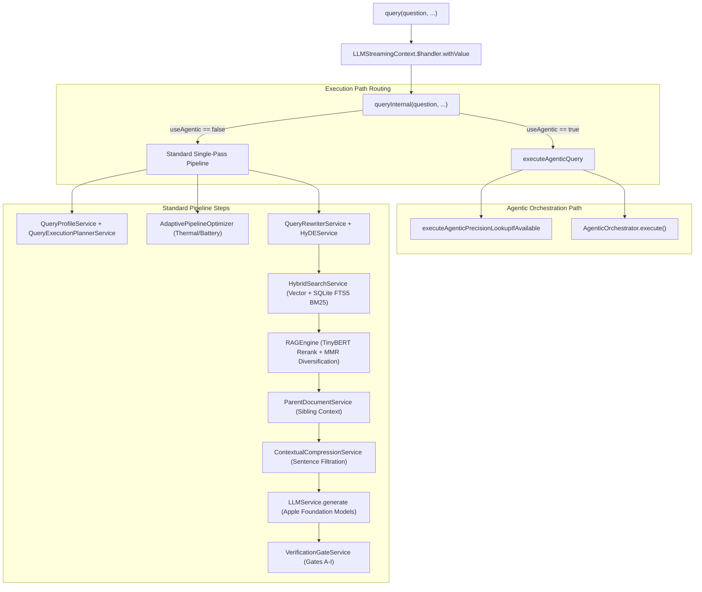

> **Documentation status:** Verified for OpenIntelligence v4.1 on 2026-06-13.
> **Source of truth:** Codebase audit in `Docs/AUDIT/`.
> **Scope:** Describes shipped behavior unless explicitly labeled experimental, developer-only, or scaffolded.

# AI Agent Map: OpenIntelligence Orchestration Architecture

This document maps the entry points, call graphs, framework dependencies, and service boundaries of the `OpenIntelligence` RAG runtime, specifically analyzing the mega-orchestrator `RAGService.swift` as of WWDC26 modernization plans.

---

## 1. RAGService.swift Line Count & API Surface

`RAGService.swift` is the central orchestrator of the local-first Apple-native RAG runtime.
* **Line Count**: 16,630 lines
* **API Categories**:
  1. **Public/Internal Facade Queries**: Conformances to `KnowledgeRetrievalEngine` and `RAGToolHandler`.
  2. **Ingestion & Processing Queue**: Managing document queues, background extraction, chunking, and database persistence.
  3. **Model & Consent Management**: Tracking on-device vs. Private Cloud Compute (PCC) settings, cloud provider consent states, and LLM fallbacks.
  4. **Diagnostic & Telemetry Center**: Storing audit snapshots, pipeline traces, thermal/battery optimizations, and user feedback.

### Key API Signatures
```swift
// Public Facade Conformance (KnowledgeRetrievalEngine)
func query(_ request: RetrievalRequest) async throws -> RAGResponse

// Orchestrated Multi-Mode Query Actions
func query(
    _ question: String,
    topK: Int = 3,
    config: InferenceConfig? = nil,
    containerId: UUID? = nil,
    qualityModeOverride: RAGQualityMode? = nil,
    streamHandler: LLMStreamHandler? = nil
) async throws -> RAGResponse

func queryWithAudit(
    _ question: String,
    topK: Int = 3,
    config: InferenceConfig? = nil,
    containerId: UUID? = nil,
    qualityModeOverride: RAGQualityMode? = nil,
    streamHandler: LLMStreamHandler? = nil
) async throws -> (response: RAGResponse, auditSnapshot: RAGAuditSnapshot?)

// Ingestion Orchestration
func enqueueDocuments(_ urls: [URL], context: IngestionContext = .userInitiated) -> [UUID]
func addDocument(
    at url: URL,
    context: IngestionContext = .userInitiated,
    trackingId: UUID? = nil,
    manageProcessingState: Bool = true
) async throws

// RAGToolHandler Tool Conformance
func searchDocuments(query: String) async throws -> String
func listDocuments() async throws -> String
func getDocumentSummary(documentName: String) async throws -> String
func countPatternInCorpus(pattern: String) async throws -> String
func searchExactPattern(pattern: String) async throws -> String
func getCorpusStats() async throws -> String
func findRelatedDocuments(topic: String, maxResults: Int) async throws -> String
func compareDocumentsOnTopic(topic: String, documentNames: [String]?) async throws -> String
```

---

## 2. Core Call Graphs

### A. Query Call Flow (`query` → `queryInternal`)

When the user or system triggers a query, it routes as follows:



### B. Ingestion Call Flow (`enqueueDocuments` → `runIngestionLoop` → `addDocument`)

```mermaid
graph TD
    Enqueue["enqueueDocuments(urls, ...)"] --> Queue["Ingestion Queue State"]
    Queue --> runIngestionLoop["runIngestionLoop() (Background Task)"]
    
    subgraph Ingestion Pipeline (Per Document)
        runIngestionLoop --> addDocument["addDocument(at: url, ...)"]
        addDocument --> Parse["DocumentProcessor.processDocument (PDFKit / Vision OCR)"]
        Parse --> Spotlight["SpotlightIndexService.indexDocument"]
        Parse --> SelfTune["LibraryIntelligenceCenter.analyzeLibrary"]
        SelfTune --> ContextualPrefix["Contextual Retrieval (Prepend Doc & Section Metadata)"]
        ContextualPrefix --> TokenValidation["BertTokenizer Length Validation (≤510 tokens)"]
        TokenValidation --> Embedding["EmbeddingService (CoreML Sentence Embedding)"]
        Embedding --> Store["BNNSVectorDatabase.storeBatch + SQLiteFullTextService"]
    end
```

---

## 3. Apple Framework Dependency Mapping

The RAG runtime leverages specific Apple OS-level frameworks, integrated as follows:

| Framework | Current Role in OpenIntelligence | Target WWDC26 Modernization |
| :--- | :--- | :--- |
| **FoundationModels** | Language generation session lifecycle, token heuristics, tool schemas, and TTFT-based PCC guessing. | Upgrade to use explicit `SystemLanguageModel.default` and `PrivateCloudComputeLanguageModel()` routing policies. Exploit the new 32K context window for complex queries and expose PCC quota and reasoning levels. |
| **AppIntents** | Basic command-wrapper intents (`OIAskQueryIntent`, etc.) referencing new/ephemeral service instances. | Convert to entity-native intents backed by `AppEntity` (`OIDocumentEntity`, `OILibraryEntity`). |
| **CoreSpotlight** | Document discovery indexing (preview description and titles). | Upgrade to semantic retrieval plane by indexing chunk, section, and table metadata. |
| **Vision** | OCR processing, page-level visual complexity evaluation, and layout analyses. | Build `VisualEvidenceSource` to ground multimodal models directly in visual evidence. |
| **CoreML** | Embedding generation (`CoreMLSentenceEmbeddingProvider`) and TinyBERT reranker. | Leverage `CoreAI` for specialized local execution and compilation. |
| **NaturalLanguage** | Lemmatization, semantic chunking token boundaries, and language detection. | Integrate as the foundation for linguistic and syntactic parsing. |
| **Accelerate / BNNS** | Memory-mapped local vector calculations, vector indexing, and distance scoring. | Keep as target local vector acceleration layer. |

---

## 4. Logical Ingestion & Inferences (29 Steps)

Below is the logical pipeline tracing data from raw input files to a cited answers:

```
INGESTION:
  1. Parse: PDFKit & Vision OCR text/visual layout extraction
  2. SemanticChunker: Sentence-bound chunks capped at 310 words
  3. Entity Extraction: NLTagger NER extracts people/places/special terms
  4. Token Validation: Tokenizer ensures <= 510 tokens per chunk
  5. Embedding: Prepend Document & Section prefixes, embed using CoreML
  6. Store: Save to BNNS-backed vector store and SQLite FTS5 lexical index

QUERY-RESPONSE:
  0. Corpus Analysis: Load container-specific vocabulary cache
  1. Query Understanding: Resolve pronouns and entities via NLTagger
  1.5. Query Expansion: Enrich query with container vocabulary synonyms
  1.6. Intent Classification: Standard, lookup, procedure, or overview routing
  2. Query Embedding: Embed expanded query using active embedding model
  2.5. RAPTOR-lite Routing: Route overview queries to summary-level index
  3. Hybrid Search: Vector search + SQLite FTS5 lexical search fusion
  4. Cross-Encoder Rerank: Re-score top candidates using TinyBERT model
  4.3. Low-Confidence Filtering: Remove candidates below semantic overlap gates
  4.4. Multi-Document Representation: Ensure source document diversity
  4.5. MMR Diversification: Apply MMR (lambda = 0.6) to reduce redundancy
  4.6. Parent Document Retrieval: Expand selected chunks with sibling context
  4.7. Contextual Compression: Extrapolate only query-relevant sentences
  4.9. Graph Context Packing: Token packing optimized for context window
  5. Context Assembly: Interleave chunks using Lost-in-Middle reordering
  5.9. Extractive Summarization: Route summary intents to extractive summarizes
  5.10. Extractive QA: Determinstic exact-value retrieval for lookup intents
  6. LLM Generation: Local LanguageModelSession generation within 4K token limit
  6.5. Response Formatting: Markdown layout normalization
  7. Quality Assessment: Evaluate model outputs for structural correctness
  7.5. Verification Gates: Validate claims against retrieved source facts (Gates A-I)
  8. Package Results: Assemble citations and response container
  8.1. Calibrated Confidence: Scale response confidence via Platt scaling
  9. Response Metadata: Record timestamps, tokens, and telemetry
  10. Markdown Rendering: UI rendering of answer and citation anchors
```

---

## 5. WWDC26 Product & UX Modernization Strategy

As part of the WWDC26 modernization, OpenIntelligence transitions from a powerful but app-contained RAG engine to an **Apple Intelligence-native evidence system**. The system is modular, system-integrated, and trust-first.

### A. Core UX Trust Layer
To make the app's reliability legible, the UI exposes the exact pipeline route, model isolation, and source grounding.

| UI Element | Data Shown | User/Product Value |
| :--- | :--- | :--- |
| **Answer Route Badge** | Extracted, Grounded Generation, Deep Think, Image Evidence, Abstained | Clarifies whether the answer is generative vs. exact extraction. |
| **Model Route Badge** | On-Device FM, PCC Eligible, External Provider, Extractive-Only | Visualizes privacy isolation and latency estimation. |
| **Evidence Drawer** | Sources, chunks, tables, OCR blocks, citation anchors | Lets the user inspect the exact context used to ground the model. |
| **Confidence Bar** | Combined retrieval and verification gate confidence | Replaces vague "AI accuracy" with mathematical confidence. |
| **Source Fidelity Status** | Source-locked, Partially supported, Not enough evidence | Prevents trust errors by flagging hallucination risk. |
| **Thinking Timeline** | Query plan &rarr; Search &rarr; Rerank &rarr; Context &rarr; Verify &rarr; Answer | Exposes the agentic cycles of Deep Think & Maximum modes. |
| **Visual Evidence Card** | OCR text, image regions, barcodes/QR codes, screenshot source | Promotes camera/photo captures to first-class evidence. |
| **Context Budget Meter** | Active token usage, window limits (e.g., 4K vs 32K), and fallback states | Developer and power-user visibility into context constraints and PCC context utilization. |
| **Citation Cards** | Tapping a source citation scrolls directly to the page/chunk | Connects answers back to physical document locations. |

---

### B. Apple Intelligence explicit Private Cloud Compute (PCC) Integration

OpenIntelligence transitions from treating Private Cloud Compute (PCC) as a latency-based guess (TTFT) to an explicit model routing strategy using `PrivateCloudComputeLanguageModel` and `SystemLanguageModel.default`.

*   **PCC Routing Policy:**
    *   **Extractive/Exact Lookup:** Prefer non-LLM or `SystemLanguageModel` processing.
    *   **Standard Queries:** Default to `SystemLanguageModel` unless the required context exceeds the on-device capacity (e.g., 4096 or 8192 tokens).
    *   **Deep Think / Maximum:** explicitly route to `PrivateCloudComputeLanguageModel` using `ContextOptions(reasoningLevel: .deep)` and leverage its 32,768-token capacity to construct robust, high-fidelity evidence contexts, significantly reducing the need for aggressive context compression and Parent/Sibling trimming.
*   **Context Management:** RAG context assembly is directly tied to the active model's `contextSize` (4K/8K for on-device vs. 32K for PCC).
*   **PCC Quota Handling:** Monitor and handle `PrivateCloudComputeLanguageModel().quotaUsage` statuses natively.

---

### C. Image & Camera Grounding Flow
Rather than treating images as plain text query inputs, the visual pipeline integrates OCR and detected regions directly into the RAG context:

```
User Adds Image / Screenshot
  │
  ▼
Visual Evidence Card Generated (143 OCR words, 2 tables, 1 barcode)
  │
  ▼
Query Sent & Cross-Referenced with Document Library
  │
  ▼
Answer Outputted with Mixed Citations (e.g. [Image OCR] + [Manual.pdf, p. 9])
```

---

### D. Restructured Settings Architecture
Settings are simplified for standard users and structured for developer debugging, fully integrating PCC options.

#### 1. Main Settings
* **Answer Quality**: Standard (fast lookup + verification) / Deep Think (agentic search) / Maximum (exhaustive reasoning + strict verification).
* **Private Cloud Compute**: Never use / Ask when needed / Allow for Deep Think and Maximum.
* **Visual Evidence**: Off / OCR only / OCR + image reasoning.
* **Siri & Spotlight**: Off / Documents only / Documents + sections + actions.
* **Citation Strictness**: Normal / Strict source-locked.

#### 2. Advanced / Developer Diagnostics
* **Retrieval**: `topK`, min similarity, vector/lexical weights, MMR lambda.
* **Context**: max context, sentence extraction, parent expansion, compression.
* **Models**: tool calling, structured generation, Dynamic Profiles, prewarm.
* **PCC Diagnostics**: PCC availability, 32K context size utilization, quota status (below limit / approaching limit / limit reached / iCloud+ suggestion available), reasoning level (none / light / moderate / deep).
* **Spotlight**: index documents, sections, tables, citations, saved answers.
* **Visual**: OCR revision, barcode detection, image evidence retention.
* **Evaluations**: run eval suite, export report, compare baseline.
* **Debug**: pipeline trace, token budget, raw evidence pack, model route.

---

### D. Phased Implementation Roadmap
Modernization is rolled out in four progressive stages:

1. **Phase 1: Architectural Foundation** (Under-the-hood stability, token budget refactoring, `LLMService` split, `QueryRuntimeCoordinator` extraction).
2. **Phase 2: Visible Trust Layer** (Answer/model badges, evidence drawer, citation jumping, thinking timeline UI).
3. **Phase 3: Apple OS Integration** (Entity-native App Intents for Siri, Spotlight semantic indexing, screen view annotations).
4. **Phase 4: Visual Intelligence** (Multimodal prompts, image evidence cards, visual citations, barcode tools).

