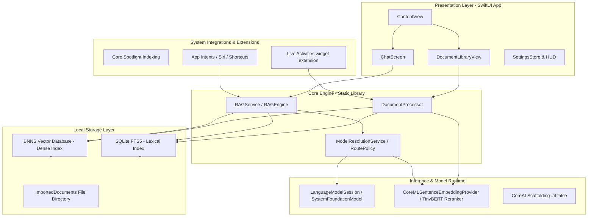

# Docs/ARCHITECTURE.md — OpenIntelligence v4.1

> **Documentation status:** Verified for OpenIntelligence v4.1 on 2026-06-13.
> **Source of truth:** Codebase audit in `Docs/AUDIT/`.
> **Scope:** Describes shipped behavior unless explicitly labeled experimental, developer-only, or scaffolded.

OpenIntelligence is an Apple-native document intelligence application built around a SwiftUI app shell and a retrieval-oriented document engine.

I designed the codebase to expose the entire RAG pipeline: document ingestion, chunking, indexing, retrieval, grounded answer generation, citation handling, confidence surfaces, and diagnostics. The architecture is local-first, with Apple-managed cloud capacity (PCC) simulated for future platform compatibility.

---

## 1. System Architecture Map

---

## 2. Major Subsystems

- **`OpenIntelligence/App`**: Application entry points and top-level composition.
- **`OpenIntelligence/Features`**: User-facing document, chat, settings, diagnostics, telemetry, camera, onboarding, and billing surfaces.
- **`OpenIntelligence/Services/Document`**: Extraction, parsing, analysis, chunking, classification, and document processing.
- **`OpenIntelligence/Services/RAG`**: Retrieval, context packing, orchestration, verification, source-only answering, confidence, and safety checks.
- **`OpenIntelligence/Services/Embedding`**: Embedding generation utilizing Core ML, containing disabled Core AI providers.
- **`OpenIntelligence/Services/Storage`**: Full-text indexers (SQLite FTS5) and local storage services.
- **`OpenIntelligence/Services/VectorStore`**: Vector database abstractions and local vector search ([BNNSVectorDatabase.swift](file:///Users/gunnarhostetler/Documents/GitHub/OpenIntelligence-Public/OpenIntelligence/Services/VectorStore/BNNSVectorDatabase.swift)).
- **`OpenIntelligence/Services/AIPlatform/AppleFoundationModels`**: Monolithic manager handling Apple Foundation Model sessions, prompt compilation, and token budgets.
- **`OpenIntelligence/Services/AIPlatform/CoreAI`**: Custom local model registry, local model runtimes, and disabled embedding/cross-encoder scaffolding.
- **`OpenIntelligence/Services/Evaluation`**: Local evaluation suite containing the RAG runner, JSONL datasets loader, report writer, and evaluations bridge.
- **`OpenIntelligence/SDK`**: Experimental package boundary for the engine-facing API.

---

## 3. Ingestion & Indexing Pipeline

1. **Parse**: Files enter through document workflows. Content is parsed using type-specific extractors. For PDFs, the system uses [LayoutAwareExtractor](file:///Users/gunnarhostetler/Documents/GitHub/OpenIntelligence-Public/OpenIntelligence/Services/Document/Processing/LayoutAwareExtractor.swift) or Vision OCR when a native text layer is missing.
2. **Semantic Chunking**: [SemanticChunker](file:///Users/gunnarhostetler/Documents/GitHub/OpenIntelligence-Public/OpenIntelligence/Services/Document/Chunking/SemanticChunker.swift) splits text into retrievable units (typically $\le 310$ words) while identifying document structures like sections, lists, and tables.
3. **Entity Extraction**: Runs `NLTagger` Named Entity Recognition (NER) to extract key entities, formatting them in PascalCase.
4. **Token Validation**: Chunks are validated using local tokenizers (e.g. `BertTokenizer` $\le 510$ tokens) to guarantee compatibility with embedding models.
5. **Embedding Generation**: Generates 384-dimensional dense vectors using a local Core ML model (`CoreMLSentenceEmbeddingProvider`).
6. **Corpus Storage**: Text and layout metadata are indexed into a shared SQLite FTS5 database (using `container_id` isolation), and dense vectors are written into [BNNSVectorDatabase](file:///Users/gunnarhostetler/Documents/GitHub/OpenIntelligence-Public/OpenIntelligence/Services/VectorStore/BNNSVectorDatabase.swift).

---

## 4. Query-to-Response Pipeline

### Phase 1: Query Routing & Understanding
* **Query Expansion & Intent Classification**: Resolves pronouns, extracts entities via `NLTagger` NER, expands queries using Synonyms, and classifies user intent (lookup, procedure, compare, or summarize).
* **Query Embedding**: Generates a 384-dimensional query vector.
* **Model Routing Policy**: 
  - **On-Device Default**: Standard quality queries execute locally via `SystemLanguageModel.default`, subject to a 4,096-token context window limit.
  - **PCC Escalation**: If the context size exceeds 4,096 tokens, or if the user selects **Deep Think** or **Maximum** quality modes, the route policy elevates the query to `PrivateCloudComputeLanguageModel` in Apple's secure Private Cloud Compute (PCC) enclaves, supporting a 32K token context window. In the current build, this remote enclave execution is resolved locally on `SystemLanguageModel.default` via [EngineSDKCompatibility.swift](file:///Users/gunnarhostetler/Documents/GitHub/OpenIntelligence-Public/OpenIntelligence/Core/Support/EngineSDKCompatibility.swift).

### Phase 2: Evidence Retrieval & Packing
* **Hybrid Search**: Fuses vector similarity scores and FTS5 BM25 lexical scores using Reciprocal Rank Fusion (RRF).
* **Cross-Encoder Rerank**: Scores candidate chunks using a local Core ML TinyBERT reranker. If the model is absent, it falls back to a term-proximity/boost heuristic score.
* **Context Expansion**: Expands matching chunks to include neighboring sibling chunks using [ParentDocumentService](file:///Users/gunnarhostetler/Documents/GitHub/OpenIntelligence-Public/OpenIntelligence/Services/RAG/Retrieval/ParentDocumentService.swift).
* **Context Assembly**: Arranges the evidence using a **Lost-in-Middle** reordering algorithm (placing high-relevance chunks at the start and end of the prompt window to maximize LLM attention).

### Phase 3: Generation & Safety Verification
* **LLM Generation**: Invokes the resolved foundation model using the packed evidence context.
* **Verification Gates**: Routes the generated response through safety checks in [VerificationGateService.swift](file:///Users/gunnarhostetler/Documents/GitHub/OpenIntelligence-Public/OpenIntelligence/Services/RAG/Safety/VerificationGateService.swift) (including negation checks and word-overlap contradiction sweeps) to calibrate confidence and trigger abstentions when evidence is weak.

---

## 5. Continuous Evaluation and Quality Gates

To prevent regressions, the RAG pipeline is validated against test datasets using the `Evaluation` framework.
* **Test Suites**: Run JSONL test files containing ground-truth chunks and expected answers.
* **Compatibility**: The [AppleEvaluationsBridge](file:///Users/gunnarhostetler/Documents/GitHub/OpenIntelligence-Public/OpenIntelligence/Services/Evaluation/AppleEvaluationsBridge.swift) bridges evaluation data to Apple's native command-line testing suite (`fm CLI`).

---

## 6. Design Goals

- Keep user files under user-controlled workflows.
- Keep library or workspace boundaries visible in retrieval.
- Prefer source-backed answers over un-+constrained model output.
- Make uncertainty inspectable instead of hiding it.
- Preserve enough diagnostics for rapid engineering iteration.
