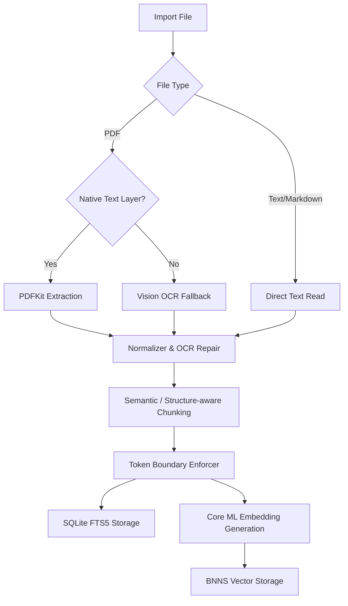

# Docs/INGESTION_PIPELINE.md — OpenIntelligence v4.1

> **Documentation status:** Verified for OpenIntelligence v4.1 on 2026-06-13.
> **Source of truth:** Codebase audit in `Docs/AUDIT/`.
> **Scope:** Describes shipped behavior unless explicitly labeled experimental, developer-only, or scaffolded.

This document describes the design and implementation of the import-time document ingestion pipeline in OpenIntelligence v4.1.

---

## 1. Overview
The ingestion pipeline converts raw files (PDFs, images, text documents) into searchable text segments with semantic metadata, storing them in parallel lexical and vector indexes. 

---

## 2. Text Extraction Lanes

### PDF Ingestion
- **Standard Lane:** Uses PDFKit to extract the native text layer if available. I use [StructuredDocumentParser.swift](file:///Users/gunnarhostetler/Documents/GitHub/OpenIntelligence-Public/OpenIntelligence/Services/Document/Processing/StructuredDocumentParser.swift) to resolve structures like tables, lists, and headings.
- **OCR Fallback Lane:** If the native text layer is missing or malformed, the pipeline invokes [LayoutAwareExtractor.swift](file:///Users/gunnarhostetler/Documents/GitHub/OpenIntelligence-Public/OpenIntelligence/Services/Document/Processing/LayoutAwareExtractor.swift) to render pages as images and run local Apple Vision OCR, restoring page layout anchors.

### Text & Markdown Ingestion
- Text files, markdown notes, and source code are ingested directly. Markdown structures (headers, code blocks) are parsed to preserve hierarchical section paths.

---

## 3. Chunking & Token Gating

### Semantic Chunking
Raw text is chunked using [SemanticChunker.swift](file:///Users/gunnarhostetler/Documents/GitHub/OpenIntelligence-Public/OpenIntelligence/Services/Document/Chunking/SemanticChunker.swift). It runs adaptive windows (default size $\le 310$ words) with character overlap.

### Structure-Aware Chunking
When structured tables or lists survive the parsing phase, they are preserved as atomic chunks to prevent layout breakage, ensuring that data cells are not separated from their column headers during retrieval.

### Token Limit Enforcement
Before indexing, chunks are checked against local tokenizers (e.g. `BertTokenizer`) to guarantee they are within the embedding model's limit ($\le 510$ tokens).

---

## 4. Dual Index Storage

Once chunks are generated and validated, they are written to two separate storage engines:
1. **Lexical Index:** Stored in SQLite FTS5 via [SQLiteFullTextService.swift](file:///Users/gunnarhostetler/Documents/GitHub/OpenIntelligence-Public/OpenIntelligence/Services/Storage/SQLiteFullTextService.swift). BM25 column weights prioritize section titles and entity tags.
2. **Vector Index:** Dense query vectors (384-dimensions) are generated using a local Core ML model (`EmbeddingModel.mlpackage`) and stored in [BNNSVectorDatabase.swift](file:///Users/gunnarhostetler/Documents/GitHub/OpenIntelligence-Public/OpenIntelligence/Services/VectorStore/BNNSVectorDatabase.swift) using Cosine Similarity.
Both indexes are isolated by `container_id` to enforce library boundaries.
