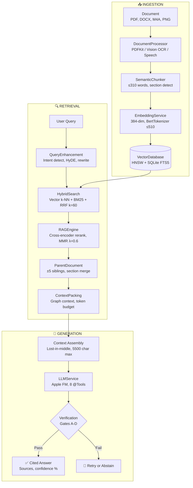

# OpenIntelligence

[](https://apps.apple.com/us/app/openintelligence/id6756559175)
[](https://developer.apple.com/ios/)
[](https://swift.org)
[](LICENSE)
[](Docs/reference/ARCHITECTURE.md)
[](HOW_IT_WORKS.md)

**Ask your documents anything. Get cited answers.**

<p align="center">
  <a href="https://apps.apple.com/us/app/openintelligence/id6756559175">
    
  </a>
</p>

OpenIntelligence is a document question-answering app powered by Apple Intelligence. Import any document—PDFs, Office files, audio, images—ask questions in plain English, and get accurate answers with citations. All processing happens on your device.

---

## What It Does

```
┌─────────────┐      ┌─────────────┐      ┌─────────────┐      ┌─────────────┐
│  1. ADD     │ ───▶ │  2. INDEX   │ ───▶ │   3. ASK    │ ───▶ │ 4. ANSWER   │
│  Documents  │      │ Chunk+Embed │      │ Your query  │      │ With sources│
└─────────────┘      └─────────────┘      └─────────────┘      └─────────────┘
```

1. **Add** - Tap "+" in the Documents tab, select files from the picker (PDF, Office, audio, images, code)
2. **Index** - App chunks text (≤310 words), generates 384-dim embeddings, builds vector + keyword indexes
3. **Ask** - Go to Chat tab, type a question; app retrieves relevant chunks via hybrid search
4. **Answer** - Apple Intelligence generates a response citing exact source passages

---

## Supported File Formats

| Category        | Formats                                                                                         | Notes                                                  |
| --------------- | ----------------------------------------------------------------------------------------------- | ------------------------------------------------------ |
| **Documents**   | PDF                                                                                             | Native PDFKit + Vision OCR @ 360 DPI for scanned pages |
| **Office**      | DOCX, XLSX, PPTX                                                                                | Native ZIP-based XML extraction (no dependencies)      |
| **Text**        | TXT, MD, RTF                                                                                    | Direct text extraction                                 |
| **Code**        | Swift, Python, JS, TS, Java, C/C++, Go, Rust, Ruby, PHP, HTML, CSS, JSON, XML, YAML, SQL, Shell | Syntax-aware chunking                                  |
| **Data**        | CSV, JSON                                                                                       | Unlimited rows, handles special characters             |
| **Images**      | PNG, JPEG, HEIC, TIFF, GIF                                                                      | Vision OCR extracts text from images                   |
| **Audio/Video** | M4A, MP3, WAV, MP4, MOV                                                                         | Speech.framework transcription to text                 |
| **Apple**       | Pages, Numbers, Keynote                                                                         | Supported via export or direct extraction              |

---

## Core Technology

### Embedding Pipeline

| Component           | Technology          | Specification                          |
| ------------------- | ------------------- | -------------------------------------- |
| **Embedding Model** | CoreML MiniLM-L6-v2 | 384 dimensions, bundled in app         |
| **Tokenizer**       | BertTokenizer       | 510 token max (512 - CLS/SEP)          |
| **Chunk Size**      | SemanticChunker     | ≤310 words + 30-word contextual prefix |
| **Vector Index**    | HNSW (in-memory)    | Cosine similarity, LRU cache           |
| **Keyword Index**   | SQLite FTS5         | BM25 scoring, Porter stemmer           |

### Search & Retrieval

| Component           | Technology           | Specification                     |
| ------------------- | -------------------- | --------------------------------- |
| **Hybrid Search**   | Vector + BM25        | Reciprocal Rank Fusion (k=60)     |
| **Reranker**        | CoreML Cross-Encoder | `ReRankerModel.mlpackage` bundled |
| **Diversification** | MMR                  | λ=0.6 relevance/diversity balance |
| **Context Window**  | Lost-in-Middle       | Best chunks at start AND end      |

### LLM Generation

| Component         | Technology              | Specification                                   |
| ----------------- | ----------------------- | ----------------------------------------------- |
| **Primary**       | Apple Foundation Models | iOS 26 FoundationModels framework (on-device)   |
| **Fallback**      | Private Cloud Compute   | Apple-routed when context exceeds device limits |
| **Context Limit** | 4,096 tokens            | ~5,500 characters with margin                   |
| **Agentic Tools** | 8 @Tool functions       | Search, summarize, compare, analyze             |

> **Offline-First**: The app works fully offline. All parsing, embedding, search, and LLM inference run on-device. PCC only activates when online AND Apple's system decides it's needed.

---

## Apple's On-Device Language Model

The app uses Apple's ~3 billion parameter language model that runs entirely on the Neural Engine. Here's what you're actually using:

### Model Specifications

| Spec                     | Value                                         |
| ------------------------ | --------------------------------------------- |
| **Parameters**           | ~3 billion                                    |
| **Context Window**       | 4,096 tokens (hard limit, TN3193)             |
| **Vocabulary**           | 49,000 tokens (on-device) / 100,000 (server)  |
| **Quantization**         | 3.7 bits per weight (mixed 2-bit/4-bit)       |
| **Inference Speed**      | 0.6ms per prompt token, 30 tokens/sec         |
| **Architecture**         | Transformer with grouped-query-attention      |
| **Adapters**             | LoRA adapters (~10s of MB each) per use case  |
| **Instruction Accuracy** | 85.7% on IFEval benchmark                     |
| **Safety**               | 7.5% violation rate (lowest among comparable) |

### Benchmarks vs Other Models

Per Apple's research, the on-device model outperforms larger open-source models in human evaluation:

| Comparison    | On-Device FM Win Rate |
| ------------- | --------------------- |
| vs Phi-3-mini | Wins                  |
| vs Mistral-7B | Wins                  |
| vs Gemma-7B   | Wins                  |
| vs Llama-3-8B | Wins                  |

Despite having only ~3B parameters (vs 7-8B), the model wins on instruction following and safety due to Apple's training approach.

### Capabilities

The model excels at these tasks (per Apple's documentation):

- **Text Generation**: Summarization, writing, rewriting, creative content
- **Entity Extraction**: Pull structured data from unstructured text
- **Text Understanding**: Comprehension, classification, analysis
- **Guided Generation**: Output Swift structs directly with `@Generable`
- **Tool Calling**: Execute Swift functions via `@Tool` protocol
- **Multi-language**: Supports major world languages via `supportedLanguages`

### Private Cloud Compute (PCC)

When the on-device model isn't sufficient, Apple may route to PCC. Key facts:

- **Same model**: PCC runs the exact same architecture, just on Apple's server silicon
- **Apple controls routing**: You can't force PCC — the system decides
- **No data retention**: Requests are processed and discarded, no training on your data
- **Verifiable privacy**: Cryptographic attestation proves what code runs on PCC servers

**In practice**: Most queries complete on-device. PCC only activates for complex reasoning that exceeds device capabilities.

---

## 8 Agentic @Tool Functions

The LLM can call these tools autonomously during reasoning:

| Tool                       | Purpose                           | Example Use                              |
| -------------------------- | --------------------------------- | ---------------------------------------- |
| `SearchDocumentsTool`      | Semantic search across all chunks | "Find sections about safety"             |
| `ListDocumentsTool`        | List all ingested documents       | "What documents do I have?"              |
| `GetDocumentSummaryTool`   | Get/generate document summary     | "Summarize the contract"                 |
| `CountPatternTool`         | Count pattern occurrences         | "How many times is 'revenue' mentioned?" |
| `SearchExactPatternTool`   | Find exact text matches           | "Find all phone numbers"                 |
| `GetCorpusStatsTool`       | Library-wide statistics           | "How many pages total?"                  |
| `FindRelatedDocumentsTool` | Find similar documents            | "What's related to this memo?"           |
| `CompareDocumentsTool`     | Compare two documents             | "How do these contracts differ?"         |

---

## Quality Modes

| Mode           | Sessions | Use Case                                 | Response Time |
| -------------- | -------- | ---------------------------------------- | ------------- |
| **Standard**   | 1-3      | Quick factual questions                  | 2-3 seconds   |
| **Deep Think** | 4-8      | Complex analysis, multi-step reasoning   | 5-15 seconds  |
| **Maximum**    | 8-50     | Exhaustive research, document comparison | 15-60 seconds |

Deep Think and Maximum modes use **Self-RAG 2.0**: multiple reasoning sessions that enrich (not verify) answers, adding details from different evidence chains.

---

## 23-Step Pipeline

OpenIntelligence processes every query through 23 distinct steps:

```
INGESTION (6 steps):
  1. Parse         → PDFKit / Vision OCR @ 360 DPI / Office ZIP extraction
  2. Chunk         → SemanticChunker (≤310 words, section boundary detection)
  3. Extract       → Entity extraction (NLTagger NER + PascalCase detection)
  4. Validate      → Token validation (BertTokenizer, truncate if >510)
  5. Embed         → CoreML MiniLM-L6-v2 (384-dim vectors)
  6. Store         → HNSW index + SQLite FTS5 + EntityIndex

RETRIEVAL (17 steps):
  Step 0    Corpus Analysis        → Build vocabulary cache per container
  Step 1    Query Understanding    → Pronoun resolution, NER extraction
  Step 1.5  Query Expansion        → Corpus-aware synonym expansion
  Step 1.6  Intent Classification  → lookup / procedure / compare / summarize
  Step 2    Query Embedding        → 384-dim vector from same model
  Step 2.5  RAPTOR-lite Routing    → Overview queries → L1 summaries
  Step 3    Hybrid Search          → Vector k-NN + BM25 + RRF fusion
  Step 4    Cross-Encoder Rerank   → CoreML ReRankerModel.mlpackage
  Step 4.3  Low-Confidence Filter  → Drop chunks below threshold
  Step 4.4  Multi-Doc Representation → Ensure source diversity
  Step 4.5  MMR Diversification    → λ=0.6 relevance/diversity
  Step 4.6  Parent Document        → Expand ±5 sibling chunks
  Step 4.7  Contextual Compression → LLM filters irrelevant sentences
  Step 4.9  Graph Context Packing  → Optimal token budget allocation
  Step 5    Context Assembly       → Lost-in-middle reordering
  Step 5.9  Extractive Summary     → For summarize intent
  Step 5.10 Extractive QA          → For lookup intent
  Step 6    LLM Generation         → Apple FM / Private Cloud Compute
  Step 7    Quality Assessment     → Confidence scoring
  Step 7.5  Verification Gates     → Gates A-D (see below)
  Step 8    Package Results        → Build response with sources
  Step 8.1  Calibrated Confidence  → Platt scaling (0.0-1.0)
  Step 9    Response Metadata      → Timing, token counts, source URIs
```

---

## Verification Gates (Anti-Hallucination)

Every response passes through 4 verification gates:

| Gate  | Name                 | What It Checks                                            |
| ----- | -------------------- | --------------------------------------------------------- |
| **A** | Retrieval Confidence | `max(score) ≥ τ` AND `margin ≥ μ` between top results     |
| **B** | Evidence Coverage    | All claims must cite `evidence_ids` from retrieved chunks |
| **C** | Numeric Sanity       | Numbers in response must match source documents           |
| **D** | Contradiction Sweep  | Detect conflicting evidence across chunks                 |

If any gate fails, the system either abstains or triggers iterative retrieval.

---

## Architecture

**51 services** organized into **9 categories**:

| Category           | Count | Key Services                                                        |
| ------------------ | ----- | ------------------------------------------------------------------- |
| **RAG Pipeline**   | 14    | RAGService, RAGEngine, HybridSearchService, VerificationGateService |
| **Query**          | 6     | QueryEnhancementService, HyDEService, ContextualCompressionService  |
| **Document**       | 10    | DocumentProcessor, SemanticChunker, AudioTranscriptionService       |
| **Embedding**      | 2     | EmbeddingService, CoreMLSentenceEmbeddingProvider                   |
| **Storage**        | 3     | FullTextStorageService, SQLiteFullTextService                       |
| **VectorStore**    | 4     | VectorDatabase, InMemoryVectorDatabase, BNNSVectorDatabase          |
| **LLM**            | 7     | AppleFoundationLLMService, OnDeviceAnalysisService                  |
| **Agentic**        | 3     | AgenticOrchestrator, ConversationMemoryService, WritingToolsService |
| **Infrastructure** | 7     | ContainerService, GPUComputeService, DeviceCapabilityService        |

**Full inventory**: See [ARCHITECTURE.md](Docs/reference/ARCHITECTURE.md) → "Complete Service Inventory (51 Services)"

### Data Flow



<details>
<summary><strong>📖 Glossary — Why Each Piece Is In OpenIntelligence</strong> (click to expand)</summary>

| Term                       | Why It's Here                                                                                                                                                                                                                                                                                                                                                                                                                                                                                                                                                                                                                                                                                                                                                                                                                                                                                                                                                                                            |
| -------------------------- | -------------------------------------------------------------------------------------------------------------------------------------------------------------------------------------------------------------------------------------------------------------------------------------------------------------------------------------------------------------------------------------------------------------------------------------------------------------------------------------------------------------------------------------------------------------------------------------------------------------------------------------------------------------------------------------------------------------------------------------------------------------------------------------------------------------------------------------------------------------------------------------------------------------------------------------------------------------------------------------------------------- |
| **HNSW**                   | Hierarchical Navigable Small World graph. `InMemoryVectorDatabase` builds a multi-layer graph where each chunk connects to its nearest neighbors. Searching starts at the top layer (sparse, long jumps) and descends to bottom layers (dense, precise). Result: 50,000 chunks searched in ~5ms instead of brute-force O(n) comparisons. Without this, "instant answers" would be 3-second answers.                                                                                                                                                                                                                                                                                                                                                                                                                                                                                                                                                                                                      |
| **SQLite FTS5**            | Full-Text Search 5 engine inside `SQLiteFullTextService`. Builds an inverted index: every word maps to which chunks contain it. Query "VIN 1HGCM82633A004352" → FTS5 instantly returns chunks containing that exact string. Vector search would fail here because embeddings capture meaning, not character sequences. FTS5 catches what vectors miss.                                                                                                                                                                                                                                                                                                                                                                                                                                                                                                                                                                                                                                                   |
| **BM25**                   | Best Match 25 — the scoring formula inside FTS5. Factors in: (1) term frequency (mentions "oil" 8× beats 1×), (2) inverse document frequency (rare words matter more than "the"), (3) document length normalization. The chunk that's actually ABOUT oil changes scores higher than one that mentions it in passing.                                                                                                                                                                                                                                                                                                                                                                                                                                                                                                                                                                                                                                                                                     |
| **BertTokenizer**          | WordPiece tokenizer from the original BERT paper. Splits text into subword units: "unbelievable" → ["un", "##believ", "##able"]. Critical because MiniLM has a 512-token hard limit (510 usable after [CLS]/[SEP]). `CoreMLSentenceEmbeddingProvider.countTokens()` uses this — NOT NLTokenizer, which counts "VHA21\\VHAPALGarciG1" as 1 word when it's actually 10+ tokens. Wrong count = silent truncation = lost meaning.                                                                                                                                                                                                                                                                                                                                                                                                                                                                                                                                                                            |
| **Contextual Prefix**      | `SemanticChunker` prepends section breadcrumbs to each chunk: "Chapter 5: Maintenance > Oil Change Procedure: [actual chunk text]". Why? A chunk saying "remove the cap and drain" means nothing without context. With the prefix, the embedding captures that this is about oil changes, not radiators. ~30 words overhead, massive relevance gain.                                                                                                                                                                                                                                                                                                                                                                                                                                                                                                                                                                                                                                                     |
| **HyDE**                   | Hypothetical Document Embeddings via `HyDEService.swift`. Problem: user queries are short and vague ("how to fix"). Solution: generate a fake 100-word answer FIRST using Apple FM, then embed THAT and search. The hypothetical answer contains domain vocabulary the user didn't type. Deep Think mode only — adds ~500ms latency but dramatically improves recall for ambiguous queries.                                                                                                                                                                                                                                                                                                                                                                                                                                                                                                                                                                                                              |
| **RRF (k=60)**             | Reciprocal Rank Fusion in `HybridSearchService`. Formula: `score = Σ 1/(k + rank)` where k=60 smooths the curve. Merges two ranked lists (vector, keyword) into one. A chunk ranked #1 in keywords + #50 in vectors scores `1/61 + 1/110 = 0.0255`. A chunk ranked #5 in both scores `1/65 + 1/65 = 0.0308` — wins. Neither search dominates; both contribute fairly.                                                                                                                                                                                                                                                                                                                                                                                                                                                                                                                                                                                                                                    |
| **MMR (λ=0.6)**            | Maximal Marginal Relevance in `RAGEngine.applyMMR()`. Iteratively selects chunks: `score = λ × relevance - (1-λ) × max_similarity_to_already_selected`. λ=0.6 means 60% relevance, 40% diversity penalty. Prevents returning 5 near-identical paragraphs from the same page. Forces coverage across different document sections. Tunable per intent — summarize queries use λ=0.5 for more diversity.                                                                                                                                                                                                                                                                                                                                                                                                                                                                                                                                                                                                    |
| **k-NN**                   | k-Nearest Neighbors — the core retrieval primitive. `EmbeddingService` encodes query → 384-dim vector. HNSW finds the k=20 chunks with smallest cosine distance. "Car maintenance" (query) matches "vehicle servicing" (chunk) because their vectors land in similar regions of the embedding space. This is why semantic search works — meaning, not keywords.                                                                                                                                                                                                                                                                                                                                                                                                                                                                                                                                                                                                                                          |
| **Cross-encoder**          | `ReRankerModel.mlpackage` — a 4.5MB TinyBERT model (ms-marco-TinyBERT-L-2-v2). Unlike bi-encoders that embed query and chunk separately, cross-encoders see `[CLS] query [SEP] chunk [SEP]` together. Attention flows between them, catching subtle relevance signals. 10× slower than bi-encoder, but far more accurate. Runs on top ~20 candidates after initial retrieval to reorder by true relevance.                                                                                                                                                                                                                                                                                                                                                                                                                                                                                                                                                                                               |
| **Parent Document**        | `ParentDocumentService` expands context around matched chunks. If chunk #47 (index 0.82 relevance) matches, grab siblings #42-51 from the same document section. Why? The matching chunk might be mid-paragraph — preceding context often contains the setup, following context contains conclusions. ±5 siblings configurable. Merged chunks deduplicated before context packing.                                                                                                                                                                                                                                                                                                                                                                                                                                                                                                                                                                                                                       |
| **Contextual Compression** | `ContextualCompressionService` calls Apple FM with: "Given this query, extract only relevant sentences from this chunk." A 300-word chunk about oil changes might contain 200 words of background — compression strips it to the 80 words that actually answer the question. Runs BEFORE final generation. Saves 40-60% context tokens, letting more chunks fit in the 5,500-char window.                                                                                                                                                                                                                                                                                                                                                                                                                                                                                                                                                                                                                |
| **RAPTOR-lite**            | Recursive Abstractive Processing for Tree-Organized Retrieval — simplified. At ingestion, `RAGService` generates a ~150-word summary of each document (L1 chunk). `QueryRouterService` classifies queries: "summarize" or "what is this about" → search L1 summaries. "What's the torque spec on page 47" → search L0 detail chunks. 80% of RAPTOR's benefit (hierarchical retrieval) at 20% complexity (single summary level).                                                                                                                                                                                                                                                                                                                                                                                                                                                                                                                                                                          |
| **Lost-in-middle**         | Liu et al. 2023 discovered LLMs attend strongly to the start and end of context, forgetting the middle. `RAGEngine.applyLostInMiddleReordering()` fixes this: if chunks are ranked [A, B, C, D, E] by relevance, reorder to [A, C, E, D, B] — best at position 1, second-best at end, worst in middle. Apple FM now "sees" the critical evidence because it's not buried.                                                                                                                                                                                                                                                                                                                                                                                                                                                                                                                                                                                                                                |
| **Verification Gates**     | 4-gate anti-hallucination pipeline in `VerificationGateService`: **(A)** Retrieval confidence — top score ≥ threshold AND margin over #2 is sufficient. **(B)** Evidence coverage — every claim in the response cites a retrieved chunk. **(C)** Numeric sanity — numbers in response match source documents exactly. **(D)** Contradiction sweep — no conflicting evidence across chunks. Any gate fails → abstain ("I don't have enough information") or trigger iterative re-retrieval with expanded queries.                                                                                                                                                                                                                                                                                                                                                                                                                                                                                         |
| **Entity Index**           | `EntityIndexService` runs NLTagger NER at ingestion: extracts persons, organizations, locations, plus PascalCase technical terms. Builds a `Dict<Entity, Set<ChunkID>>` index. Query mentions "John Smith" → instant lookup returns all chunks referencing him, even if the embedding similarity is weak. Bridges the gap between keyword search (exact match) and semantic search (meaning match).                                                                                                                                                                                                                                                                                                                                                                                                                                                                                                                                                                                                      |
| **PCC**                    | Private Cloud Compute — Apple's confidential computing cloud. **Critical: PCC runs the EXACT SAME MODEL as on-device.** Same 4096 token limit. Same capabilities. Same everything. The ONLY difference is WHERE it runs: Apple's server Apple Silicon instead of your phone's Neural Engine. Why use cloud for identical model? **(1)** Thermal/battery relief — hot device can offload to cloud hardware. **(2)** Faster token generation — server chips are faster once running. The app works fully offline; PCC only activates when network is available, user opted in via iOS Settings, AND Apple's `modelmanagerd` decides to route there (device thermals, battery, load). `AppleFoundationLLMService` detects which ran by TTFT (<1s = on-device, >1s = PCC). Apple guarantees: end-to-end encryption, stateless computation, no data retention, cryptographic attestation, verifiable transparency. You control the preference; Apple controls the routing; the model is identical either way. |

</details>

---

## Telemetry Badges

Every response shows execution metadata:

| Badge            | Meaning                                                        |
| ---------------- | -------------------------------------------------------------- |
| 📱 **On-Device** | Ran on your device's Neural Engine                             |
| ☁️ **PCC**       | Ran on Apple's server silicon (same model, different hardware) |
| 🔧 **Tools: N**  | Number of @Tool functions called during reasoning              |
| ⏱️ **X.Xs**      | Total response time                                            |

> **Note:** On-Device and PCC run the **identical model** with identical 4096-token context. PCC is just Apple's way of offloading inference to cloud hardware when your device is busy/hot — it's not a bigger or smarter model.

---

## Privacy

- **Fully offline capable**: All parsing, embedding, search, and LLM inference run on-device with no network required
- **PCC is Apple-controlled**: If/when Apple routes to Private Cloud Compute, it uses end-to-end encryption with cryptographic attestation and zero data retention
- **No third-party APIs**: No OpenAI, no external cloud services, no API keys
- **No telemetry**: No analytics sent anywhere — ever

See [PRIVACY.md](PRIVACY.md) for full details.

---

## Getting Started

### Requirements

- **iOS 26.0+** (required for FoundationModels framework)
- **Xcode 26+** (required for Swift 6)
- **Device**: iPhone 15 Pro or newer recommended (A17+ for best performance)

### Installation

```bash
# Clone
git clone https://github.com/Gunnarguy/OpenIntelligence.git
cd OpenIntelligence

# Fetch submodules (swift-transformers)
git submodule update --init --recursive

# Open in Xcode
open OpenIntelligence.xcodeproj

# Build & Run
# Select OpenIntelligence scheme → iPhone 17 Pro → Cmd+R
```

### Troubleshooting

```bash
# Clean build if you see stale UI or build errors
./clean_and_rebuild.sh
```

---

## Project Structure

```text
OpenIntelligence/
├── App/                        # Entry point, ContentView
├── Core/
│   ├── Extensions/             # Swift extensions
│   ├── Models/                 # DocumentChunk, RAGResponse, etc.
│   └── Protocols/              # Service protocols
├── Features/
│   ├── Billing/                # StoreKit subscription UI
│   ├── Camera/                 # Vision camera overlay (v2.0)
│   ├── Chat/                   # Chat interface, message bubbles
│   ├── Database/               # Container management UI
│   ├── Diagnostics/            # Debug dashboards
│   ├── Documents/              # Document picker, ingestion UI
│   ├── Onboarding/             # First-launch experience
│   ├── Settings/               # Settings views
│   └── Telemetry/              # Execution metrics display
├── Resources/
│   ├── MLModels/               # EmbeddingModel + ReRankerModel
│   └── StoreKit/               # Subscription configuration
├── Services/
│   ├── Agentic/                # AgenticOrchestrator, ConversationMemory
│   ├── Billing/                # StoreKitBillingService
│   ├── Document/               # DocumentProcessor, SemanticChunker, OCR
│   ├── Embedding/              # EmbeddingService, CoreMLProvider
│   ├── Infrastructure/         # ContainerService, GPUCompute, Settings
│   ├── LLM/                    # AppleFoundationLLMService, tools
│   ├── Query/                  # QueryEnhancement, HyDE, Compression
│   ├── RAG/                    # RAGService, RAGEngine, HybridSearch
│   ├── Storage/                # FullTextStorage, SQLiteFTS5
│   └── VectorStore/            # VectorDatabase, BNNS, Router
└── UI/                         # Shared UI components
```

---

## Documentation

| Document                                          | Description                                                     |
| ------------------------------------------------- | --------------------------------------------------------------- |
| **[HOW_IT_WORKS.md](HOW_IT_WORKS.md)**            | 🔥 Plain-English deep dive: 5 gears, token budget, orchestrator |
| [ARCHITECTURE.md](Docs/reference/ARCHITECTURE.md) | Complete technical architecture, 51-service inventory           |
| [ADVANCED_RAG.md](Docs/reference/ADVANCED_RAG.md) | RAG technique reference (HyDE, compression, reranking)          |
| [ROADMAP.md](ROADMAP.md)                          | Feature roadmap and version history                             |
| [PRIVACY.md](PRIVACY.md)                          | Privacy policy and data handling                                |

---

## Contributing

1. Fork the repository
2. Create a feature branch: `git checkout -b feature/your-feature`
3. Write Swift 6 compliant code with `actor` isolation for heavy tasks
4. Test on device (Simulator lacks Apple FM)
5. Submit a PR with clear description

### Coding Standards

- Use `async/await` and `actor` for concurrency (no GCD)
- Never send data to cloud without explicit consent
- Update `Docs/reference/` when changing architecture

---

## License

MIT License - see [LICENSE](LICENSE) for details.
