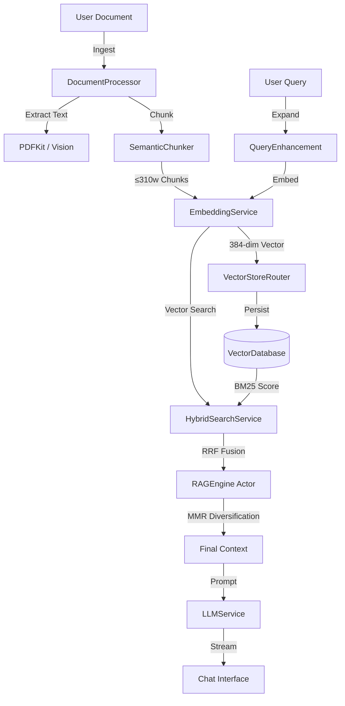

# OpenIntelligence

[](https://developer.apple.com/ios/)
[](https://swift.org)
[](LICENSE)
[](Docs/reference/ARCHITECTURE.md)

**Ask your documents anything. Get cited answers.**

OpenIntelligence is a document question-answering app that runs entirely on your iOS device. Import PDFs, Word documents, spreadsheets, or any text file. Ask questions in plain English. Get accurate answers with citations powered by Apple Intelligence.

---

## What It Does

1. **Import documents** - PDFs, Office files (DOCX/XLSX/PPTX), text files, images with text
2. **Ask questions** - "What's the main topic?" "Find the revenue figures" "Summarize section 3"
3. **Get cited answers** - Every response includes citations to the exact source passages
4. **Verify sources** - Tap any citation to see the original text in context

All processing happens on-device by default. Your files never leave your iPhone or iPad unless you explicitly enable Private Cloud Compute for complex queries.

---

## 🚀 Key Features

- **Privacy by Design**: All processing happens on-device by default. Optional Private Cloud Compute (PCC) with Apple's zero-retention guarantee.
- **Hybrid Search**: Combines BM25 keyword matching with vector semantic search using Reciprocal Rank Fusion (RRF).
- **Apple Intelligence**: Powered by iOS 26 Foundation Models running on your device's Neural Engine.
- **CoreML Embeddings**: 384-dimensional sentence embeddings via bundled all-MiniLM-L6-v2 model.
- **Neural Reranking**: Cross-encoder CoreML model for precision relevance scoring.
- **Enhanced OCR**: 360 DPI rendering with device-tier-aware concurrency (A17-A19 Pro, M-series optimized).
- **Platform Optimized**: Tuned for iPhone, iPad, and Mac (via iPad compatibility mode).
- **Office Support**: Native extraction for DOCX, XLSX, PPTX (no external dependencies).
- **8 Agentic Tools**: `@Tool` functions let the AI search, summarize, count patterns, compare documents, and analyze your library.
- **Multi-Session Reasoning**: Deep Think mode uses 4-8 parallel reasoning sessions with Self-RAG 2.0 enrichment.
- **Quality Modes**: Standard (fast), Deep Think (thorough), Maximum (multi-chain parallel reasoning).
- **Observability**: Real-time telemetry badges (📱 On-Device / ☁️ PCC), execution timers, retrieval scores.

### 📷 Coming Soon (v1.2.0)

- **Apple CoreML Vision Models**: Integrate FastViT (8MB), DETR (43MB), and DeepLabV3 for intelligent document understanding. Classify content types, detect tables/figures/text regions, and route to optimized processors.
- **Camera Vision Overlay**: Point your camera at documents, whiteboards, or receipts. Live bounding boxes show detected text, tables, and documents. One-tap capture to ingest directly into RAG.
- **Documentation Cache**: Automatically save fetched web documentation locally for offline access. Browse, search, and ingest cached docs.
- **Enhanced Image Understanding**: Apple Intelligence describes images in natural language—"This flowchart shows 5 steps..." instead of just classifying as "diagram".

### 🔮 v2.0 Model Catalog

Full integration of Apple's CoreML model library:

| Model           | Size  | Use Case                      |
| --------------- | ----- | ----------------------------- |
| BERT-SQuAD      | 217MB | Extractive QA for all devices |
| DepthAnythingV2 | 49MB  | 3D document scanning          |
| YOLOv3 Tiny     | 17MB  | Real-time camera detection    |
| ResNet-50       | 51MB  | High-accuracy classification  |

All models from [Apple Machine Learning](https://developer.apple.com/machine-learning/models/).

---

## 🏗 Architecture

OpenIntelligence uses a **Protocol-First** architecture with strict **Actor Isolation** to handle heavy RAG workloads without blocking the main thread.

### Data Flow Pipeline



### Core Components

| Component               | Responsibility | Implementation Details                                                     |
| ----------------------- | -------------- | -------------------------------------------------------------------------- |
| **`RAGService`**        | Orchestration  | `@MainActor` singleton. Manages state, ingestion, and routing.             |
| **`RAGEngine`**         | Math & Logic   | `actor`. Offloads BM25 scoring, RRF fusion, and MMR to background threads. |
| **`VectorStoreRouter`** | Storage Access | Manages container-isolated `PersistentVectorDatabase` instances.           |
| **`LLMService`**        | Generation     | Protocol with 6 implementations (Apple FM, GGUF, OpenAI, etc.).            |
| **`SemanticChunker`**   | Pre-processing | Intelligent splitting with topic boundary detection and overlap.           |

---

## 📚 Reference Docs

- Architecture overview: [`Docs/reference/ARCHITECTURE.md`](Docs/reference/ARCHITECTURE.md)
- Apple Intelligence deep dive: [`Docs/reference/AFW.md`](Docs/reference/AFW.md)

---

## 🛠 Getting Started

### Prerequisites

- **Xcode 26+** (Required for Swift 6)
- **iOS 26.0+** (Minimum deployment)
- **Device**: iPhone 15 Pro or newer recommended for local inference.

### Installation

1. **Clone the repository**:

   ```bash
   git clone https://github.com/yourusername/OpenIntelligence.git
   cd OpenIntelligence
   ```

2. **Fetch git submodules** (required for the local `swift-transformers` package):

   ```bash
   git submodule update --init --recursive
   ```

3. **Open in Xcode**:

   ```bash
   open OpenIntelligence.xcodeproj
   ```

4. **Build & Run**:
   - Select the **OpenIntelligence** scheme.
   - Destination: **iPhone 17 Pro Max** (Simulator) or physical device.
   - Press `Cmd+R`.

### Troubleshooting

If you encounter build issues or UI glitches, run the clean script:

```bash
./clean_and_rebuild.sh
```

---

## 📖 Usage Guide

### 1. Ingestion

Navigate to the **Documents** tab. Drag and drop files. Supported formats:

- **PDFs**: Native parsing + 360 DPI OCR for scanned pages
- **Office Docs**: .docx, .xlsx, .pptx (native ZIP-based extraction)
- **Text**: .txt, .md, .rtf, code files
- **Data**: .csv, .json (unlimited rows)

The app will:

- **Parse** text using PDFKit, Vision OCR (360 DPI), or native Office extractors.
- **Chunk** content into optimized ≤310 word segments with ~17% overlap.
- **Embed** chunks using on-device CoreML (384-dim all-MiniLM-L6-v2).
- **Index** for both vector (HNSW) and BM25 keyword search.
- **Store** complete original text for exact pattern queries.

> 💡 **Tip**: Enable high-accuracy mode in Library Settings → Embedding Model for technical or complex documents.

### 2. Chat & Retrieval

Go to the **Chat** tab. Ask questions about your documents.

- **Telemetry Badges**:
  - 📱 **On-Device**: Inference ran locally.
  - ☁️ **PCC**: Private Cloud Compute was used.
  - 🔑 **API**: External API (e.g., OpenAI) was used.
  - 🔧 **Tools**: Shows how many agent tools were called.
- **Citations**: Tap any citation to view the source chunk.

### 3. Model Configuration

In **Settings**, configure your AI preferences:

- **Quality Mode**:
  - **Standard**: Fast single-pass retrieval + generation (~2-3 seconds)
  - **Deep Think**: 4-8 session multi-step reasoning with Self-RAG 2.0 enrichment
  - **Maximum**: Parallel multi-chain reasoning across document clusters (breaks 4096 token ceiling)
- **Privacy Settings**: Control Private Cloud Compute usage and view execution location.
- **Intelligence Layer**: Enable/disable query understanding, multi-pass retrieval, conversation memory.

---

## 📂 Project Structure

```text
OpenIntelligence/
├── App/                    # Entry point and configuration
├── Models/                 # Shared data structures (RAGQuery, Chunk)
├── Services/               # Core business logic
│   ├── RAG/                # RAGService, RAGEngine, HybridSearch
│   ├── LLM/                # LLMService implementations
│   ├── Ingestion/          # DocumentProcessor, SemanticChunker
│   └── Storage/            # VectorDatabase, ModelRegistry
├── Views/                  # SwiftUI Views
│   ├── Chat/               # Chat interface components
│   ├── Documents/          # Document management
│   └── Telemetry/          # Debug dashboards
└── Resources/              # Assets and Localizations
```

---

## 🤝 Contributing

Contributions are welcome! Please follow these steps:

1. **Fork & Clone**: Create your own fork of the repository.
2. **Branch**: Create a feature branch (`git checkout -b feature/amazing-feature`).
3. **Implement**: Write clean, Swift 6 compliant code. Prefer `actor` isolation for heavy tasks.
4. **Test**:
   - Run the **Smoke Test** procedure outlined in [`smoke_test.md`](smoke_test.md).
   - Verify no regressions in the Telemetry Dashboard.
5. **Pull Request**: Submit a PR with a clear description of changes.

### Coding Standards

- **Concurrency**: Use `Task`, `actor`, and `await`. Avoid GCD (`DispatchQueue`) unless absolutely necessary.
- **Privacy**: Never send user data to the cloud without explicit, logged consent.
- **Documentation**: Update `Docs/reference/` if changing architecture.

---

## 📄 License

This project is licensed under the MIT License - see the [LICENSE](LICENSE) file for details.
