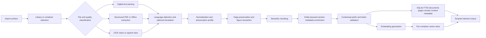
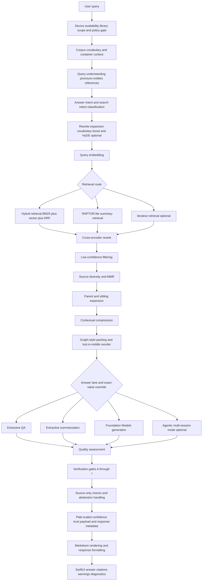
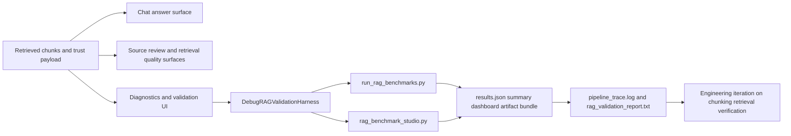

# OpenIntelligence

OpenIntelligence is an experimental Apple-native document intelligence prototype for working with user-controlled files.

It explores local-first document ingestion, library-based organization, retrieval, source-backed answers, citations, confidence signals, and AI-assisted reasoning on Apple platforms.

This repository is meant to show the engineering work directly: the SwiftUI app, document ingestion services, retrieval stack, answer grounding logic, benchmark harness, local model resources, technical notes, research references, and inspection assets are linked from this front page.

OpenIntelligence is a proof-of-concept and portfolio project. It is not a finished enterprise SDK, regulated healthcare system, clinical decision-support tool, diagnostic system, production-ready commercial product, company, or product for sale.

## Start Here

- [App Store](https://apps.apple.com/us/app/openintelligence/id6756559175): live public listing.
- [What's New](WHATS_NEW.md) and [Changelog](CHANGELOG.md): public release notes and version-by-version history.
- [How it works](HOW_IT_WORKS.md): public workflow overview from import to cited answers.
- [Architecture](Docs/ARCHITECTURE.md): app structure, service boundaries, data flow, and package boundary.
- [Retrieval pipeline](Docs/RETRIEVAL_PIPELINE.md): ingestion, chunking, retrieval, context packing, grounded answer generation, and diagnostics.
- [RAG technical specifications](Docs/Engineering/RAG_TECHNICAL.md): deeper implementation notes for HyDE, parent retrieval, compression, verification, reranking, and retrieval policy.
- [Hard limits and claim boundaries](Docs/Engineering/HARD_LIMITS.md): current token budgets, model constraints, and safe claim boundaries.
- [Storage and pipeline trace](Docs/Engineering/STORAGE_AND_PIPELINE_TRACE.md): current storage reality, SQLite/vector traces, container isolation, and benchmark hooks.
- [Research index](Docs/Research/README.md): supporting references for Apple Foundation Models, RAG, OCR, and local AI design choices.
- [Benchmarks](Benchmarks/README.md): manifest format, local RAG validation runner, document studio, outputs, and fixture guidance.
- [Demo guide](Docs/DEMO.md): suggested public demo flow and safe demo-document guidance.
- [Limitations](Docs/LIMITATIONS.md): product, safety, technical, and demo limits.
- [Roadmap](Docs/ROADMAP.md): near-term engineering direction.

## Release History

The README now keeps a quick version index so the shipped app history is visible here without jumping straight into the deeper public notes in [WHATS_NEW.md](WHATS_NEW.md) and [CHANGELOG.md](CHANGELOG.md).

| Version | Release focus                                                                                                                                                                        |
| ------- | ------------------------------------------------------------------------------------------------------------------------------------------------------------------------------------ |
| 3.6     | Per-library Local Only versus iCloud Drive storage, cross-device library review, safer shared-library reconciliation, and more conservative handling for clean digital text imports. |
| 3.5     | Reliability cleanup for exact answers, harder PDFs, grounded starter prompts, and first-run product clarity.                                                                         |
| 3.3     | Stronger import recovery, adaptive visual ingestion, searchable figures, and better exact table/spec lookups.                                                                        |
| 3.2.5   | Corrective pass for direct source-backed fact answers, exact measurements, and stricter grounded starter questions.                                                                  |
| 3.1     | Better OCR and table preservation, corrective retrieval on weak evidence, and stricter grounded answer handling.                                                                     |
| 3.0     | Retrieval hardening for noisy PDFs and tables, stronger extractive handling, and clearer diagnostics around recovery behavior.                                                       |
| 2.5     | Better suggested questions, stronger answer grounding and evidence review, and broader rendering and PDF-cleanup polish.                                                             |
| 2.0.x   | Faster everyday document Q&A, sharper source review, and stability/polish follow-up work after launch.                                                                               |
| 2.0.0   | Initial App Store release of the iPhone app with multi-format import, library organization, cited answers, and paid access tiers.                                                    |

## What It Demonstrates

- AI product engineering in a native Apple app.
- Local-first document workflows built around user-controlled files.
- Per-library Local Only versus iCloud Drive storage with cross-device review instead of one global cloud mode.
- Document ingestion, OCR-oriented extraction, chunking, enrichment, and indexing.
- Type-aware preparation that preserves clean digital text more conservatively while still escalating cleanup for noisy OCR and scanned material.
- Retrieval-oriented answer generation with citations and evidence review.
- Library/workspace isolation so questions stay scoped to the selected material.
- Confidence, warning, and verification surfaces instead of pretending every answer is final.
- Benchmarking and diagnostics for inspecting retrieval quality.
- A Swift/SwiftUI implementation with a developing engine boundary.

## Repository Map

| Area                                     | What to look at                                                                                                                                            |
| ---------------------------------------- | ---------------------------------------------------------------------------------------------------------------------------------------------------------- |
| App shell                                | [`OpenIntelligence/App`](OpenIntelligence/App)                                                                                                             |
| Core models and protocols                | [`OpenIntelligence/Core`](OpenIntelligence/Core)                                                                                                           |
| Document library UI                      | [`OpenIntelligence/Features/Documents`](OpenIntelligence/Features/Documents)                                                                               |
| Chat and answer surfaces                 | [`OpenIntelligence/Features/Chat`](OpenIntelligence/Features/Chat)                                                                                         |
| Diagnostics and validation UI            | [`OpenIntelligence/Features/Diagnostics`](OpenIntelligence/Features/Diagnostics)                                                                           |
| Telemetry and visualizations             | [`OpenIntelligence/Features/Telemetry`](OpenIntelligence/Features/Telemetry)                                                                               |
| Document processing services             | [`OpenIntelligence/Services/Document`](OpenIntelligence/Services/Document)                                                                                 |
| Embedding providers                      | [`OpenIntelligence/Services/Embedding`](OpenIntelligence/Services/Embedding)                                                                               |
| Query analysis and rewriting             | [`OpenIntelligence/Services/Query`](OpenIntelligence/Services/Query)                                                                                       |
| RAG orchestration, retrieval, and safety | [`OpenIntelligence/Services/RAG`](OpenIntelligence/Services/RAG)                                                                                           |
| Storage and vector search                | [`OpenIntelligence/Services/Storage`](OpenIntelligence/Services/Storage), [`OpenIntelligence/Services/VectorStore`](OpenIntelligence/Services/VectorStore) |
| Experimental engine API boundary         | [`OpenIntelligence/SDK/OpenIntelligenceEngine.swift`](OpenIntelligence/SDK/OpenIntelligenceEngine.swift)                                                   |
| Local model resources                    | [`OpenIntelligence/Resources/MLModels`](OpenIntelligence/Resources/MLModels)                                                                               |
| Benchmark and audit scripts              | [`scripts`](scripts)                                                                                                                                       |
| Benchmark manifests and studio           | [`Benchmarks`](Benchmarks)                                                                                                                                 |

## Engineering Highlights

The main app flow runs through a native SwiftUI shell and a document intelligence service layer:

- [`OpenIntelligence/App/OpenIntelligenceApp.swift`](OpenIntelligence/App/OpenIntelligenceApp.swift): app entry point.
- [`OpenIntelligence/App/ContentView.swift`](OpenIntelligence/App/ContentView.swift): top-level app composition.
- [`OpenIntelligence/App/DebugRAGValidationHarness.swift`](OpenIntelligence/App/DebugRAGValidationHarness.swift): debug validation entry point for scripted RAG runs.
- [`OpenIntelligence/Features/Documents/Library/DocumentLibraryView.swift`](OpenIntelligence/Features/Documents/Library/DocumentLibraryView.swift): document/library management surface.
- [`OpenIntelligence/Features/Chat/Conversation/ChatScreen.swift`](OpenIntelligence/Features/Chat/Conversation/ChatScreen.swift): main question-answering experience.
- [`OpenIntelligence/Features/Chat/Response/RetrievalSourcesTray.swift`](OpenIntelligence/Features/Chat/Response/RetrievalSourcesTray.swift): source review UI.
- [`OpenIntelligence/Features/Chat/Response/RetrievalQualityView.swift`](OpenIntelligence/Features/Chat/Response/RetrievalQualityView.swift): retrieval-quality feedback surface.
- [`OpenIntelligence/Features/Diagnostics/Validation/RAGAccuracyView.swift`](OpenIntelligence/Features/Diagnostics/Validation/RAGAccuracyView.swift): validation dashboard.

The document and retrieval stack is split across focused services:

- [`DocumentProcessor.swift`](OpenIntelligence/Services/Document/Processing/DocumentProcessor.swift): document ingestion and processing coordinator.
- [`SemanticChunker.swift`](OpenIntelligence/Services/Document/Chunking/SemanticChunker.swift): semantic chunking experiments.
- [`EmbeddingService.swift`](OpenIntelligence/Services/Embedding/EmbeddingService.swift): embedding abstraction.
- [`SQLiteFullTextService.swift`](OpenIntelligence/Services/Storage/SQLiteFullTextService.swift): full-text storage path.
- [`VectorStoreRouter.swift`](OpenIntelligence/Services/VectorStore/VectorStoreRouter.swift): vector store routing.
- [`RAGService.swift`](OpenIntelligence/Services/RAG/Orchestration/RAGService.swift): retrieval-augmented answer orchestration.
- [`HybridSearchService.swift`](OpenIntelligence/Services/RAG/Retrieval/HybridSearchService.swift): hybrid retrieval.
- [`ContextPackingService.swift`](OpenIntelligence/Services/RAG/Retrieval/ContextPackingService.swift): context budget and evidence packing.
- [`SourceOnlyAnswerService.swift`](OpenIntelligence/Services/RAG/Safety/SourceOnlyAnswerService.swift): source-backed answer checks.
- [`VerificationGateService.swift`](OpenIntelligence/Services/RAG/Safety/VerificationGateService.swift): answer verification gates.

Recent 3.6 follow-up work tightened two product surfaces that matter in practice:

- Shared-library sync now centers on explicit per-library intent, global refresh/review in Documents, and clearer handling of additions and removals across devices.
- Authored digital files such as text, markdown, code, CSV, transcripts, and Office-style documents now avoid the heavier OCR/PDF cleanup path unless the source quality actually calls for it.

## Retrieval Pipeline

The earlier README summary was too compressed. The documented system is not one straight line; it is an adaptive ingest, retrieval, verification, and inspection pipeline.

The diagrams below are an audit-style systems map based on the repo docs. They are meant to show the full documented shape from import to response and review, not to imply that every document or every query runs every branch.

### Ingestion To Indexed Corpus


```mermaid
flowchart LR
  A[Import surface] --> B[Library or container selection]
  B --> C{File and quality classification}
  C --> D[Digital text parsing]
  C --> E[Structured PDF or Office extraction]
  C --> F[OCR vision or speech lane]
  D --> G[Language detection and optional translation]
  E --> G
  F --> G
  G --> H[Normalization and preservation profile]
  H --> I[Page preservation and figure semantics]
  I --> J[Semantic chunking]
  J --> K[Entity keyword section metadata enrichment]
  K --> L[Contextual prefix and token validation]
  L --> M[Embedding generation]
  L --> N[SQLite FTS5 documents pages chunks content metadata]
  M --> O[Per-container vector store]
  N --> P[Scoped indexed corpus]
  O --> P
```

### Query To Response


```mermaid
flowchart TD
  A[User query] --> B[Device availability library scope and policy gate]
  B --> C[Corpus vocabulary and container context]
  C --> D[Query understanding pronouns entities references]
  D --> E[Answer intent and search intent classification]
  E --> F[Rewrite expansion vocabulary boost and HyDE optional]
  F --> G[Query embedding]
  G --> H{Retrieval route}
  H --> I[Hybrid retrieval BM25 plus vector plus RRF]
  H --> J[RAPTOR-lite summary retrieval]
  H --> K[Iterative retrieval optional]
  I --> L[Cross-encoder rerank]
  J --> L
  K --> L
  L --> M[Low-confidence filtering]
  M --> N[Source diversity and MMR]
  N --> O[Parent and sibling expansion]
  O --> P[Contextual compression]
  P --> Q[Graph-style packing and lost-in-middle reorder]
  Q --> R{Answer lane and exact-value override}
  R --> S[Extractive QA]
  R --> T[Extractive summarization]
  R --> U[Foundation Models generation]
  R --> V[Agentic multi-session mode optional]
  S --> W[Quality assessment]
  T --> W
  U --> W
  V --> W
  W --> X[Verification gates A through I]
  X --> Y[Source-only checks and abstention handling]
  Y --> Z[Platt-scaled confidence trust payload and response metadata]
  Z --> AA[Markdown rendering and response formatting]
  AA --> AB[SwiftUI answer citations warnings diagnostics]
```

### Validation And Inspection Loop


```mermaid
flowchart LR
  A[Retrieved chunks and trust payload] --> B[Chat answer surface]
  A --> C[Source review and retrieval quality surfaces]
  A --> D[Diagnostics and validation UI]
  D --> E[DebugRAGValidationHarness]
  E --> F[run_rag_benchmarks.py]
  E --> G[rag_benchmark_studio.py]
  F --> H[results.json summary dashboard artifact bundle]
  G --> H
  H --> I[pipeline_trace.log and rag_validation_report.txt]
  I --> J[Engineering iteration on chunking retrieval verification]
```

### Constraints That Force This Architecture

- The public Apple Foundation Models path is budgeted around 4096 tokens total, so instructions, tool schemas, retrieved context, and the response all compete for the same window.
- The current embedding path uses 384-dimensional vectors and an embedding input ceiling around 510 tokens, so chunking and token validation cannot be sloppy.
- Chunking targets roughly 260 words with a hard ceiling around 310 words because contextual prefix overhead has to be reserved before embedding.
- Context packing is tuned around roughly 3200 estimated tokens and about 5500 characters for the current public Apple path, which is why reranking, compression, and lost-in-middle reordering matter.
- Tool schemas can consume roughly 1000 tokens, so the RAG path disables tools when context has already been assembled.
- Library isolation is enforced through shared SQLite tables plus container filters and per-container vector stores, which is why storage and routing are more involved than a single database lookup.

### Why So Many Stages Exist

- Adaptive ingestion exists because clean digital text, scanned PDFs, tables, figures, images, and media transcripts fail in different ways.
- Dual storage exists because lexical lookup and semantic similarity solve different retrieval problems.
- Query rewrite, vocabulary expansion, and HyDE exist because users often ask in different language than the source material uses.
- Reranking, diversity, parent retrieval, and compression exist because relevant evidence is often fragmented, duplicated, or buried in weak matches.
- Exact-value overrides and extractive lanes exist because numbers, specs, and procedures need stricter handling than freeform synthesis.
- Verification, calibrated confidence, warnings, and abstention exist because citations alone are not enough and the system should surface uncertainty instead of hiding it.
- Diagnostics and benchmarks exist because the pipeline is supposed to be inspectable and regression-testable, not just persuasive when it works.

See [Retrieval Pipeline](Docs/RETRIEVAL_PIPELINE.md), [RAG Technical Specifications](Docs/Engineering/RAG_TECHNICAL.md), [Storage and Pipeline Trace](Docs/Engineering/STORAGE_AND_PIPELINE_TRACE.md), [Apple Intelligence Models and Specs](Docs/Engineering/APPLE_MODELS.md), [Hard Limits and Claim Constraints](Docs/Engineering/HARD_LIMITS.md), and [Benchmarks](Benchmarks/README.md) for the deeper trace and the constraints that shape it.

## Technical References

- [Apple Document Intelligence Reference](Docs/Engineering/APPLE_DOCUMENT_INTELLIGENCE.md): Vision, VisionKit, Natural Language, PDFKit, Speech, and related Apple document APIs.
- [Apple Intelligence Foundation Language Models Tech Report Notes](Docs/Engineering/APPLE_FM_TECH_REPORT_2025.md): model architecture and platform constraints relevant to the prototype.
- [Apple Intelligence Models and Specs](Docs/Engineering/APPLE_MODELS.md): context-window, token-budget, `LanguageModelSession`, tool-calling, and guided-generation notes.
- [Private Cloud Compute Reference](Docs/Engineering/PRIVATE_CLOUD_COMPUTE.md): PCC architecture notes and conservative wording for what it does and does not imply.

## Research Notes And Supporting Assets

- [Research index](Docs/Research/README.md): source map and repo mapping for the deeper research notes.
- [Apple Intelligence and Foundation Models research](Docs/Research/APPLE_INTELLIGENCE_AND_FOUNDATION_MODELS.md)
- [RAG and retrieval research](Docs/Research/RAG_AND_RETRIEVAL_2024_2026.md)
- [CAG and context engineering research](Docs/Research/CAG_AND_CONTEXT_ENGINEERING_2024_2026.md)
- [Core ML, Metal, and on-device AI research](Docs/Research/COREML_METAL_ON_DEVICE_AI.md)
- [Document intelligence and OCR research](Docs/Research/DOCUMENT_INTELLIGENCE_AND_OCR.md)
- [Public workflow overview](HOW_IT_WORKS.md)
- [Test documents](Docs/TestDocuments/README.md)
- [Benchmark fixtures](Benchmarks/Fixtures/README.md)
- [Research fixtures](Benchmarks/ResearchFixtures/README.md)
- [Pipeline xray](Xrays/pipeline-xray/index.html)
- [What's New](WHATS_NEW.md), [Changelog](CHANGELOG.md), [Privacy](PRIVACY.md), and [Third Party Notices](THIRD_PARTY_NOTICES.md)

## Benchmarks And Diagnostics

The repo includes a local benchmark harness for testing RAG behavior against controlled manifests:

- [`Benchmarks/rag_validation_sample.json`](Benchmarks/rag_validation_sample.json): sample manifest.
- [`Benchmarks/studio.html`](Benchmarks/studio.html): lightweight ad hoc document studio.
- [`scripts/run_rag_benchmarks.py`](scripts/run_rag_benchmarks.py): benchmark runner.
- [`scripts/rag_benchmark_studio.py`](scripts/rag_benchmark_studio.py): local benchmark-studio helper.
- [`scripts/prepare_rag_research_fixtures.py`](scripts/prepare_rag_research_fixtures.py): fixture preparation helper.
- [`scripts/secret_scan.py`](scripts/secret_scan.py): lightweight local secret scan.

The benchmark path exists to make retrieval failures inspectable: source mismatches, weak answers, abstention behavior, missing evidence, and context-packing issues should be visible rather than hidden behind a polished answer.

## Setup

Requirements:

- macOS with Xcode installed.
- iOS 26.0+ SDK/toolchain support.
- Developer familiarity with Xcode, SwiftPM, and local simulator builds.

Build the app target:

```bash
xcodebuild \
  -project OpenIntelligence.xcodeproj \
  -scheme OpenIntelligence \
  -destination 'generic/platform=iOS Simulator' \
  CODE_SIGNING_ALLOWED=NO \
  build
```

Run the simulator smoke script:

```bash
./scripts/build_simulator_smoke.sh
```

Inspect the experimental package boundary:

```bash
swift package describe
```

Run the lightweight secret scan:

```bash
python3 scripts/secret_scan.py .
```

## Limits And Non-Goals

OpenIntelligence is intentionally honest about what it is:

- Experimental prototype.
- Not validated for regulated workflows.
- Not intended for clinical, legal, financial, or safety-critical decision-making.
- Not guaranteed to produce complete or correct answers.
- Some paths may depend on device-specific Apple Intelligence availability.
- Packaging and setup may require developer familiarity.
- The engine boundary is exploratory and should not be treated as a finished public SDK contract.

See [Limitations](Docs/LIMITATIONS.md) for the full version.

## Relationship To OpenClinic

OpenClinic and OpenIntelligence are separate projects. OpenIntelligence is a general document intelligence prototype and is not a clinical tool. Any healthcare-adjacent examples should be treated as generic document workflows, not medical guidance or regulated functionality.

## License

See [`LICENSE`](LICENSE).
