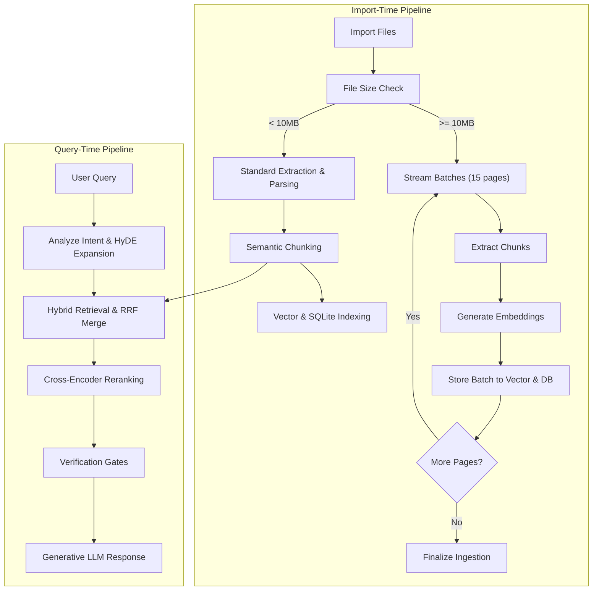

# OpenIntelligence

> **Documentation status:** Verified for OpenIntelligence v4.5 on July 1, 2026.
> **Scope:** Describes shipped behavior for on-device Apple Intelligence RAG architecture.

<p align="center">
   
</p>

<p align="center">
   <strong>Local-first document intelligence for macOS and iOS, featuring an entirely on-device Retrieval-Augmented Generation (RAG) pipeline and native Apple Foundation Models integration.</strong>
</p>

<p align="center">
   <a href="https://apps.apple.com/us/app/openintelligence/id6756559175"></a>
   <a href="Docs/DEMO.md"></a>
   <a href="Docs/OPENINTELLIGENCE_ARCHITECTURE_ATLAS.md"></a>
   <a href="https://gunzino.notion.site/OpenIntelligence-Public-Roadmap-e4446012bb8940e6b78a745aee688075"></a>
</p>

OpenIntelligence is an exploratory, privacy-obsessed document query assistant built natively for Apple platforms. It demonstrates that production-grade document ingestion, vector indexing, lexical retrieval, and generative AI can run **entirely on device** without sacrificing privacy or relying on third-party cloud wrappers.

---

## 📚 Rigorous Engineering Documentation

OpenIntelligence is backed by extensive, rigorous engineering documentation detailing how reliable, hallucination-resistant on-device RAG is achieved using Apple's 4K-token local context windows.

### 🗺️ Documentation Atlas
* [**Documentation Atlas (`Docs/README.md`)**](Docs/README.md): The unified index of all verified codebase audits, pipeline specs, and technical research sheets. Start here to navigate the documentation.

### Core Architecture & Systems
* [**System Architecture**](Docs/OPENINTELLIGENCE_ARCHITECTURE_ATLAS.md): The high-level view of the decoupled import-time and query-time pipelines.
* [**Retrieval Pipeline (`RETRIEVAL_PIPELINE.md`)**](Docs/RETRIEVAL_PIPELINE.md): Deep dive into the hybrid search engine (BM25 + Core ML Vector) and Reciprocal Rank Fusion implementation.
* [**Ingestion Pipeline (`INGESTION_PIPELINE.md`)**](Docs/INGESTION_PIPELINE.md): Details of the semantic chunker, local Vision OCR fallbacks, and NLP metadata extraction.
* [**Privacy & Routing (`PRIVACY_AND_ROUTING.md`)**](Docs/PRIVACY_AND_ROUTING.md): Strict local-first data guarantees, local cache layouts, and routing protocols.

### Apple Intelligence Engineering Specs
* [**Apple Foundation Models Specs**](Docs/Engineering/APPLE_MODELS.md): Optimization guide for macOS/iOS 26.x/27, managing 4K token budgets, guided generation via `@Generable`, and `SystemLanguageModel` sessions.
* [**Apple Document Intelligence**](Docs/Engineering/APPLE_DOCUMENT_INTELLIGENCE.md): Practical integration with Vision OCR, SFSpeechRecognizer, PDFKit, and CoreText for semantic document parsing.
* [**Private Cloud Compute (PCC)**](Docs/Engineering/PRIVATE_CLOUD_COMPUTE.md): Analysis of Apple's PCC enclave constraints, secure remote processing, and native execution routing layers.

### Audits & Constraints
* [**Hard Limits**](Docs/Engineering/HARD_LIMITS.md): A centralized reference for token boundaries, model caps, memory limitations, and platform bottlenecks.
* [**Current State & Gaps**](Docs/CURRENT_STATE_AND_GAPS.md): Analysis of local inference latency, context packing, and model capability gaps.
* [**Evaluation Framework**](Docs/EVALS.md): Detailed verification procedures using `scripts/run_rag_benchmarks.py` to assert extraction accuracy and similarity scores.

---

## ⚙️ Technical Architecture Overview

The runtime operates in two decoupled phases:


```mermaid
flowchart TD
  subgraph INGEST["Import-Time Pipeline"]
    A1["Import Files"]
    A2["File Size Check"]
    A1 --> A2
    A2 -- "< 10MB" --> A3["Standard Extraction & Parsing"]
    A3 --> A4["Semantic Chunking"]
    A4 --> A5["Vector & SQLite Indexing"]
    
    A2 -- ">= 10MB" --> S1["Stream Batches (15 pages)"]
    S1 --> S2["Extract Chunks"]
    S2 --> S3["Generate Embeddings"]
    S3 --> S4["Store Batch to Vector & DB"]
    S4 --> S5{"More Pages?"}
    S5 -- "Yes" --> S1
    S5 -- "No" --> S6["Finalize Ingestion"]
  end

  subgraph QUERY["Query-Time Pipeline"]
    B1["User Query"]
    B2["Analyze Intent & HyDE Expansion"]
    B3["Hybrid Retrieval & RRF Merge"]
    B4["Cross-Encoder Reranking"]
    B5["Verification Gates"]
    B6["Generative LLM Response"]
    B1 --> B2 --> B3 --> B4 --> B5 --> B6
  end

  A4 --> B3
```

### 🧠 Quality Modes & Inference Routing
The entire RAG architecture operates on a strict **29-Step Pipeline** (6 Ingestion steps + 23 Query Loop steps). To handle complex queries, the query loop routes dynamically across three agentic modes and foundation models:

#### 3 Agentic Quality Modes
* **Standard:** Executes the 23-step query loop sequentially for maximum speed and battery life.
* **Deep Think:** Actively loops the retrieval agent through 4-10 concurrent reasoning sessions until it hits 98% confidence (scales dynamically based on device thermal state).
* **Maximum:** Removes the 8-session ceiling, granting the orchestrator an unlimited budget to recursively hunt down answers up to 50 loops.

#### 3 Foundation Model Routes
* **3B Core:** Offline Apple Silicon model (`SystemLanguageModel.default`) executing standard query tasks.
* **20B Advanced:** Offline Apple Silicon model leveraging unified memory and NAND Flash Paging for enhanced reasoning.
* **Private Cloud Compute (PT-MoE):** Escalates over encrypted channels to Apple's 32K context secure server enclaves. Integrates native `FoundationModels.PrivateCloudComputeLanguageModel` execution when running on iOS 27 / macOS 27+, falling back cleanly to local `SystemLanguageModel` simulation on older OS versions.

---

## 🗺️ Codebase Map

| Module | Core Files | Responsibility |
| :--- | :--- | :--- |
| **Ingestion** | `DocumentProcessor.swift`, `LayoutAwareExtractor.swift` | Document content extraction, Vision OCR fallback, semantic structure recovery. |
| **Chunking** | `SemanticChunker.swift`, `ContentTaggingService.swift` | Context-aware document chunking, entity resolution, NLP metadata enrichment. |
| **Indexing** | `SQLiteFullTextService.swift`, `BNNSVectorDatabase.swift` | SQLite FTS5 lexical storage and local BNNS-accelerated vector indexing. |
| **Retrieval** | `HybridSearchService.swift`, `ContextPackingService.swift` | BM25 + Vector hybrid merging, parent-chunk reconstruction, exact token packing. |
| **Orchestration** | `RAGEngine.swift`, `AgenticOrchestrator.swift` | Reranking, MMR, context packing, execution coordination, and closed-loop agentic reasoning. |
| **Foundation Models**| `LLMService.swift`, `FoundationModelRoutePolicy.swift` | On-device SLM context execution, Private Cloud Compute escalation, and routing. |
| **Evidence Threads**| `EvidenceThread.swift`, `EvidenceThreadStore.swift` | Thread-safe local persistence of conversational research queries and verification results. |
| **Storage & Sync**| `SettingsStore.swift`, `EntitlementStore.swift` | Persistence of feature gates, StoreKit 2 quotas, and iCloud ubiquity container sync. |
| **User Interface**| `ChatScreen.swift`, `DocumentLibraryView.swift` | Primary SwiftUI surfaces for conversational RAG queries and library document management. |
| **Shortcuts** | `RAGAppIntents.swift`, `ScreenAwarenessIntents.swift` | Siri voice integration and entity-native App Intents resolving in-process. |
| **Diagnostics** | `EvidenceThreadDebugService.swift` | Developer-only view and helper service to test local persistent store integrity. |

---

## 🛠️ Placeholders & Scaffolding Warnings

To maintain codebase transparency, please note:
* **Core AI Integration:** Fully integrated and registered via `CoreAISentenceEmbeddingProvider.swift`. Runs zero-copy Silicon-native sentence embeddings on iOS 27+ / macOS 27+ compatible devices, automatically falling back to the standard `CoreMLSentenceEmbeddingProvider` on older targets. Powered by a unified, high-performance Rust-backed `swift-tokenizers` (DePasqualeOrg) wrapper target for microsecond-latency batch tokenization and exact byte-level offset matching.
* **Private Cloud Compute (PCC):** Native Private Cloud Compute secure enclave execution is integrated for iOS 27 / macOS 27+, falling back cleanly to local simulation via `EngineSDKCompatibility.swift` on older OS releases. Runtime signature checking via `EntitlementChecker` dynamically detects missing developer entitlements and redirects to local on-device models to prevent process crashes.
* **iCloud Sync:** Sync utilizes iCloud Drive ubiquity containers (`NSFileCoordinator` and `NSMetadataQuery`). The app does not utilize CloudKit databases.
* **Pro Tier Document Limit:** Document uploads are restricted to a hard quota of 1,000 documents under the Pro tier. Unlimited uploads are restricted to the Lifetime tier.
* **Evidence Thread Synchronization:** Thread history JSON arrays are stored under `Application Support/EvidenceThreads/<containerId>/` and are synchronized bidirectionally across devices via `WorkspaceSyncService` in iCloud Drive, gated by tier-specific limits (5 Free / 20 Pro / Unlimited Lifetime).

---

## 🚀 Build & Verification

### Requirements
* macOS Tahoe (26.x) with Xcode 26+
* iOS 26.0+ SDK target support
* Apple Silicon (M1+ / A17 Pro+) for adequate Neural Engine throughput

### Instructions
1. Clear macOS extended attributes to prevent codesign failure:
   ```bash
   /usr/bin/xattr -cr /Users/gunnarhostetler/Documents/GitHub/OpenIntelligence
   ```
2. Compile the simulator smoke target:
   ```bash
   ./scripts/build_simulator_smoke.sh
   ```
3. Execute the local RAG pipeline validation harness:
   ```bash
   python3 scripts/run_rag_benchmarks.py
   ```

---

## License
OpenIntelligence is open-source software. See [LICENSE](LICENSE) for details.
\n## Document Ingestion Optimization\nOpenIntelligence now supports massive documents (500+ pages) through an end-to-end streamed and batched ingestion pipeline, preventing OOM crashes during CoreImage text-layer rendering and LLM embedding generation.\n