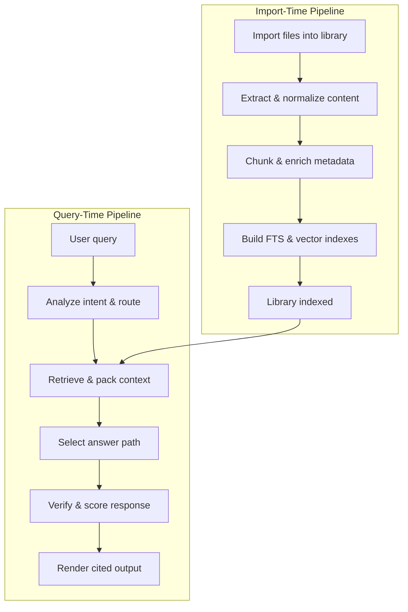

# OpenIntelligence

> **Documentation status:** Verified for OpenIntelligence v4.1 on 2026-06-13.
> **Source of truth:** Codebase audit in `Docs/AUDIT/`.
> **Scope:** Describes shipped behavior unless explicitly labeled experimental, developer-only, or scaffolded.

<p align="center">
   
</p>

<p align="center">
   <strong>Local-first document intelligence for iPhone and iPad, with a reusable engine boundary and Mac evaluation paths in the repo.</strong>
</p>

<p align="center">
   <a href="https://apps.apple.com/us/app/openintelligence/id6756559175"></a>
   <a href="Docs/DEMO.md"></a>
   <a href="Docs/ARCHITECTURE.md"></a>
</p>

OpenIntelligence is a local-first document query and retrieval-augmented generation (RAG) assistant built natively for Apple platforms. I designed the app to process document ingestion, lexical and vector indexing, and query orchestration locally using system frameworks.

---

## Technical Architecture Overview

The runtime operates in two decoupled phases: import-time document indexing and query-time retrieval/generation.


```mermaid
flowchart TD
  subgraph INGEST[Import-Time Pipeline]
    A1[Import files into library]
    A2[Extract & normalize content]
    A3[Chunk & enrich metadata]
    A4[Build FTS & vector indexes]
    A5[Library indexed]
    A1 --> A2 --> A3 --> A4 --> A5
  end

  subgraph QUERY[Query-Time Pipeline]
    B1[User query]
    B2[Analyze intent & route]
    B3[Retrieve & pack context]
    B4[Select answer path]
    B5[Verify & score response]
    B6[Render cited output]
    B1 --> B2 --> B3 --> B4 --> B5 --> B6
  end

  A5 --> B3
```

### Ingestion & Indexing Pipeline
The ingestion engine extracts text layers and structures from PDFs or text documents, falls back to local Vision OCR for non-text assets, normalizes the output, and builds scoped indexes.

### Query Pipeline
The query path builds a profile, runs vector and lexical searches in parallel, merges results via Reciprocal Rank Fusion (RRF), packs context, executes an on-device Core ML cross-encoder reranker (with heuristic fallbacks), and applies negation-based verification gates to prevent hallucinations.

---

## Codebase Map

| Module             | Core Files | Responsibility |
| ------------------ | ---------- | -------------- |
| **Ingestion**      | [DocumentProcessor.swift](OpenIntelligence/Services/Document/Processing/DocumentProcessor.swift), [IntelligentDocumentProcessor.swift](OpenIntelligence/Services/Document/Processing/IntelligentDocumentProcessor.swift), [StructuredDocumentParser.swift](OpenIntelligence/Services/Document/Processing/StructuredDocumentParser.swift), [LayoutAwareExtractor.swift](OpenIntelligence/Services/Document/Processing/LayoutAwareExtractor.swift) | Document content extraction, OCR fallback, structure recovery. |
| **Chunking**       | [SemanticChunker.swift](OpenIntelligence/Services/Document/Chunking/SemanticChunker.swift), [ContentTaggingService.swift](OpenIntelligence/Services/Document/Chunking/ContentTaggingService.swift), [EntityIndexService.swift](OpenIntelligence/Services/Document/Analysis/EntityIndexService.swift) | Parsing raw text into chunks, entity resolution, metadata enrichment. |
| **Indexing**       | [EmbeddingService.swift](OpenIntelligence/Services/Embedding/EmbeddingService.swift), [SQLiteFullTextService.swift](OpenIntelligence/Services/Storage/SQLiteFullTextService.swift), [VectorStoreRouter.swift](OpenIntelligence/Services/VectorStore/VectorStoreRouter.swift), [BNNSVectorDatabase.swift](OpenIntelligence/Services/VectorStore/BNNSVectorDatabase.swift) | SQLite FTS5 lexical storage, BNNS-accelerated local vector indexing. |
| **Query Planning** | [QueryProfileService.swift](OpenIntelligence/Services/Query/Analysis/QueryProfileService.swift), [QueryRewriterService.swift](OpenIntelligence/Services/Query/Rewriting/QueryRewriterService.swift), [HyDEService.swift](OpenIntelligence/Services/Query/Rewriting/HyDEService.swift) | Query profiling, intent classification, expansion, HyDE generation. |
| **Retrieval**      | [HybridSearchService.swift](OpenIntelligence/Services/RAG/Retrieval/HybridSearchService.swift), [IterativeRetrievalService.swift](OpenIntelligence/Services/RAG/Retrieval/IterativeRetrievalService.swift), [ParentDocumentService.swift](OpenIntelligence/Services/RAG/Retrieval/ParentDocumentService.swift), [ContextPackingService.swift](OpenIntelligence/Services/RAG/Retrieval/ContextPackingService.swift) | Hybrid merging, parent-chunk context reconstruction, token-budget packing. |
| **Orchestration**  | [ExtractiveQAService.swift](OpenIntelligence/Services/RAG/Extraction/ExtractiveQAService.swift), [LLMService.swift](OpenIntelligence/Services/LLM/LLMService.swift), [AgenticOrchestrator.swift](OpenIntelligence/Services/Agentic/AgenticOrchestrator.swift), [RAGService.swift](OpenIntelligence/Services/RAG/Orchestration/RAGService.swift) | Generation coordination, agentic pipelines, validation loops. |
| **Evaluations**    | [RAGEvalRunner.swift](OpenIntelligence/Services/Evaluation/RAGEvalRunner.swift), [AppleEvaluationsBridge.swift](OpenIntelligence/Services/Evaluation/AppleEvaluationsBridge.swift) | RAG query evaluation, performance metrics calculation, and report generation. |
| **Diagnostics**    | [ChatScreen.swift](OpenIntelligence/Features/Chat/Conversation/ChatScreen.swift), [RAGPipelineAuditView.swift](OpenIntelligence/Features/Diagnostics/Validation/RAGPipelineAuditView.swift), [DebugRAGValidationHarness.swift](OpenIntelligence/App/DebugRAGValidationHarness.swift), [run_rag_benchmarks.py](scripts/run_rag_benchmarks.py) | Telemetry overlays, audit logs, CLI evaluation harness. |

---

## Technical Constants & Constraints

* **On-Device Context Limit**: 4,096 total token context window (includes system prompt, chat history, retrieval targets, and output buffer).
* **Embedding Model Output**: 384-dimensional dense vectors calculated using local BNNS frameworks.
* **Lexical Indexing**: SQLite FTS5 configured with BM25 column weights prioritizing section headings and entity tags.
* **Confidence Gate Threshold**: Grounded RAG responses require a semantic evidence overlap index of `0.70` to verify output generation.

---

## StoreKit Billing Tiers & Resource Quotas
Limits are enforced locally in [EntitlementStore.swift](file:///Users/gunnarhostetler/Documents/GitHub/OpenIntelligence-Public/OpenIntelligence/Services/Billing/EntitlementStore.swift) via StoreKit 2 APIs:

* **Free Tier:** Limited to **5 documents**, **1 library**, and **3 Maximum mode runs per day**.
* **Pro Tier (`pro_monthly`, `pro_annual`):** Limited to **1,000 documents**, **10 libraries**, and **unlimited** Maximum mode runs.
* **Lifetime Tier (`lifetime_cohort`):** Unlimited documents, up to **20 libraries**, and **unlimited** Maximum mode runs.
* **Document Pack Add-On (`doc_pack_addon`):** Consumable purchase that adds **+10 document slots** (up to 3 active packs active simultaneously for a maximum bonus of +30 slots).

---

## Placeholders & Scaffolding Warnings
To maintain codebase transparency, I document the following scaffolded layers:
- **Core AI Integration:** Disabled via `#if false` directives in [CoreAISentenceEmbeddingProvider.swift](file:///Users/gunnarhostetler/Documents/GitHub/OpenIntelligence-Public/OpenIntelligence/Services/Embedding/Providers/CoreAISentenceEmbeddingProvider.swift). The project currently runs on local `CoreMLSentenceEmbeddingProvider` code.
- **Private Cloud Compute (PCC) Routing:** Simulated using a local system language model compatibility wrapper in [EngineSDKCompatibility.swift](file:///Users/gunnarhostetler/Documents/GitHub/OpenIntelligence-Public/OpenIntelligence/Core/Support/EngineSDKCompatibility.swift). No remote enclave execution is compiled in or active.

---

## Build & Verification

### Requirements
* macOS with Xcode.
* iOS 26.0+ SDK target support.
* Simulator configured.

### Instructions
1. **Clear macOS extended attributes to prevent codesign failure**:
   ```bash
   /usr/bin/xattr -cr /Users/gunnarhostetler/Documents/GitHub/OpenIntelligence-Public/OpenIntelligence
   ```
2. **Compile the simulator smoke target**:
   ```bash
   ./scripts/build_simulator_smoke.sh
   ```
3. **Execute local RAG pipeline validation harness**:
   ```bash
   python3 scripts/run_rag_benchmarks.py
   ```

---

## Scope & Limitations
OpenIntelligence is an exploratory technical implementation of on-device RAG. Responses depend on local foundation model availability and on-device memory constraints. Core engine targets and schemas are subject to change.

## License
See [LICENSE](LICENSE).
