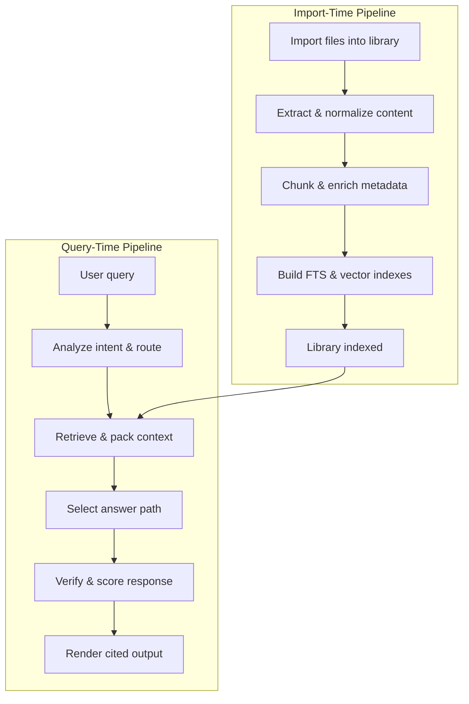
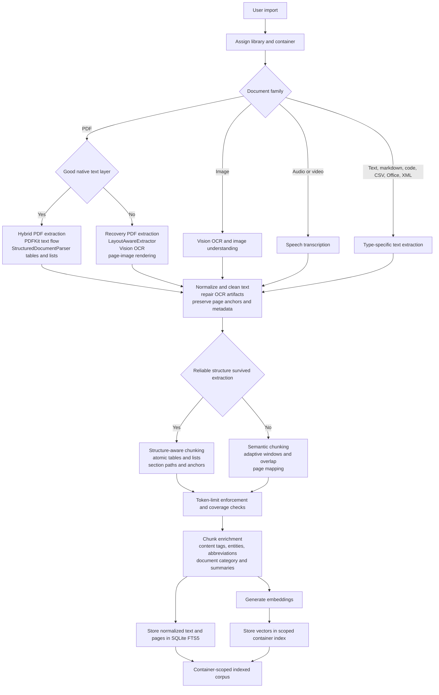
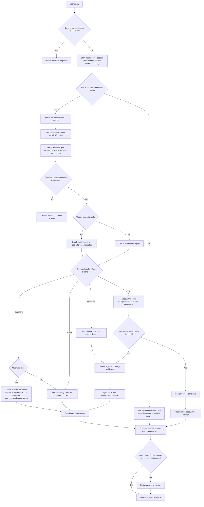

# OpenIntelligence

<p align="center">
   
</p>

<p align="center">
   <strong>Local-first document intelligence for iPhone and iPad, with a reusable engine boundary and Mac evaluation paths in the repo.</strong>
</p>

<p align="center">
   <a href="https://apps.apple.com/us/app/openintelligence/id6756559175"></a>
   <a href="Docs/DEMO.md"></a>
   <a href="Docs/ARCHITECTURE.md"></a>
</p>

OpenIntelligence is a local-first document query and retrieval-augmented generation (RAG) product built natively for Apple platforms. It handles document ingestion, lexical and vector indexing, and grounded query orchestration using Apple platform capabilities, with the public shipping app on iPhone and iPad and broader engine evaluation paths inside the repo.

---

## System Architecture

The runtime operates in two decoupled phases: import-time document indexing and query-time retrieval and generation.


```mermaid
flowchart TD
  subgraph INGEST[Import-Time Pipeline]
    A1[Import files into library]
    A2[Extract & normalize content]
    A3[Chunk & enrich metadata]
    A4[Build FTS & vector indexes]
    A5[Library indexed]
    A1 --> A2 --> A3 --> A4 --> A5
  end

  subgraph QUERY[Query-Time Pipeline]
    B1[User query]
    B2[Analyze intent & route]
    B3[Retrieve & pack context]
    B4[Select answer path]
    B5[Verify & score response]
    B6[Render cited output]
    B1 --> B2 --> B3 --> B4 --> B5 --> B6
  end

  A5 --> B3
```

### Ingestion & Indexing Pipeline
The ingestion engine branches based on file type and text quality, extracting structured lists/tables and generating OCR layout flows where native text is missing.


```mermaid
flowchart TD
   A[User import] --> B[Assign library and container]
   B --> C{Document family}
   C -- PDF --> D{Good native text layer}
   D -- Yes --> E[Hybrid PDF extraction<br/>PDFKit text flow<br/>StructuredDocumentParser tables and lists]
   D -- No --> F[Recovery PDF extraction<br/>LayoutAwareExtractor<br/>Vision OCR<br/>page-image rendering]
   C -- Image --> G[Vision OCR and image understanding]
   C -- Audio or video --> H[Speech transcription]
   C -- Text, markdown, code, CSV, Office, XML --> I[Type-specific text extraction]
   E --> J[Normalize and clean text<br/>repair OCR artifacts<br/>preserve page anchors and metadata]
   F --> J
   G --> J
   H --> J
   I --> J
   J --> K{Reliable structure survived extraction}
   K -- Yes --> L[Structure-aware chunking<br/>atomic tables and lists<br/>section paths and anchors]
   K -- No --> M[Semantic chunking<br/>adaptive windows and overlap<br/>page mapping]
   L --> N[Token-limit enforcement and coverage checks]
   M --> N
   N --> O[Chunk enrichment<br/>content tags, entities, abbreviations<br/>document category and summaries]
   O --> P[Store normalized text and pages in SQLite FTS5]
   O --> Q[Generate embeddings]
   Q --> R[Store vectors in scoped container index]
   P --> S[Container-scoped indexed corpus]
   R --> S
```

### Single-Pass Query Pipeline
The standard query flow runs lexical and vector searches, applies parent-chunk expansion, packages context within on-device constraints, and runs output verification gates.


```mermaid
flowchart TD
   A[User query] --> B[Build query profile and execution plan]
   B --> C{Agentic selected}
   C -- Yes --> AGENT[Hand off to agentic map below]
   C -- No --> D[Resolve embedding context<br/>quality-mode toggles<br/>container retrieval config]
   D --> E{Literal or exact-phrase lookup}
   E -- Yes --> F[Keep user wording literal]
   E -- No --> G[Rewrite query when enabled]
   F --> H{Expansion enabled}
   G --> H
   H -- Yes --> I[Add planner expansions<br/>heuristics, container vocabulary<br/>gazetteer terms]
   H -- No --> J[Use current effective query]
   I --> K[Classify answer intent and routing]
   J --> K
   K --> L{HyDE allowed for this intent}
   L -- Yes --> M[Generate hypothetical answer doc and embed it]
   L -- No --> N[Embed effective query directly]
   M --> O{Iterative retrieval enabled}
   N --> O
   O -- Yes --> P[Iterative retrieval loop]
   O -- No --> Q[Hybrid retrieval<br/>vector plus FTS plus exact match]
   P --> R[Rerank and confidence filter]
   Q --> R
   R --> S[Shape the evidence pack<br/>MMR diversity, parent expansion<br/>compression, graph pack, cross-ref recovery]
   S --> T{Corrective or cascade retrieval needed}
   T -- Yes --> U[Broaden search and recover missing evidence]
   T -- No --> V[Lock current evidence pack]
   U --> V
   V --> W[Assess evidence strength and answer intent]
   W --> X{Summarize with extractive-first lane}
   X -- Yes --> Y[Return extractive summary early]
   X -- No --> Z{Exact value or extractive question}
   Z -- Yes --> AA{High-precision direct extraction found}
   Z -- No --> AB[Build grounded prompt<br/>citations, conversation memory<br/>intent-specific instructions]
   AA -- Yes --> AC[Return direct source extraction early]
   AA -- No --> AB
   AB --> AD{Evidence weak or topical mismatch}
   AD -- Yes --> AE[Use Evidence-First prompt]
   AD -- No --> AF[Use standard grounded prompt]
   AE --> AG[LLM generation]
   AF --> AG
   AG --> AH{Context overflow or empty answer}
   AH -- Yes --> AI[Retry with smaller evidence pack]
   AH -- No --> AJ[Use generated answer]
   AI --> AJ
   AJ --> AK{Post-generation extraction override}
   AK -- Yes --> AL[Replace answer with direct extraction]
   AK -- No --> AM[Keep generated answer]
   AL --> AN[Quality assessment]
   AM --> AN
   AN --> AO{Verification gates enabled}
   AO -- Yes --> AP{Verification passes}
   AP -- No --> AQ[Grounded abstention or warned response]
   AP -- Yes --> AR[Calibrate confidence]
   AO -- No --> AR
   AR --> AS{Source-only refinement needed}
   AS -- Yes --> AT[Refine answer or abstain]
   AS -- No --> AU[Finalize cited response]
   AQ --> AU
   AT --> AU
```

### Agentic Orchestration Map
Deeper reasoning queries route through a multi-step orchestration loop featuring self-critique, multi-query retrieval, and speculative validation.


```mermaid
flowchart TD
   A[User query] --> B{Direct precision lookup succeeds first}
   B -- Yes --> C[Return precision response]
   B -- No --> D[Start fresh agentic session<br/>choose Deep Think or Maximum config]
   D --> E{Self-RAG says retrieval is needed}
   E -- No --> F[Run Self-RAG answer path<br/>self-critique and grounded answer]
   E -- Yes --> G[Generate diverse search queries]
   G --> H[Run multi-query search with RRF fusion]
   H --> I[Hard relevance gate<br/>lexical check plus semantic intent check]
   I --> J{Evidence relevant enough to continue}
   J -- No --> K[Return honest not-found answer]
   J -- Yes --> L{Quality moderate or low}
   L -- Yes --> M[Graph expansion and cross-reference resolution]
   L -- No --> N[Keep initial evidence pool]
   M --> O{Retrieval quality after expansion}
   N --> O
   O -- Excellent --> P{Maximum mode}
   P -- Yes --> Q[Gather broader chunk set<br/>run unlimited multi-session reasoning<br/>stop near confidence target]
   P -- No --> R[Run reasoning chain on sorted chunks]
   O -- Good --> R
   O -- Moderate --> S[Reformulate query or recurse deeper]
   O -- Low --> T[Speculative RAG<br/>multiple candidates plus verification]
   S --> U[Search again and merge evidence]
   T --> V{Speculative result clears threshold}
   V -- Yes --> W[Accept verified candidate]
   V -- No --> U
   U --> X[Synthesize with accumulated context]
   Q --> Y[Self-RAG 2.0 verification]
   R --> Y
   W --> Z[Use verified speculative answer]
   X --> Y
   Y --> AA[Build final agentic answer and reasoning trace]
   F --> AA
   Z --> AA
   AA --> AB{Direct extraction or source-only refinement needed}
   AB -- Yes --> AC[Refine answer or abstain]
   AB -- No --> AD[Finalize agentic response]
   AC --> AD
```

---

## File Entry Points

| Module             | Core Files | Responsibility |
| ------------------ | ---------- | -------------- |
| **Ingestion**      | [DocumentProcessor.swift](OpenIntelligence/Services/Document/Processing/DocumentProcessor.swift), [IntelligentDocumentProcessor.swift](OpenIntelligence/Services/Document/Processing/IntelligentDocumentProcessor.swift), [StructuredDocumentParser.swift](OpenIntelligence/Services/Document/Processing/StructuredDocumentParser.swift), [LayoutAwareExtractor.swift](OpenIntelligence/Services/Document/Processing/LayoutAwareExtractor.swift) | Document content extraction, OCR fallback, structure recovery. |
| **Chunking**       | [SemanticChunker.swift](OpenIntelligence/Services/Document/Chunking/SemanticChunker.swift), [ContentTaggingService.swift](OpenIntelligence/Services/Document/Chunking/ContentTaggingService.swift), [EntityIndexService.swift](OpenIntelligence/Services/Document/Analysis/EntityIndexService.swift) | Parsing raw text into chunks, entity resolution, metadata enrichment. |
| **Indexing**       | [EmbeddingService.swift](OpenIntelligence/Services/Embedding/EmbeddingService.swift), [SQLiteFullTextService.swift](OpenIntelligence/Services/Storage/SQLiteFullTextService.swift), [VectorStoreRouter.swift](OpenIntelligence/Services/VectorStore/VectorStoreRouter.swift), [BNNSVectorDatabase.swift](OpenIntelligence/Services/VectorStore/BNNSVectorDatabase.swift) | SQLite FTS5 lexical storage, BNNS-accelerated local vector indexing. |
| **Query Planning** | [QueryProfileService.swift](OpenIntelligence/Services/Query/Analysis/QueryProfileService.swift), [QueryRewriterService.swift](OpenIntelligence/Services/Query/Rewriting/QueryRewriterService.swift), [HyDEService.swift](OpenIntelligence/Services/Query/Rewriting/HyDEService.swift) | Query profiling, intent classification, expansion, HyDE generation. |
| **Retrieval**      | [HybridSearchService.swift](OpenIntelligence/Services/RAG/Retrieval/HybridSearchService.swift), [IterativeRetrievalService.swift](OpenIntelligence/Services/RAG/Retrieval/IterativeRetrievalService.swift), [ParentDocumentService.swift](OpenIntelligence/Services/RAG/Retrieval/ParentDocumentService.swift), [ContextPackingService.swift](OpenIntelligence/Services/RAG/Retrieval/ContextPackingService.swift) | Hybrid merging, parent-chunk context reconstruction, token-budget packing. |
| **Orchestration**  | [ExtractiveQAService.swift](OpenIntelligence/Services/RAG/Extraction/ExtractiveQAService.swift), [LLMService.swift](OpenIntelligence/Services/LLM/LLMService.swift), [AgenticOrchestrator.swift](OpenIntelligence/Services/Agentic/AgenticOrchestrator.swift), [RAGService.swift](OpenIntelligence/Services/RAG/Orchestration/RAGService.swift) | Generation coordination, agentic pipelines, validation loops. |
| **AI Platform**    | [FoundationModelSessionFactory.swift](OpenIntelligence/Services/AIPlatform/AppleFoundationModels/FoundationModelSessionFactory.swift), [FoundationModelRoutePolicy.swift](OpenIntelligence/Services/AIPlatform/AppleFoundationModels/FoundationModelRoutePolicy.swift), [CoreAIModelRegistry.swift](OpenIntelligence/Services/AIPlatform/CoreAI/CoreAIModelRegistry.swift) | Core AI custom local model registry, Apple Foundation Model session factory, and PCC vs on-device route selection policy. |
| **Evaluations**    | [RAGEvalRunner.swift](OpenIntelligence/Services/Evaluation/RAGEvalRunner.swift), [AppleEvaluationsBridge.swift](OpenIntelligence/Services/Evaluation/AppleEvaluationsBridge.swift) | RAG query evaluation, performance metrics calculation, and report generation. |
| **Diagnostics**    | [ChatScreen.swift](OpenIntelligence/Features/Chat/Conversation/ChatScreen.swift), [RAGPipelineAuditView.swift](OpenIntelligence/Features/Diagnostics/Validation/RAGPipelineAuditView.swift), [DebugRAGValidationHarness.swift](OpenIntelligence/App/DebugRAGValidationHarness.swift), [run_rag_benchmarks.py](scripts/run_rag_benchmarks.py) | Telemetry overlays, audit logs, CLI evaluation harness. |

---

## Technical Constraints & Constants

* **On-Device Context Limit**: 4,096 total token context window (includes system prompt, chat history, retrieval targets, and output buffer).
* **Private Cloud Compute (PCC) Limit**: Up to 32,768 tokens dynamically supported when queries route to secure cloud enclaves.
* **Embedding Model Output**: 384-dimensional dense vectors calculated using local BNNS frameworks.
* **Lexical Indexing**: SQLite FTS5 configured with adjusted BM25 column weights prioritizing section headings and entity tags.
* **Confidence Gate Threshold**: Grounded RAG responses require a semantic evidence overlap index of `0.70` to verify output generation.

---

## Release History

| Version   | Focus |
| --------- | ----- |
| **4.0**   | WWDC26 Apple Intelligence modernization: dynamic On-Device vs. PCC model routing, Core AI frameworks foundation, first-class RAG Evaluations suite, and Liquid Glass UI. |
| **3.7**   | Library layout refactoring, background ingestion queues, tab-switching lag elimination, and successful-answer review prompting. |
| **3.6**   | Container-isolated iCloud Drive sync, stable library identity reconciliation, and digital text preservation updates.            |
| **3.5**   | Exact-value lookup improvements, empty state onboarding updates, and PDF/image processing consolidation.                        |
| **3.3**   | Queue state recovery on interruption, adaptive visual PDF ingestion, and figure extraction.                                     |
| **3.2.5** | Precision database checks prior to standard generation, target table row anchoring.                                             |
| **3.1**   | Custom layout fallback for multi-column structures, verification loop tuning.                                                   |
| **3.0**   | Initial native layout extraction and structured answer resolution implementation.                                               |
| **2.0.0** | Initial Native iOS RAG application release with local vector/lexical index engines and container isolation.                     |

---

## Build & Verification

### Requirements
* macOS with Xcode.
* iOS 26.0+ SDK target support.
* Simulator configured.

### Instructions
1. **Clear macOS extended attributes to prevent codesign failure**:
   ```bash
   /usr/bin/xattr -cr /Users/gunnarhostetler/Documents/GitHub/OpenIntelligence-Public/OpenIntelligence
   ```
2. **Compile the simulator smoke target**:
   ```bash
   ./scripts/build_simulator_smoke.sh
   ```
3. **Execute local RAG pipeline validation harness**:
   ```bash
   python3 scripts/run_rag_benchmarks.py
   ```

---

## Limitations & Scope

* The system is a technical prototype and exploratory implementation of on-device RAG.
* Core engine targets and schemas are subject to change.
* Responses depend on local foundation model availability and on-device memory constraints.

## License

See [LICENSE](LICENSE).
