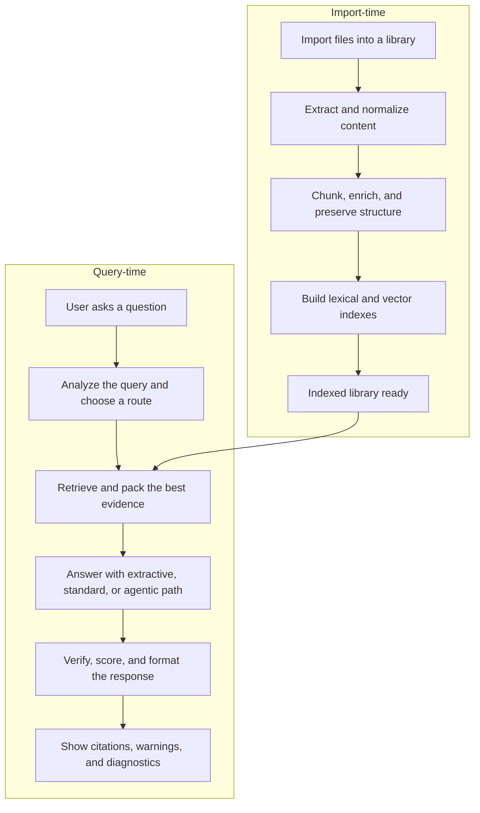
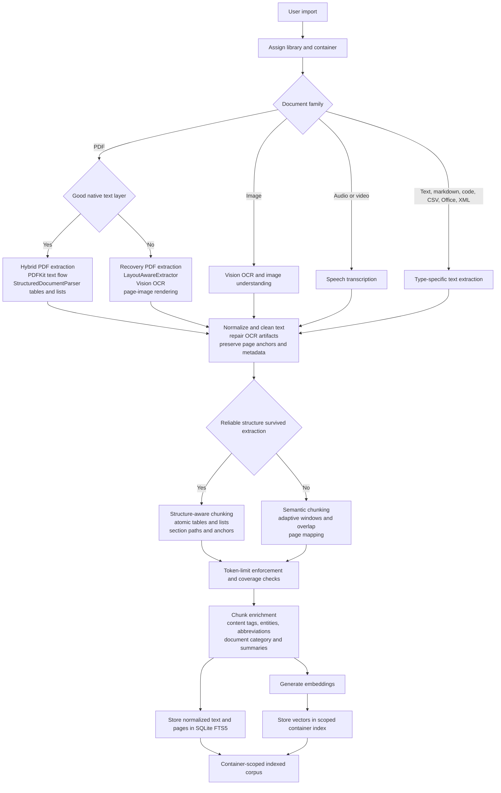
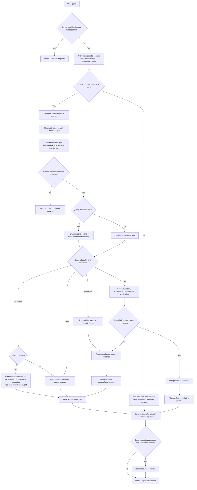
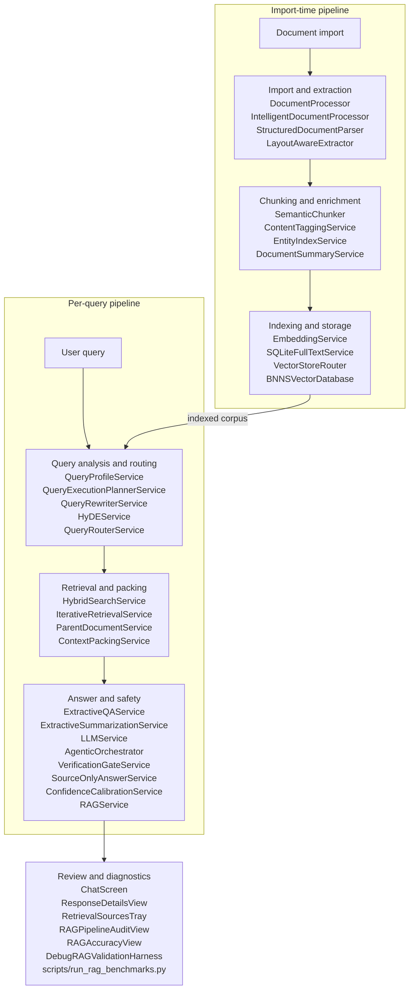
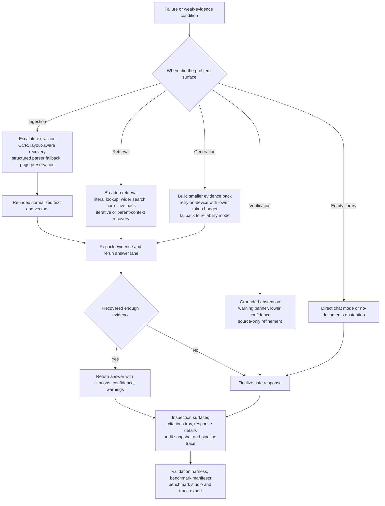

# OpenIntelligence

<p align="center">
   
</p>

<p align="center">
   <strong>Your documents. Clear answers.</strong>
</p>

<p align="center">
   Apple-native document intelligence for iPhone — built to ingest PDFs, scans, screenshots, notes, and other user-controlled files, retrieve the right evidence, and answer with citations, verification signals, and visible reasoning paths.
</p>

<p align="center">
   <a href="https://apps.apple.com/us/app/openintelligence/id6756559175"></a>
   <a href="Docs/DEMO.md"></a>
   <a href="Docs/ARCHITECTURE.md"></a>
</p>

<p align="center">
   <a href="HOW_IT_WORKS.md">How it works</a> ·
   <a href="Docs/RETRIEVAL_PIPELINE.md">Retrieval pipeline</a> ·
   <a href="Benchmarks/README.md">Benchmarks</a> ·
   <a href="WHATS_NEW.md">What's new</a>
</p>

<p align="center">
   
   
   
    
   
    
</p>

OpenIntelligence is an experimental SwiftUI iPhone app for Apple-native document intelligence, PDF Q&A, OCR-aware ingestion, and source-backed answers over user-controlled files. It turns messy real-world documents into a cited, inspectable intelligence layer with library-scoped retrieval, confidence signals, and answer paths you can actually inspect.

This repository is intentionally code-first and engineering-first: the SwiftUI app, document ingestion services, retrieval stack, answer grounding logic, benchmark harness, local model resources, technical notes, research references, and inspection assets are all linked from this front page so people can evaluate the product and the implementation side by side.

OpenIntelligence is a proof-of-concept and portfolio project. It is not a finished enterprise SDK, regulated healthcare system, clinical decision-support tool, diagnostic system, production-ready commercial product, company, or product for sale.

## Product Tour

<p align="center"><em>Current UI from the App Store build.</em></p>

<table>
   <tr>
      <td width="50%" valign="top">
         <a href=".github/assets/screenshots/openintelligence-onboarding.png"></a><br>
         <strong>Built for your files</strong><br>
         Import PDFs, Office docs, scans, images, code, and transcripts into a source-backed document workflow.
      </td>
      <td width="50%" valign="top">
         <a href=".github/assets/screenshots/openintelligence-ingestion-pipeline.png"></a><br>
         <strong>Watch the pipeline come online</strong><br>
         Extraction, chunking, embeddings, and indexing stay visible instead of disappearing behind a spinner.
      </td>
   </tr>
   <tr>
      <td width="50%" valign="top">
         <a href=".github/assets/screenshots/openintelligence-cited-answer-cropped.png"></a><br>
         <strong>Cited answers, not generic chat</strong><br>
         Answers stay tied to evidence with citations, verification state, and deeper inspection hooks.
      </td>
      <td width="50%" valign="top">
         <a href=".github/assets/screenshots/openintelligence-library.png"></a><br>
         <strong>Libraries stay scoped and inspectable</strong><br>
         Organize documents into focused libraries with chunk counts, tags, and searchable structure.
      </td>
   </tr>
</table>

<p align="center"><a href="https://apps.apple.com/us/app/openintelligence/id6756559175">See the full App Store gallery</a></p>

## What You Can Do With It

- Ask questions over PDFs, scanned documents, screenshots, manuals, notes, and mixed document libraries.
- Recover searchable text and structure from OCR-heavy or layout-heavy imports instead of treating every file like plain text.
- Compare exact specs, procedures, and details across a scoped library without searching your entire file universe at once.
- Review citations, evidence quality, confidence signals, and diagnostics instead of accepting a black-box answer.
- Study a real SwiftUI + SQLite FTS5 + vector retrieval + RAG-style document intelligence app in public.

## Why It Feels Different

- **Built around your files:** the app starts from user-controlled documents and scoped libraries instead of one generic cloud corpus.
- **Type-aware ingestion:** clean digital text, scans, screenshots, tables, and harder documents do not all go through the same path.
- **Grounded answers:** the system is designed around citations, evidence review, confidence handling, and abstention when evidence is weak.
- **Library isolation:** retrieval stays tied to the selected material so answers are easier to inspect and reason about.
- **Apple-native product shape:** the app is built as a native iPhone experience with SwiftUI, local storage, diagnostics surfaces, and Apple-platform constraints in mind.

## Start Here

- [App Store](https://apps.apple.com/us/app/openintelligence/id6756559175): live public listing.
- [What's New](WHATS_NEW.md) and [Changelog](CHANGELOG.md): public release notes and version-by-version history.
- [How it works](HOW_IT_WORKS.md): public workflow overview from import to cited answers.
- [Architecture](Docs/ARCHITECTURE.md): app structure, service boundaries, data flow, and package boundary.
- [Retrieval pipeline](Docs/RETRIEVAL_PIPELINE.md): ingestion, chunking, retrieval, context packing, grounded answer generation, and diagnostics.
- [RAG technical specifications](Docs/Engineering/RAG_TECHNICAL.md): deeper implementation notes for HyDE, parent retrieval, compression, verification, reranking, and retrieval policy.
- [Hard limits and claim boundaries](Docs/Engineering/HARD_LIMITS.md): current token budgets, model constraints, and safe claim boundaries.
- [Storage and pipeline trace](Docs/Engineering/STORAGE_AND_PIPELINE_TRACE.md): current storage reality, SQLite/vector traces, container isolation, and benchmark hooks.
- [Research index](Docs/Research/README.md): supporting references for Apple Foundation Models, RAG, OCR, and local AI design choices.
- [Benchmarks](Benchmarks/README.md): manifest format, local RAG validation runner, document studio, outputs, and fixture guidance.
- [Demo guide](Docs/DEMO.md): suggested public demo flow and safe demo-document guidance.
- [Limitations](Docs/LIMITATIONS.md): product, safety, technical, and demo limits.
- [Roadmap](Docs/ROADMAP.md): near-term engineering direction.

## FAQ

### What is OpenIntelligence?

OpenIntelligence is an experimental iPhone document AI app built in SwiftUI for importing PDFs, scans, screenshots, notes, and other user-controlled files, then answering questions with citations over a scoped library.

### Can OpenIntelligence answer questions over PDFs and scanned documents?

Yes. The project is specifically aimed at PDF Q&A, OCR-heavy document question answering, and grounded retrieval over messy real-world files rather than only over clean plain text.

### Does OpenIntelligence use OCR?

Yes. OCR-aware extraction is a core part of the ingestion system for scans, images, and harder documents where a reliable native text layer is missing or weak.

### Does OpenIntelligence work offline?

OpenIntelligence does not run its own document-processing backend. Core ingestion, OCR, indexing, retrieval, and library handling are built around on-device execution and user-controlled files. Apple may route eligible model work through Private Cloud Compute when required by Apple's stack, but that is different from OpenIntelligence operating its own cloud service.

### Is this a production SDK or enterprise product?

No. OpenIntelligence is a proof-of-concept and portfolio project that shows a real product direction, a live App Store build, and the underlying engineering work, but it is not positioned here as a finished enterprise platform or commercial SDK.

## Release History

The README now keeps a quick version index so the shipped app history is visible here without jumping straight into the deeper public notes in [WHATS_NEW.md](WHATS_NEW.md) and [CHANGELOG.md](CHANGELOG.md).

| Version | Release focus                                                                                                                                                                        |
| ------- | ------------------------------------------------------------------------------------------------------------------------------------------------------------------------------------ |
| 3.6     | Per-library Local Only versus iCloud Drive storage, cross-device library review, safer shared-library reconciliation, and more conservative handling for clean digital text imports. |
| 3.5     | Reliability cleanup for exact answers, harder PDFs, grounded starter prompts, and first-run product clarity.                                                                         |
| 3.3     | Stronger import recovery, adaptive visual ingestion, searchable figures, and better exact table/spec lookups.                                                                        |
| 3.2.5   | Corrective pass for direct source-backed fact answers, exact measurements, and stricter grounded starter questions.                                                                  |
| 3.1     | Better OCR and table preservation, corrective retrieval on weak evidence, and stricter grounded answer handling.                                                                     |
| 3.0     | Retrieval hardening for noisy PDFs and tables, stronger extractive handling, and clearer diagnostics around recovery behavior.                                                       |
| 2.5     | Better suggested questions, stronger answer grounding and evidence review, and broader rendering and PDF-cleanup polish.                                                             |
| 2.0.x   | Faster everyday document Q&A, sharper source review, and stability/polish follow-up work after launch.                                                                               |
| 2.0.0   | Initial App Store release of the iPhone app with multi-format import, library organization, cited answers, and paid access tiers.                                                    |

## What It Demonstrates

- AI product engineering in a native Apple app.
- Document workflows built around user-controlled files and scoped libraries.
- Per-library Local Only versus iCloud Drive storage with cross-device review instead of one global cloud mode.
- Document ingestion, OCR-oriented extraction, chunking, enrichment, and indexing.
- Type-aware preparation that preserves clean digital text more conservatively while still escalating cleanup for noisy OCR and scanned material.
- Retrieval-oriented answer generation with citations and evidence review.
- Library/workspace isolation so questions stay scoped to the selected material.

At a high level, the system works in two phases: import-time first, query-time second.


```mermaid
flowchart TD
  subgraph INGEST[Import-time]
    A1[Import files into a library]
    A2[Extract and normalize content]
    A3[Chunk, enrich, and preserve structure]
    A4[Build lexical and vector indexes]
    A5[Indexed library ready]
    A1 --> A2 --> A3 --> A4 --> A5
  end

  subgraph QUERY[Query-time]
    B1[User asks a question]
    B2[Analyze the query and choose a route]
    B3[Retrieve and pack the best evidence]
    B4[Answer with extractive, standard, or agentic path]
    B5[Verify, score, and format the response]
    B6[Show citations, warnings, and diagnostics]
    B1 --> B2 --> B3 --> B4 --> B5 --> B6
  end

  A5 --> B3
```

Everything else in the codebase exists to make one of those two phases more reliable.

### How To Read The Maps

- Import-time and query-time are different phases. The import pipeline builds the searchable corpus first. The query pipeline runs later against that stored corpus.
- These are routing maps, not universal sequences. Not every box runs on every query.
- Rectangles are work that does happen. Decision diamonds mean the code chooses one route, not all routes.
- Early-return branches mean the pipeline can stop there with an answer or abstention instead of continuing downstream.
- Retry or fallback arrows mean the engine detected a weak result and is trying a narrower, broader, or safer recovery path.
- Retrieval helpers are solving different failure modes, not decorating the pipeline. Query rewriting, HyDE, diversity control, parent expansion, graph recovery, and cross-reference follow-up each exist because retrieval can fail for different reasons.
- Extractive and source-only paths are precision-protection paths, not "less advanced" answer paths.
- Agentic mode is a separate orchestration path, not a later bonus step stacked on top of the standard path.
- Verification changes the trust posture of the answer. It does not prove the answer is true.
- Dense diagrams below are for technical fidelity. Use the overview and the talk track first, then use the dense maps to answer implementation questions.

### How To Explain It Out Loud

1. Import and scope.
   Plain language: The app first turns raw user files into a scoped library so later questions are grounded in a known document set.
   Engineering: Import runs through container selection, type-aware extraction, normalization, chunking, enrichment, and index writes before query-time starts.

2. Prepare the material locally.
   Plain language: Different file types need different cleanup paths, so the app does not treat a clean PDF, a scan, and an image the same way.
   Engineering: The engine branches into digital parsing, structured extraction, OCR, layout-aware recovery, speech handling, or file-type-specific text extraction depending on document family and text quality.

3. Preserve what matters for later retrieval.
   Plain language: It keeps the parts that make later answers more trustworthy, like page boundaries, structure, tags, and metadata.
   Engineering: It preserves page text, section paths, table or list structure, chunk metadata, entity signals, summaries, and container scoping for later retrieval and review.

4. Build two kinds of local indexes.
   Plain language: The app builds one index for exact words and another for semantic similarity because those fail in different ways.
   Engineering: Normalized text lands in SQLite FTS5 and embeddings land in scoped vector storage so the query path can mix literal lookup, BM25-style lexical retrieval, and embedding search.

5. Understand the question before searching.
   Plain language: When a user asks something, the app decides what kind of question it is before it searches.
   Engineering: Query-time resolves the active container, quality mode, embedding context, and routing plan, then may apply rewriting, expansion, HyDE, or literal lookup constraints before retrieval.

6. Retrieve and assemble evidence.
   Plain language: The system does not just grab the first matching chunk; it tries to assemble the strongest evidence pack it can fit.
   Engineering: It runs hybrid or iterative retrieval, reranking, diversity control, parent expansion, corrective passes, compression, cross-reference recovery, and context packing under strict token budgets because different retrieval misses come from different causes.

7. Choose the right answer lane.
   Plain language: Not every question should go through the same answer engine.
   Engineering: The pipeline can early-return through extractive summarization or direct extraction, continue through single-pass grounded generation, or hand off up front to agentic multi-session reasoning. The extractive paths are precision-protection paths, not a downgrade.

8. Verify before presenting.
   Plain language: A fluent answer is not enough; the app tries to decide whether it is grounded enough to show confidently.
   Engineering: The standard path applies quality assessment, verification gates, confidence calibration, and optional source-only refinement before final rendering and citation review. This is a trust-control layer, not a proof-of-truth layer.

9. Inspect and iterate.
   Plain language: The pipeline is built to be inspectable, not mysterious.
   Engineering: The app exposes audit snapshots, source trays, diagnostics screens, trace export, a validation harness, and benchmark scripts so retrieval or grounding failures stay debuggable. Diagnostics are part of the product story, not a bolt-on debug extra.

### Two Ways To Talk About It

If you need a short plain-language version: OpenIntelligence builds a local library from messy files, searches that library intelligently, chooses the safest answer path for the question, and shows its work.

If you need the full-blown nerd version: OpenIntelligence is a library-scoped local RAG system with type-aware ingestion, dual lexical plus vector indexing, query planning and routing, multi-stage evidence shaping, multiple answer lanes including extractive and agentic paths, explicit verification and confidence calibration, and first-class audit surfaces.

### Term Crosswalk

| Term                     | Plain-language meaning                                                           | Why it exists                                                                           |
| ------------------------ | -------------------------------------------------------------------------------- | --------------------------------------------------------------------------------------- |
| HyDE                     | Generate a hypothetical answer-like document, then search with that embedding    | Helps when the user's wording does not match the document's wording                     |
| MMR                      | Keep strong results while avoiding too many near-duplicates                      | Prevents the context window from filling with the same evidence over and over           |
| Parent expansion         | Pull the larger surrounding document context around a promising chunk            | Helps when the best answer spans beyond the first matching chunk                        |
| Cross-reference recovery | Follow "see section/page/table" style references                                 | Helps when the reranker finds the pointer but not the actual target content             |
| Context packing          | Fit the strongest evidence into the final prompt budget                          | Apple token limits force evidence to compete for space                                  |
| Extractive summary       | Build a summary by selecting from source text instead of generating from scratch | Reduces hallucination risk for summary-style questions                                  |
| Direct extraction        | Return an exact value or source-grounded snippet before or after generation      | Protects exact-value and spec-table answers                                             |
| Evidence-First mode      | Switch to a more cautious prompt when retrieval looks weak or mismatched         | Tries to stop fluent nonsense when evidence quality drops                               |
| Verification gates       | Check the answer against the evidence before final display                       | Controls trust posture rather than guaranteeing correctness                             |
| Source-only refinement   | Force the final answer to stay tightly locked to source-supported content        | Useful for extractive and high-risk precision questions                                 |
| Agentic mode             | Use a separate multi-step orchestrator instead of one normal pass                | Helps harder questions that need reformulation, deeper retrieval, or verification loops |

### Why It Is This Deep

- Different source types fail differently, so ingestion cannot be one universal parser.
- Exact lexical search and semantic retrieval both matter, so the app keeps both storage paths.
- Retrieval misses are not one problem. The system has to defend against wording mismatch, duplicated evidence, missing surrounding context, unresolved cross-references, and evidence that gets lost during packing.
- Apple’s public context budget is tight, so retrieval has to rerank, compress, and pack evidence aggressively.
- Exact values, specs, and procedures need stricter handling than freeform synthesis.
- Agentic mode exists because some questions fail in one pass for structural reasons, not because "more model" is always better.
- The app is designed to expose uncertainty, not just produce fluent answers.
- Diagnostics and audit surfaces matter because a polished answer can still be wrong for boring pipeline reasons.

### Key Constraints

- The public Apple Foundation Models path is budgeted around 4096 tokens total.
- The current embedding path uses 384-dimensional vectors with a relatively small embedding input ceiling.
- Chunking and context packing are tuned tightly because prompt overhead, retrieved evidence, and output tokens all compete for the same budget.
- Library isolation is enforced through scoped storage and retrieval, not by searching every imported file at once.

### Code-Verified Routing Notes

These control-flow notes are verified against the current implementation in [RAGService.swift](OpenIntelligence/Services/RAG/Orchestration/RAGService.swift), [QueryExecutionPlannerService.swift](OpenIntelligence/Services/Query/Analysis/QueryExecutionPlannerService.swift), and [DocumentProcessor.swift](OpenIntelligence/Services/Document/Processing/DocumentProcessor.swift).

- agentic mode is chosen before the standard retrieval pipeline starts, not after context packing
- extractive summarization is an early return, not a sibling step that runs alongside LLM generation
- direct high-precision extraction can return before LLM generation, and can also override a generated answer later
- verification gates and calibrated confidence are part of the standard single-pass generation path, not a universal block that every answer path re-enters

<details>
<summary>Detailed engineering views</summary>

Decision diamonds below mean the code chooses one branch. Dense on purpose: these are the code-level route maps, not the simplified overview above.

#### Full-fidelity ingestion and indexing

Plain-language read: this is the import-time machine that turns raw files into an indexed library.

Engineering read: the code branches hard by document family and text quality, then converges on normalized text, chunking, enrichment, and dual indexing.


```mermaid
flowchart TD
   A[User import] --> B[Assign library and container]
   B --> C{Document family}
   C -- PDF --> D{Good native text layer}
   D -- Yes --> E[Hybrid PDF extraction<br/>PDFKit text flow<br/>StructuredDocumentParser tables and lists]
   D -- No --> F[Recovery PDF extraction<br/>LayoutAwareExtractor<br/>Vision OCR<br/>page-image rendering]
   C -- Image --> G[Vision OCR and image understanding]
   C -- Audio or video --> H[Speech transcription]
   C -- Text, markdown, code, CSV, Office, XML --> I[Type-specific text extraction]
   E --> J[Normalize and clean text<br/>repair OCR artifacts<br/>preserve page anchors and metadata]
   F --> J
   G --> J
   H --> J
   I --> J
   J --> K{Reliable structure survived extraction}
   K -- Yes --> L[Structure-aware chunking<br/>atomic tables and lists<br/>section paths and anchors]
   K -- No --> M[Semantic chunking<br/>adaptive windows and overlap<br/>page mapping]
   L --> N[Token-limit enforcement and coverage checks]
   M --> N
   N --> O[Chunk enrichment<br/>content tags, entities, abbreviations<br/>document category and summaries]
   O --> P[Store normalized text and pages in SQLite FTS5]
   O --> Q[Generate embeddings]
   Q --> R[Store vectors in scoped container index]
   P --> S[Container-scoped indexed corpus]
   R --> S
```

#### Full-fidelity standard single-pass query path

Plain-language read: this is the normal question-answer path when the planner does not escalate into agentic mode.

Engineering read: the pipeline first decides how to search, then builds an evidence pack, then may early-return into extractive lanes, and only then goes through grounded generation, quality assessment, and verification.


```mermaid
flowchart TD
   A[User query] --> B[Build query profile and execution plan]
   B --> C{Agentic selected}
   C -- Yes --> AGENT[Hand off to agentic map below]
   C -- No --> D[Resolve embedding context<br/>quality-mode toggles<br/>container retrieval config]
   D --> E{Literal or exact-phrase lookup}
   E -- Yes --> F[Keep user wording literal]
   E -- No --> G[Rewrite query when enabled]
   F --> H{Expansion enabled}
   G --> H
   H -- Yes --> I[Add planner expansions<br/>heuristics, container vocabulary<br/>gazetteer terms]
   H -- No --> J[Use current effective query]
   I --> K[Classify answer intent and routing]
   J --> K
   K --> L{HyDE allowed for this intent}
   L -- Yes --> M[Generate hypothetical answer doc and embed it]
   L -- No --> N[Embed effective query directly]
   M --> O{Iterative retrieval enabled}
   N --> O
   O -- Yes --> P[Iterative retrieval loop]
   O -- No --> Q[Hybrid retrieval<br/>vector plus FTS plus exact match]
   P --> R[Rerank and confidence filter]
   Q --> R
   R --> S[Shape the evidence pack<br/>MMR diversity, parent expansion<br/>compression, graph pack, cross-ref recovery]
   S --> T{Corrective or cascade retrieval needed}
   T -- Yes --> U[Broaden search and recover missing evidence]
   T -- No --> V[Lock current evidence pack]
   U --> V
   V --> W[Assess evidence strength and answer intent]
   W --> X{Summarize with extractive-first lane}
   X -- Yes --> Y[Return extractive summary early]
   X -- No --> Z{Exact value or extractive question}
   Z -- Yes --> AA{High-precision direct extraction found}
   Z -- No --> AB[Build grounded prompt<br/>citations, conversation memory<br/>intent-specific instructions]
   AA -- Yes --> AC[Return direct source extraction early]
   AA -- No --> AB
   AB --> AD{Evidence weak or topical mismatch}
   AD -- Yes --> AE[Use Evidence-First prompt]
   AD -- No --> AF[Use standard grounded prompt]
   AE --> AG[LLM generation]
   AF --> AG
   AG --> AH{Context overflow or empty answer}
   AH -- Yes --> AI[Retry with smaller evidence pack]
   AH -- No --> AJ[Use generated answer]
   AI --> AJ
   AJ --> AK{Post-generation extraction override}
   AK -- Yes --> AL[Replace answer with direct extraction]
   AK -- No --> AM[Keep generated answer]
   AL --> AN[Quality assessment]
   AM --> AN
   AN --> AO{Verification gates enabled}
   AO -- Yes --> AP{Verification passes}
   AP -- No --> AQ[Grounded abstention or warned response]
   AP -- Yes --> AR[Calibrate confidence]
   AO -- No --> AR
   AR --> AS{Source-only refinement needed}
   AS -- Yes --> AT[Refine answer or abstain]
   AS -- No --> AU[Finalize cited response]
   AQ --> AU
   AT --> AU
```

#### Full-fidelity agentic path

Plain-language read: this is the deeper reasoning path for harder questions, where the system may reformulate, expand, verify, and keep going instead of answering in one pass.

Engineering read: agentic mode uses its own orchestrator, multi-query retrieval, hard relevance checks, expansion and reformulation loops, speculative verification, reasoning chains, and a separate finalization path.


```mermaid
flowchart TD
   A[User query] --> B{Direct precision lookup succeeds first}
   B -- Yes --> C[Return precision response]
   B -- No --> D[Start fresh agentic session<br/>choose Deep Think or Maximum config]
   D --> E{Self-RAG says retrieval is needed}
   E -- No --> F[Run Self-RAG answer path<br/>self-critique and grounded answer]
   E -- Yes --> G[Generate diverse search queries]
   G --> H[Run multi-query search with RRF fusion]
   H --> I[Hard relevance gate<br/>lexical check plus semantic intent check]
   I --> J{Evidence relevant enough to continue}
   J -- No --> K[Return honest not-found answer]
   J -- Yes --> L{Quality moderate or low}
   L -- Yes --> M[Graph expansion and cross-reference resolution]
   L -- No --> N[Keep initial evidence pool]
   M --> O{Retrieval quality after expansion}
   N --> O
   O -- Excellent --> P{Maximum mode}
   P -- Yes --> Q[Gather broader chunk set<br/>run unlimited multi-session reasoning<br/>stop near confidence target]
   P -- No --> R[Run reasoning chain on sorted chunks]
   O -- Good --> R
   O -- Moderate --> S[Reformulate query or recurse deeper]
   O -- Low --> T[Speculative RAG<br/>multiple candidates plus verification]
   S --> U[Search again and merge evidence]
   T --> V{Speculative result clears threshold}
   V -- Yes --> W[Accept verified candidate]
   V -- No --> U
   U --> X[Synthesize with accumulated context]
   Q --> Y[Self-RAG 2.0 verification]
   R --> Y
   W --> Z[Use verified speculative answer]
   X --> Y
   Y --> AA[Build final agentic answer and reasoning trace]
   F --> AA
   Z --> AA
   AA --> AB{Direct extraction or source-only refinement needed}
   AB -- Yes --> AC[Refine answer or abstain]
   AB -- No --> AD[Finalize agentic response]
   AC --> AD
```

Current code-path note: agentic responses build their own audit snapshot and response metadata inside [RAGService.swift](OpenIntelligence/Services/RAG/Orchestration/RAGService.swift) and can still apply direct extraction or source-only refinement before the final response, but they do not re-enter the standard Step 7 and Step 7.5 verification block.

#### Runtime service map

This is a two-phase map, not a single per-query execution chain. Import and extraction run when documents are added or reprocessed. Query analysis starts later, when a user asks something against the already-built indexes.

Plain-language read: these services are organized by when they matter, not as one giant always-on runtime blob.

Engineering read: the ingestion stack materializes the indexed corpus first, then the query stack consumes that corpus later, and the diagnostics surfaces sit downstream of both.


```mermaid
flowchart TD
   subgraph INGEST[Import-time pipeline]
      A[Document import]
      B[Import and extraction<br/>DocumentProcessor<br/>IntelligentDocumentProcessor<br/>StructuredDocumentParser<br/>LayoutAwareExtractor]
      C[Chunking and enrichment<br/>SemanticChunker<br/>ContentTaggingService<br/>EntityIndexService<br/>DocumentSummaryService]
      D[Indexing and storage<br/>EmbeddingService<br/>SQLiteFullTextService<br/>VectorStoreRouter<br/>BNNSVectorDatabase]
      A --> B --> C --> D
   end

   subgraph QUERY[Per-query pipeline]
      Q[User query]
      E[Query analysis and routing<br/>QueryProfileService<br/>QueryExecutionPlannerService<br/>QueryRewriterService<br/>HyDEService<br/>QueryRouterService]
      F[Retrieval and packing<br/>HybridSearchService<br/>IterativeRetrievalService<br/>ParentDocumentService<br/>ContextPackingService]
      G[Answer and safety<br/>ExtractiveQAService<br/>ExtractiveSummarizationService<br/>LLMService<br/>AgenticOrchestrator<br/>VerificationGateService<br/>SourceOnlyAnswerService<br/>ConfidenceCalibrationService<br/>RAGService]
      Q --> E --> F --> G
   end

   D -->|indexed corpus| E
   G --> H[Review and diagnostics<br/>ChatScreen<br/>ResponseDetailsView<br/>RetrievalSourcesTray<br/>RAGPipelineAuditView<br/>RAGAccuracyView<br/>DebugRAGValidationHarness<br/>scripts/run_rag_benchmarks.py]
```

#### Full-fidelity recovery and inspection

Plain-language read: this is what happens when the easy path fails or the evidence looks weak.

Engineering read: recovery spans ingestion fallback, retrieval broadening, evidence-pack retries, reliability mode, abstention, and downstream audit tooling.


```mermaid
flowchart TD
   A[Failure or weak-evidence condition] --> B{Where did the problem surface}
   B -- Ingestion --> C[Escalate extraction<br/>OCR, layout-aware recovery<br/>structured parser fallback, page preservation]
   B -- Retrieval --> D[Broaden retrieval<br/>literal lookup, wider search, corrective pass<br/>iterative or parent-context recovery]
   B -- Generation --> E[Build smaller evidence pack<br/>retry on-device with lower token budget<br/>fallback to reliability mode]
   B -- Verification --> F[Grounded abstention<br/>warning banner, lower confidence<br/>source-only refinement]
   B -- Empty library --> G[Direct chat mode or no-documents abstention]
   C --> H[Re-index normalized text and vectors]
   D --> I[Repack evidence and rerun answer lane]
   E --> I
   F --> J[Finalize safe response]
   G --> J
   H --> I
   I --> K{Recovered enough evidence}
   K -- Yes --> L[Return answer with citations, confidence, warnings]
   K -- No --> J
   L --> M[Inspection surfaces<br/>citations tray, response details<br/>audit snapshot and pipeline trace]
   J --> M
   M --> N[Validation harness, benchmark manifests<br/>benchmark studio and trace export]
```

</details>

<details>
<summary>Primary runtime files</summary>

These are the main entry points, not every helper or experimental branch.

| Area                    | Start here                                                                                                                                                                                                                                                                                                                                                                                                                                                                                                                                                                                                                                                                                                                                                                                      | What it owns                                                        |
| ----------------------- | ----------------------------------------------------------------------------------------------------------------------------------------------------------------------------------------------------------------------------------------------------------------------------------------------------------------------------------------------------------------------------------------------------------------------------------------------------------------------------------------------------------------------------------------------------------------------------------------------------------------------------------------------------------------------------------------------------------------------------------------------------------------------------------------------- | ------------------------------------------------------------------- |
| Import and extraction   | [DocumentProcessor.swift](OpenIntelligence/Services/Document/Processing/DocumentProcessor.swift), [IntelligentDocumentProcessor.swift](OpenIntelligence/Services/Document/Processing/IntelligentDocumentProcessor.swift), [StructuredDocumentParser.swift](OpenIntelligence/Services/Document/Processing/StructuredDocumentParser.swift), [LayoutAwareExtractor.swift](OpenIntelligence/Services/Document/Processing/LayoutAwareExtractor.swift)                                                                                                                                                                                                                                                                                                                                                | file ingestion, adaptive extraction, parsing, cleanup, preservation |
| Chunking and enrichment | [SemanticChunker.swift](OpenIntelligence/Services/Document/Chunking/SemanticChunker.swift), [ContentTaggingService.swift](OpenIntelligence/Services/Document/Chunking/ContentTaggingService.swift), [EntityIndexService.swift](OpenIntelligence/Services/Document/Analysis/EntityIndexService.swift), [DocumentSummaryService.swift](OpenIntelligence/Services/Document/Analysis/DocumentSummaryService.swift)                                                                                                                                                                                                                                                                                                                                                                                  | chunk construction, metadata, entity signals, summaries             |
| Indexing and storage    | [EmbeddingService.swift](OpenIntelligence/Services/Embedding/EmbeddingService.swift), [SQLiteFullTextService.swift](OpenIntelligence/Services/Storage/SQLiteFullTextService.swift), [VectorStoreRouter.swift](OpenIntelligence/Services/VectorStore/VectorStoreRouter.swift), [BNNSVectorDatabase.swift](OpenIntelligence/Services/VectorStore/BNNSVectorDatabase.swift)                                                                                                                                                                                                                                                                                                                                                                                                                        | embeddings, lexical index, vector index, scoped storage             |
| Query analysis          | [QueryProfileService.swift](OpenIntelligence/Services/Query/Analysis/QueryProfileService.swift), [QueryRewriterService.swift](OpenIntelligence/Services/Query/Rewriting/QueryRewriterService.swift), [HyDEService.swift](OpenIntelligence/Services/Query/Rewriting/HyDEService.swift), [QueryRouterService.swift](OpenIntelligence/Services/Query/Routing/QueryRouterService.swift)                                                                                                                                                                                                                                                                                                                                                                                                             | intent detection, rewriting, expansion, routing                     |
| Retrieval and packing   | [HybridSearchService.swift](OpenIntelligence/Services/RAG/Retrieval/HybridSearchService.swift), [IterativeRetrievalService.swift](OpenIntelligence/Services/RAG/Retrieval/IterativeRetrievalService.swift), [ParentDocumentService.swift](OpenIntelligence/Services/RAG/Retrieval/ParentDocumentService.swift), [ContextPackingService.swift](OpenIntelligence/Services/RAG/Retrieval/ContextPackingService.swift)                                                                                                                                                                                                                                                                                                                                                                              | hybrid search, fallback passes, parent expansion, context packing   |
| Answer and safety       | [ExtractiveQAService.swift](OpenIntelligence/Services/RAG/Extraction/ExtractiveQAService.swift), [ExtractiveSummarizationService.swift](OpenIntelligence/Services/RAG/Extraction/ExtractiveSummarizationService.swift), [LLMService.swift](OpenIntelligence/Services/LLM/LLMService.swift), [AgenticOrchestrator.swift](OpenIntelligence/Services/Agentic/AgenticOrchestrator.swift), [VerificationGateService.swift](OpenIntelligence/Services/RAG/Safety/VerificationGateService.swift), [SourceOnlyAnswerService.swift](OpenIntelligence/Services/RAG/Safety/SourceOnlyAnswerService.swift), [ConfidenceCalibrationService.swift](OpenIntelligence/Services/RAG/Safety/ConfidenceCalibrationService.swift), [RAGService.swift](OpenIntelligence/Services/RAG/Orchestration/RAGService.swift) | answer lanes, verification, confidence, orchestration               |
| Review and benchmarking | [ChatScreen.swift](OpenIntelligence/Features/Chat/Conversation/ChatScreen.swift), [ResponseDetailsView.swift](OpenIntelligence/Features/Chat/Response/ResponseDetailsView.swift), [RetrievalSourcesTray.swift](OpenIntelligence/Features/Chat/Response/RetrievalSourcesTray.swift), [RAGPipelineAuditView.swift](OpenIntelligence/Features/Diagnostics/Validation/RAGPipelineAuditView.swift), [RAGAccuracyView.swift](OpenIntelligence/Features/Diagnostics/Validation/RAGAccuracyView.swift), [DebugRAGValidationHarness.swift](OpenIntelligence/App/DebugRAGValidationHarness.swift), [scripts/run_rag_benchmarks.py](scripts/run_rag_benchmarks.py)                                                                                                                                         | source review, audit views, validation, benchmark loop              |

</details>

<details>
<summary>Fallback and recovery paths</summary>

- extraction can escalate from cleaner digital parsing into heavier OCR, layout-aware recovery, figure understanding, and page preservation when the source gets noisy
- embeddings can fall back across providers, and a chunk can still survive through lexical retrieval even if vector quality drops
- search can broaden from stricter matching into broader FTS fallback, corrective retrieval, iterative passes, and parent-context recovery
- exact-value and summary intents can route away from freeform generation into extractive lanes
- model and execution routing can fall back across runtime and capability constraints, including on-device behavior when broader execution paths are unavailable
- verification can still reject the result and force warnings or abstention even after the model produced something fluent

</details>

See [Retrieval Pipeline](Docs/RETRIEVAL_PIPELINE.md), [RAG Technical Specifications](Docs/Engineering/RAG_TECHNICAL.md), [Storage and Pipeline Trace](Docs/Engineering/STORAGE_AND_PIPELINE_TRACE.md), [Apple Intelligence Models and Specs](Docs/Engineering/APPLE_MODELS.md), [Hard Limits and Claim Constraints](Docs/Engineering/HARD_LIMITS.md), and [Benchmarks](Benchmarks/README.md) for the deeper trace and the implementation limits that shape it.

## Technical References

- [Apple Document Intelligence Reference](Docs/Engineering/APPLE_DOCUMENT_INTELLIGENCE.md): Vision, VisionKit, Natural Language, PDFKit, Speech, and related Apple document APIs.
- [Apple Intelligence Foundation Language Models Tech Report Notes](Docs/Engineering/APPLE_FM_TECH_REPORT_2025.md): model architecture and platform constraints relevant to the prototype.
- [Apple Intelligence Models and Specs](Docs/Engineering/APPLE_MODELS.md): context-window, token-budget, `LanguageModelSession`, tool-calling, and guided-generation notes.
- [Private Cloud Compute Reference](Docs/Engineering/PRIVATE_CLOUD_COMPUTE.md): PCC architecture notes and conservative wording for what it does and does not imply.

## Research Notes And Supporting Assets

- [Research index](Docs/Research/README.md): source map and repo mapping for the deeper research notes.
- [Apple Intelligence and Foundation Models research](Docs/Research/APPLE_INTELLIGENCE_AND_FOUNDATION_MODELS.md)
- [RAG and retrieval research](Docs/Research/RAG_AND_RETRIEVAL_2024_2026.md)
- [CAG and context engineering research](Docs/Research/CAG_AND_CONTEXT_ENGINEERING_2024_2026.md)
- [Core ML, Metal, and on-device AI research](Docs/Research/COREML_METAL_ON_DEVICE_AI.md)
- [Document intelligence and OCR research](Docs/Research/DOCUMENT_INTELLIGENCE_AND_OCR.md)
- [Public workflow overview](HOW_IT_WORKS.md)
- [Test documents](Docs/TestDocuments/README.md)
- [Benchmark fixtures](Benchmarks/Fixtures/README.md)
- [Research fixtures](Benchmarks/ResearchFixtures/README.md)
- [Pipeline xray](Xrays/pipeline-xray/index.html)
- [What's New](WHATS_NEW.md), [Changelog](CHANGELOG.md), [Privacy](PRIVACY.md), and [Third Party Notices](THIRD_PARTY_NOTICES.md)

## Benchmarks And Diagnostics

The repo includes a local benchmark harness for testing RAG behavior against controlled manifests:

- [`Benchmarks/rag_validation_sample.json`](Benchmarks/rag_validation_sample.json): sample manifest.
- [`Benchmarks/studio.html`](Benchmarks/studio.html): lightweight ad hoc document studio.
- [`scripts/run_rag_benchmarks.py`](scripts/run_rag_benchmarks.py): benchmark runner.
- [`scripts/rag_benchmark_studio.py`](scripts/rag_benchmark_studio.py): local benchmark-studio helper.
- [`scripts/prepare_rag_research_fixtures.py`](scripts/prepare_rag_research_fixtures.py): fixture preparation helper.
- [`scripts/secret_scan.py`](scripts/secret_scan.py): lightweight local secret scan.

The benchmark path exists to make retrieval failures inspectable: source mismatches, weak answers, abstention behavior, missing evidence, and context-packing issues should be visible rather than hidden behind a polished answer.

## Setup

Requirements:

- macOS with Xcode installed.
- iOS 26.0+ SDK/toolchain support.
- Developer familiarity with Xcode, SwiftPM, and local simulator builds.

Build the app target:

```bash
xcodebuild \
  -project OpenIntelligence.xcodeproj \
  -scheme OpenIntelligence \
  -destination 'generic/platform=iOS Simulator' \
  CODE_SIGNING_ALLOWED=NO \
  build
```

Run the simulator smoke script:

```bash
./scripts/build_simulator_smoke.sh
```

Inspect the experimental package boundary:

```bash
swift package describe
```

Run the lightweight secret scan:

```bash
python3 scripts/secret_scan.py .
```

## Limits And Non-Goals

OpenIntelligence is intentionally honest about what it is:

- Experimental prototype.
- Not validated for regulated workflows.
- Not intended for clinical, legal, financial, or safety-critical decision-making.
- Not guaranteed to produce complete or correct answers.
- Some paths may depend on device-specific Apple Intelligence availability.
- Packaging and setup may require developer familiarity.
- The engine boundary is exploratory and should not be treated as a finished public SDK contract.

See [Limitations](Docs/LIMITATIONS.md) for the full version.

## Relationship To OpenClinic

OpenClinic and OpenIntelligence are separate projects. OpenIntelligence is a general document intelligence prototype and is not a clinical tool. Any healthcare-adjacent examples should be treated as generic document workflows, not medical guidance or regulated functionality.

## License

See [`LICENSE`](LICENSE).
