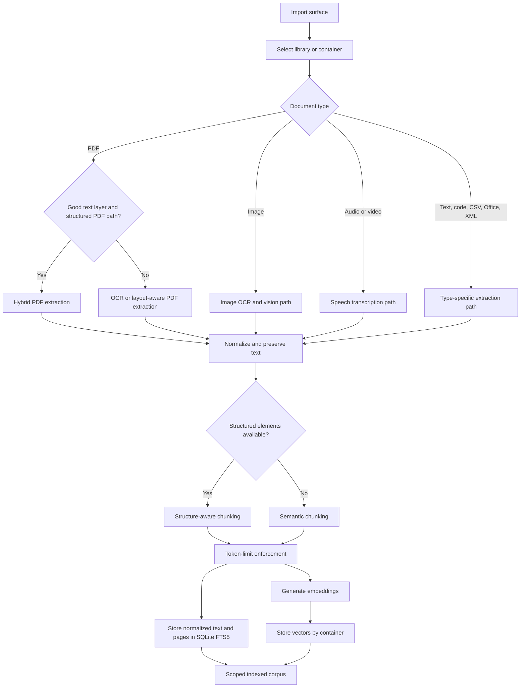
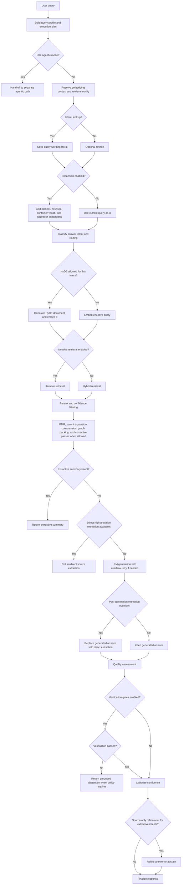
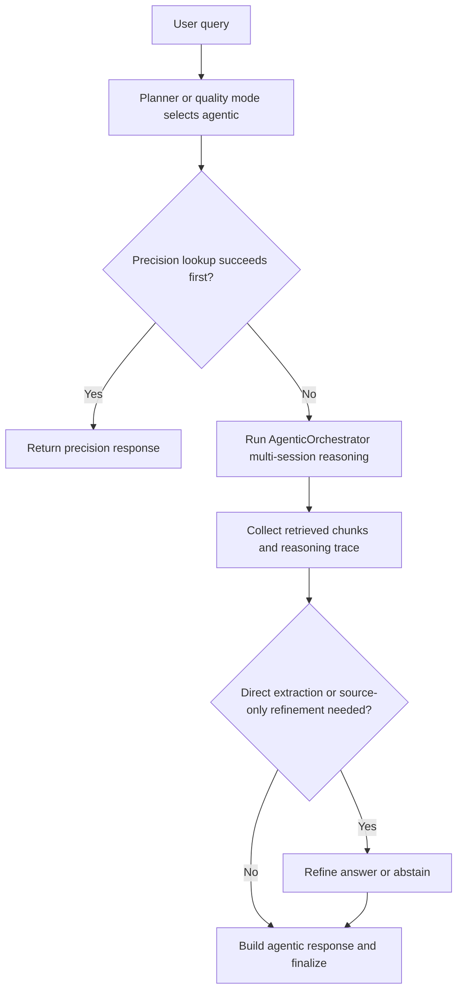
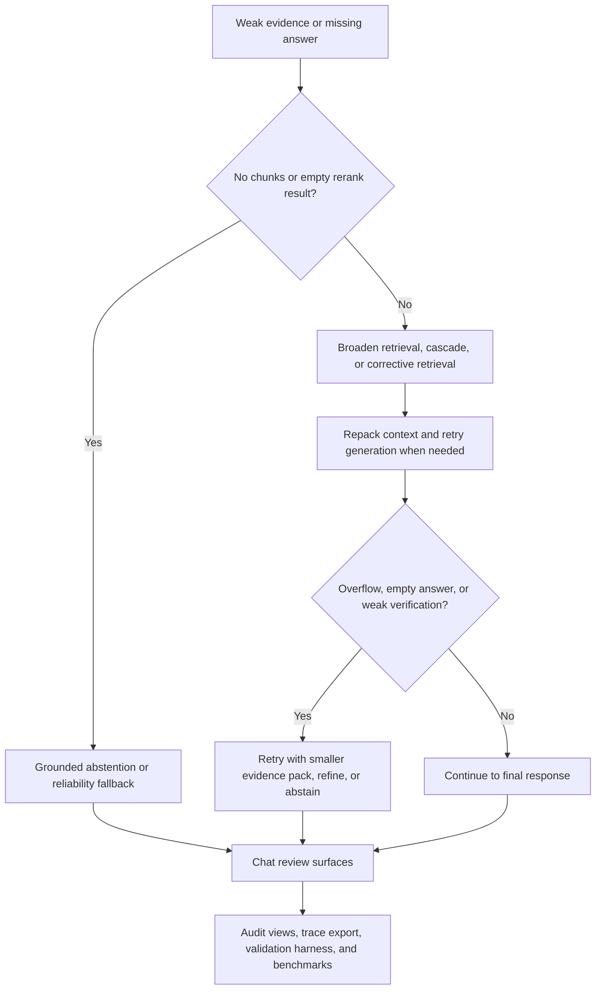

# OpenIntelligence

OpenIntelligence is an experimental Apple-native document intelligence prototype for working with user-controlled files.

It explores local-first document ingestion, library-based organization, retrieval, source-backed answers, citations, confidence signals, and AI-assisted reasoning on Apple platforms.

This repository is meant to show the engineering work directly: the SwiftUI app, document ingestion services, retrieval stack, answer grounding logic, benchmark harness, local model resources, technical notes, research references, and inspection assets are linked from this front page.

OpenIntelligence is a proof-of-concept and portfolio project. It is not a finished enterprise SDK, regulated healthcare system, clinical decision-support tool, diagnostic system, production-ready commercial product, company, or product for sale.

## Start Here

- [App Store](https://apps.apple.com/us/app/openintelligence/id6756559175): live public listing.
- [What's New](WHATS_NEW.md) and [Changelog](CHANGELOG.md): public release notes and version-by-version history.
- [How it works](HOW_IT_WORKS.md): public workflow overview from import to cited answers.
- [Architecture](Docs/ARCHITECTURE.md): app structure, service boundaries, data flow, and package boundary.
- [Retrieval pipeline](Docs/RETRIEVAL_PIPELINE.md): ingestion, chunking, retrieval, context packing, grounded answer generation, and diagnostics.
- [RAG technical specifications](Docs/Engineering/RAG_TECHNICAL.md): deeper implementation notes for HyDE, parent retrieval, compression, verification, reranking, and retrieval policy.
- [Hard limits and claim boundaries](Docs/Engineering/HARD_LIMITS.md): current token budgets, model constraints, and safe claim boundaries.
- [Storage and pipeline trace](Docs/Engineering/STORAGE_AND_PIPELINE_TRACE.md): current storage reality, SQLite/vector traces, container isolation, and benchmark hooks.
- [Research index](Docs/Research/README.md): supporting references for Apple Foundation Models, RAG, OCR, and local AI design choices.
- [Benchmarks](Benchmarks/README.md): manifest format, local RAG validation runner, document studio, outputs, and fixture guidance.
- [Demo guide](Docs/DEMO.md): suggested public demo flow and safe demo-document guidance.
- [Limitations](Docs/LIMITATIONS.md): product, safety, technical, and demo limits.
- [Roadmap](Docs/ROADMAP.md): near-term engineering direction.

## Release History

The README now keeps a quick version index so the shipped app history is visible here without jumping straight into the deeper public notes in [WHATS_NEW.md](WHATS_NEW.md) and [CHANGELOG.md](CHANGELOG.md).

| Version | Release focus                                                                                                                                                                        |
| ------- | ------------------------------------------------------------------------------------------------------------------------------------------------------------------------------------ |
| 3.6     | Per-library Local Only versus iCloud Drive storage, cross-device library review, safer shared-library reconciliation, and more conservative handling for clean digital text imports. |
| 3.5     | Reliability cleanup for exact answers, harder PDFs, grounded starter prompts, and first-run product clarity.                                                                         |
| 3.3     | Stronger import recovery, adaptive visual ingestion, searchable figures, and better exact table/spec lookups.                                                                        |
| 3.2.5   | Corrective pass for direct source-backed fact answers, exact measurements, and stricter grounded starter questions.                                                                  |
| 3.1     | Better OCR and table preservation, corrective retrieval on weak evidence, and stricter grounded answer handling.                                                                     |
| 3.0     | Retrieval hardening for noisy PDFs and tables, stronger extractive handling, and clearer diagnostics around recovery behavior.                                                       |
| 2.5     | Better suggested questions, stronger answer grounding and evidence review, and broader rendering and PDF-cleanup polish.                                                             |
| 2.0.x   | Faster everyday document Q&A, sharper source review, and stability/polish follow-up work after launch.                                                                               |
| 2.0.0   | Initial App Store release of the iPhone app with multi-format import, library organization, cited answers, and paid access tiers.                                                    |

## What It Demonstrates

- AI product engineering in a native Apple app.
- Local-first document workflows built around user-controlled files.
- Per-library Local Only versus iCloud Drive storage with cross-device review instead of one global cloud mode.
- Document ingestion, OCR-oriented extraction, chunking, enrichment, and indexing.
- Type-aware preparation that preserves clean digital text more conservatively while still escalating cleanup for noisy OCR and scanned material.
- Retrieval-oriented answer generation with citations and evidence review.
- Library/workspace isolation so questions stay scoped to the selected material.
  If someone only looks at the README once, the intended mental model is this:


```mermaid
flowchart LR
  A[Import files into a library] --> B[Prepare and preserve document content]
  B --> C[Build local search indexes]
  C --> D[Understand and scope the question]
  D --> E[Retrieve the best evidence]
  E --> F[Answer from that evidence]
  F --> G[Verify, score, and format the result]
  G --> H[Show citations, warnings, and diagnostics]
```

Everything else in the codebase exists to make one of those seven steps more reliable.

### In Plain English

1. Import and scope.
   The app pulls files from Apple import and share surfaces into a selected library or workspace, so every later query has a defined document boundary.

2. Prepare the material locally.
   The engine decides whether the source should go through digital parsing, structured extraction, OCR, vision recovery, speech handling, or some combination of those paths.

3. Preserve what matters for later retrieval.
   It keeps page text, figure or layout signals, metadata, chunks, and enrichment so the system can answer questions with better source grounding later.

4. Build two kinds of local indexes.
   The app writes lexical search data into SQLite FTS5 and semantic search data into per-container vector storage, because exact term lookup and semantic similarity solve different retrieval failures.

5. Understand the question before searching.
   Queries are scoped to the active library, checked against device and policy constraints, classified by intent, and optionally rewritten, expanded, or HyDE-boosted before retrieval starts.

6. Retrieve and assemble evidence.
   The engine runs hybrid retrieval, reranking, diversity checks, parent expansion, compression, and context packing so the final prompt favors the strongest evidence instead of the noisiest evidence.

7. Choose the right answer lane.
   Depending on the query, the app can route into extractive QA, extractive summarization, standard Foundation Models generation, or agentic multi-session mode.

8. Verify before presenting.
   The answer is checked by safety and grounding gates, confidence is calibrated, markdown is rendered, and the UI shows citations, warnings, diagnostics, and source-review affordances.

9. Inspect and iterate.
   The same pipeline can be audited through diagnostics views, trace export, the validation harness, and the benchmark scripts so retrieval failures are visible instead of hidden.

### Why It Is This Deep

- Different source types fail differently, so ingestion cannot be one universal parser.
- Exact lexical search and semantic retrieval both matter, so the app keeps both storage paths.
- Apple’s public context budget is tight, so retrieval has to rerank, compress, and pack evidence aggressively.
- Exact values, specs, and procedures need stricter handling than freeform synthesis.
- The app is designed to expose uncertainty, not just produce fluent answers.

### Key Constraints

- The public Apple Foundation Models path is budgeted around 4096 tokens total.
- The current embedding path uses 384-dimensional vectors with a relatively small embedding input ceiling.
- Chunking and context packing are tuned tightly because prompt overhead, retrieved evidence, and output tokens all compete for the same budget.
- Library isolation is enforced through scoped storage and retrieval, not by searching every imported file at once.

### Code-Verified Routing Notes

These control-flow notes are verified against the current implementation in [RAGService.swift](OpenIntelligence/Services/RAG/Orchestration/RAGService.swift), [QueryExecutionPlannerService.swift](OpenIntelligence/Services/Query/Analysis/QueryExecutionPlannerService.swift), and [DocumentProcessor.swift](OpenIntelligence/Services/Document/Processing/DocumentProcessor.swift).

- agentic mode is chosen before the standard retrieval pipeline starts, not after context packing
- extractive summarization is an early return, not a sibling step that runs alongside LLM generation
- direct high-precision extraction can return before LLM generation, and can also override a generated answer later
- verification gates and calibrated confidence are part of the standard single-pass generation path, not a universal block that every answer path re-enters

<details>
<summary>Detailed engineering views</summary>

Decision diamonds below mean the code chooses one branch. They do not mean the app runs every outgoing arrow at the same time.

#### Ingestion and indexing


```mermaid
flowchart TD
   A[Import surface] --> B[Select library or container]
   B --> C{Document type}
   C -- PDF --> D{Good text layer and structured PDF path?}
   D -- Yes --> E[Hybrid PDF extraction]
   D -- No --> F[OCR or layout-aware PDF extraction]
   C -- Image --> G[Image OCR and vision path]
   C -- Audio or video --> H[Speech transcription path]
   C -- Text, code, CSV, Office, XML --> I[Type-specific extraction path]
   E --> J[Normalize and preserve text]
   F --> J
   G --> J
   H --> J
   I --> J
   J --> K{Structured elements available?}
   K -- Yes --> L[Structure-aware chunking]
   K -- No --> M[Semantic chunking]
   L --> N[Token-limit enforcement]
   M --> N
   N --> O[Store normalized text and pages in SQLite FTS5]
   N --> P[Generate embeddings]
   P --> Q[Store vectors by container]
   O --> R[Scoped indexed corpus]
   Q --> R
```

#### Standard single-pass query path


```mermaid
flowchart TD
   A[User query] --> B[Build query profile and execution plan]
   B --> C{Use agentic mode?}
   C -- Yes --> AG[Hand off to separate agentic path]
   C -- No --> D[Resolve embedding context and retrieval config]
   D --> E{Literal lookup?}
   E -- Yes --> F[Keep query wording literal]
   E -- No --> G[Optional rewrite]
   F --> H{Expansion enabled?}
   G --> H
   H -- Yes --> I[Add planner, heuristic, container vocab, and gazetteer expansions]
   H -- No --> J[Use current query as-is]
   I --> K[Classify answer intent and routing]
   J --> K
   K --> L{HyDE allowed for this intent?}
   L -- Yes --> M[Generate HyDE document and embed it]
   L -- No --> N[Embed effective query]
   M --> O{Iterative retrieval enabled?}
   N --> O
   O -- Yes --> P[Iterative retrieval]
   O -- No --> Q[Hybrid retrieval]
   P --> R[Rerank and confidence filtering]
   Q --> R
   R --> S[MMR, parent expansion, compression, graph packing, and corrective passes when allowed]
   S --> T{Extractive summary intent?}
   T -- Yes --> U[Return extractive summary]
   T -- No --> V{Direct high-precision extraction available?}
   V -- Yes --> W[Return direct source extraction]
   V -- No --> X[LLM generation with overflow retry if needed]
   X --> Y{Post-generation extraction override?}
   Y -- Yes --> Z[Replace generated answer with direct extraction]
   Y -- No --> AA[Keep generated answer]
   Z --> AB[Quality assessment]
   AA --> AB
   AB --> AC{Verification gates enabled?}
   AC -- Yes --> AD{Verification passes?}
   AD -- No --> AE[Return grounded abstention when policy requires]
   AD -- Yes --> AF[Calibrate confidence]
   AC -- No --> AF
   AF --> AH{Source-only refinement for extractive intents?}
   AH -- Yes --> AI[Refine answer or abstain]
   AH -- No --> AJ[Finalize response]
   AI --> AJ
```

#### Agentic path


```mermaid
flowchart TD
   A[User query] --> B[Planner or quality mode selects agentic]
   B --> C{Precision lookup succeeds first?}
   C -- Yes --> D[Return precision response]
   C -- No --> E[Run AgenticOrchestrator multi-session reasoning]
   E --> F[Collect retrieved chunks and reasoning trace]
   F --> G{Direct extraction or source-only refinement needed?}
   G -- Yes --> H[Refine answer or abstain]
   G -- No --> I[Build agentic response and finalize]
   H --> I
```

Current code-path note: agentic responses build their own audit snapshot and response metadata inside [RAGService.swift](OpenIntelligence/Services/RAG/Orchestration/RAGService.swift) rather than re-entering the standard Step 7 and Step 7.5 verification block.

#### Recovery and inspection


```mermaid
flowchart TD
   A[Weak evidence or missing answer] --> B{No chunks or empty rerank result?}
   B -- Yes --> C[Grounded abstention or reliability fallback]
   B -- No --> D[Broaden retrieval, cascade, or corrective retrieval]
   D --> E[Repack context and retry generation when needed]
   E --> F{Overflow, empty answer, or weak verification?}
   F -- Yes --> G[Retry with smaller evidence pack, refine, or abstain]
   F -- No --> H[Continue to final response]
   C --> I[Chat review surfaces]
   G --> I
   H --> I
   I --> J[Audit views, trace export, validation harness, and benchmarks]
```

</details>

<details>
<summary>Primary runtime files</summary>

These are the main entry points, not every helper or experimental branch.

| Area                    | Start here                                                                                                                                                                                                                                                                                                                                                                                                                                                                                                                                                                                                                                                                                                                                                                                      | What it owns                                                        |
| ----------------------- | ----------------------------------------------------------------------------------------------------------------------------------------------------------------------------------------------------------------------------------------------------------------------------------------------------------------------------------------------------------------------------------------------------------------------------------------------------------------------------------------------------------------------------------------------------------------------------------------------------------------------------------------------------------------------------------------------------------------------------------------------------------------------------------------------- | ------------------------------------------------------------------- |
| Import and extraction   | [DocumentProcessor.swift](OpenIntelligence/Services/Document/Processing/DocumentProcessor.swift), [IntelligentDocumentProcessor.swift](OpenIntelligence/Services/Document/Processing/IntelligentDocumentProcessor.swift), [StructuredDocumentParser.swift](OpenIntelligence/Services/Document/Processing/StructuredDocumentParser.swift), [LayoutAwareExtractor.swift](OpenIntelligence/Services/Document/Processing/LayoutAwareExtractor.swift)                                                                                                                                                                                                                                                                                                                                                | file ingestion, adaptive extraction, parsing, cleanup, preservation |
| Chunking and enrichment | [SemanticChunker.swift](OpenIntelligence/Services/Document/Chunking/SemanticChunker.swift), [ContentTaggingService.swift](OpenIntelligence/Services/Document/Chunking/ContentTaggingService.swift), [EntityIndexService.swift](OpenIntelligence/Services/Document/Analysis/EntityIndexService.swift), [DocumentSummaryService.swift](OpenIntelligence/Services/Document/Analysis/DocumentSummaryService.swift)                                                                                                                                                                                                                                                                                                                                                                                  | chunk construction, metadata, entity signals, summaries             |
| Indexing and storage    | [EmbeddingService.swift](OpenIntelligence/Services/Embedding/EmbeddingService.swift), [SQLiteFullTextService.swift](OpenIntelligence/Services/Storage/SQLiteFullTextService.swift), [VectorStoreRouter.swift](OpenIntelligence/Services/VectorStore/VectorStoreRouter.swift), [BNNSVectorDatabase.swift](OpenIntelligence/Services/VectorStore/BNNSVectorDatabase.swift)                                                                                                                                                                                                                                                                                                                                                                                                                        | embeddings, lexical index, vector index, scoped storage             |
| Query analysis          | [QueryProfileService.swift](OpenIntelligence/Services/Query/Analysis/QueryProfileService.swift), [QueryRewriterService.swift](OpenIntelligence/Services/Query/Rewriting/QueryRewriterService.swift), [HyDEService.swift](OpenIntelligence/Services/Query/Rewriting/HyDEService.swift), [QueryRouterService.swift](OpenIntelligence/Services/Query/Routing/QueryRouterService.swift)                                                                                                                                                                                                                                                                                                                                                                                                             | intent detection, rewriting, expansion, routing                     |
| Retrieval and packing   | [HybridSearchService.swift](OpenIntelligence/Services/RAG/Retrieval/HybridSearchService.swift), [IterativeRetrievalService.swift](OpenIntelligence/Services/RAG/Retrieval/IterativeRetrievalService.swift), [ParentDocumentService.swift](OpenIntelligence/Services/RAG/Retrieval/ParentDocumentService.swift), [ContextPackingService.swift](OpenIntelligence/Services/RAG/Retrieval/ContextPackingService.swift)                                                                                                                                                                                                                                                                                                                                                                              | hybrid search, fallback passes, parent expansion, context packing   |
| Answer and safety       | [ExtractiveQAService.swift](OpenIntelligence/Services/RAG/Extraction/ExtractiveQAService.swift), [ExtractiveSummarizationService.swift](OpenIntelligence/Services/RAG/Extraction/ExtractiveSummarizationService.swift), [LLMService.swift](OpenIntelligence/Services/LLM/LLMService.swift), [AgenticOrchestrator.swift](OpenIntelligence/Services/Agentic/AgenticOrchestrator.swift), [VerificationGateService.swift](OpenIntelligence/Services/RAG/Safety/VerificationGateService.swift), [SourceOnlyAnswerService.swift](OpenIntelligence/Services/RAG/Safety/SourceOnlyAnswerService.swift), [ConfidenceCalibrationService.swift](OpenIntelligence/Services/RAG/Safety/ConfidenceCalibrationService.swift), [RAGService.swift](OpenIntelligence/Services/RAG/Orchestration/RAGService.swift) | answer lanes, verification, confidence, orchestration               |
| Review and benchmarking | [ChatScreen.swift](OpenIntelligence/Features/Chat/Conversation/ChatScreen.swift), [ResponseDetailsView.swift](OpenIntelligence/Features/Chat/Response/ResponseDetailsView.swift), [RetrievalSourcesTray.swift](OpenIntelligence/Features/Chat/Response/RetrievalSourcesTray.swift), [RAGPipelineAuditView.swift](OpenIntelligence/Features/Diagnostics/Validation/RAGPipelineAuditView.swift), [RAGAccuracyView.swift](OpenIntelligence/Features/Diagnostics/Validation/RAGAccuracyView.swift), [DebugRAGValidationHarness.swift](OpenIntelligence/App/DebugRAGValidationHarness.swift), [scripts/run_rag_benchmarks.py](scripts/run_rag_benchmarks.py)                                                                                                                                         | source review, audit views, validation, benchmark loop              |

</details>

<details>
<summary>Fallback and recovery paths</summary>

- extraction can escalate from cleaner digital parsing into heavier OCR, layout-aware recovery, figure understanding, and page preservation when the source gets noisy
- embeddings can fall back across providers, and a chunk can still survive through lexical retrieval even if vector quality drops
- search can broaden from stricter matching into broader FTS fallback, corrective retrieval, iterative passes, and parent-context recovery
- exact-value and summary intents can route away from freeform generation into extractive lanes
- model and execution routing can fall back across runtime and capability constraints, including on-device behavior when broader execution paths are unavailable
- verification can still reject the result and force warnings or abstention even after the model produced something fluent

</details>

See [Retrieval Pipeline](Docs/RETRIEVAL_PIPELINE.md), [RAG Technical Specifications](Docs/Engineering/RAG_TECHNICAL.md), [Storage and Pipeline Trace](Docs/Engineering/STORAGE_AND_PIPELINE_TRACE.md), [Apple Intelligence Models and Specs](Docs/Engineering/APPLE_MODELS.md), [Hard Limits and Claim Constraints](Docs/Engineering/HARD_LIMITS.md), and [Benchmarks](Benchmarks/README.md) for the deeper trace and the implementation limits that shape it.

## Technical References

- [Apple Document Intelligence Reference](Docs/Engineering/APPLE_DOCUMENT_INTELLIGENCE.md): Vision, VisionKit, Natural Language, PDFKit, Speech, and related Apple document APIs.
- [Apple Intelligence Foundation Language Models Tech Report Notes](Docs/Engineering/APPLE_FM_TECH_REPORT_2025.md): model architecture and platform constraints relevant to the prototype.
- [Apple Intelligence Models and Specs](Docs/Engineering/APPLE_MODELS.md): context-window, token-budget, `LanguageModelSession`, tool-calling, and guided-generation notes.
- [Private Cloud Compute Reference](Docs/Engineering/PRIVATE_CLOUD_COMPUTE.md): PCC architecture notes and conservative wording for what it does and does not imply.

## Research Notes And Supporting Assets

- [Research index](Docs/Research/README.md): source map and repo mapping for the deeper research notes.
- [Apple Intelligence and Foundation Models research](Docs/Research/APPLE_INTELLIGENCE_AND_FOUNDATION_MODELS.md)
- [RAG and retrieval research](Docs/Research/RAG_AND_RETRIEVAL_2024_2026.md)
- [CAG and context engineering research](Docs/Research/CAG_AND_CONTEXT_ENGINEERING_2024_2026.md)
- [Core ML, Metal, and on-device AI research](Docs/Research/COREML_METAL_ON_DEVICE_AI.md)
- [Document intelligence and OCR research](Docs/Research/DOCUMENT_INTELLIGENCE_AND_OCR.md)
- [Public workflow overview](HOW_IT_WORKS.md)
- [Test documents](Docs/TestDocuments/README.md)
- [Benchmark fixtures](Benchmarks/Fixtures/README.md)
- [Research fixtures](Benchmarks/ResearchFixtures/README.md)
- [Pipeline xray](Xrays/pipeline-xray/index.html)
- [What's New](WHATS_NEW.md), [Changelog](CHANGELOG.md), [Privacy](PRIVACY.md), and [Third Party Notices](THIRD_PARTY_NOTICES.md)

## Benchmarks And Diagnostics

The repo includes a local benchmark harness for testing RAG behavior against controlled manifests:

- [`Benchmarks/rag_validation_sample.json`](Benchmarks/rag_validation_sample.json): sample manifest.
- [`Benchmarks/studio.html`](Benchmarks/studio.html): lightweight ad hoc document studio.
- [`scripts/run_rag_benchmarks.py`](scripts/run_rag_benchmarks.py): benchmark runner.
- [`scripts/rag_benchmark_studio.py`](scripts/rag_benchmark_studio.py): local benchmark-studio helper.
- [`scripts/prepare_rag_research_fixtures.py`](scripts/prepare_rag_research_fixtures.py): fixture preparation helper.
- [`scripts/secret_scan.py`](scripts/secret_scan.py): lightweight local secret scan.

The benchmark path exists to make retrieval failures inspectable: source mismatches, weak answers, abstention behavior, missing evidence, and context-packing issues should be visible rather than hidden behind a polished answer.

## Setup

Requirements:

- macOS with Xcode installed.
- iOS 26.0+ SDK/toolchain support.
- Developer familiarity with Xcode, SwiftPM, and local simulator builds.

Build the app target:

```bash
xcodebuild \
  -project OpenIntelligence.xcodeproj \
  -scheme OpenIntelligence \
  -destination 'generic/platform=iOS Simulator' \
  CODE_SIGNING_ALLOWED=NO \
  build
```

Run the simulator smoke script:

```bash
./scripts/build_simulator_smoke.sh
```

Inspect the experimental package boundary:

```bash
swift package describe
```

Run the lightweight secret scan:

```bash
python3 scripts/secret_scan.py .
```

## Limits And Non-Goals

OpenIntelligence is intentionally honest about what it is:

- Experimental prototype.
- Not validated for regulated workflows.
- Not intended for clinical, legal, financial, or safety-critical decision-making.
- Not guaranteed to produce complete or correct answers.
- Some paths may depend on device-specific Apple Intelligence availability.
- Packaging and setup may require developer familiarity.
- The engine boundary is exploratory and should not be treated as a finished public SDK contract.

See [Limitations](Docs/LIMITATIONS.md) for the full version.

## Relationship To OpenClinic

OpenClinic and OpenIntelligence are separate projects. OpenIntelligence is a general document intelligence prototype and is not a clinical tool. Any healthcare-adjacent examples should be treated as generic document workflows, not medical guidance or regulated functionality.

## License

See [`LICENSE`](LICENSE).
