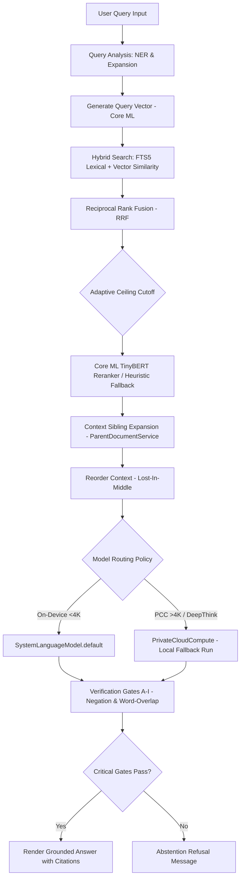

# Docs/RETRIEVAL_PIPELINE.md — OpenIntelligence v4.1

> **Documentation status:** Verified for OpenIntelligence v4.1 on 2026-06-13.
> **Source of truth:** Codebase audit in `Docs/AUDIT/`.
> **Scope:** Describes shipped behavior unless explicitly labeled experimental, developer-only, or scaffolded.

---

## 1. Overview
The retrieval pipeline is the core engineering idea in OpenIntelligence: answers are grounded in user-provided material and expose the exact evidence that influenced them. I built this app to bias responses toward groundedness, showing uncertainty when evidence is weak rather than inventing confident prose.

---

## 2. RAG Retrieval Flow

---

## 3. Pipeline Stages

1. **Import**: Files enter through Apple platform document workflows.
2. **Extraction**: Text, layout, and metadata are extracted.
3. **Chunking**: Chunks are generated with metadata using semantic and structure-aware rules.
4. **Indexing**: Chunks are written into local search (SQLite FTS5) and vector databases ([BNNSVectorDatabase.swift](file:///Users/gunnarhostetler/Documents/GitHub/OpenIntelligence-Public/OpenIntelligence/Services/VectorStore/BNNSVectorDatabase.swift)).
5. **Query Analysis & Planning**: Incoming questions are classified, scoped, and prepared for retrieval.
6. **Retrieval**: Candidate chunks are selected from the active library or workspace container.
7. **Reranking and Packing**: Evidence is scored using a local Core ML TinyBERT cross-encoder (with proximity-based heuristic fallback if the model is absent), deduplicated (MMR), expanded with sibling context, and compressed.
8. **Model Routing & Generation**: Resolves the routing policy. Queries in standard mode default to on-device execution (up to 4K tokens). Escalated modes (Deep Think/Maximum) route to a secure Private Cloud Compute (PCC) policy (supporting 32K tokens). *Note:* In the current build, PCC execution is simulated locally using a compatibility wrapper in [EngineSDKCompatibility.swift](file:///Users/gunnarhostetler/Documents/GitHub/OpenIntelligence-Public/OpenIntelligence/Core/Support/EngineSDKCompatibility.swift).
9. **Fidelity Verification**: Responses pass through negation and overlap verification checks in [VerificationGateService.swift](file:///Users/gunnarhostetler/Documents/GitHub/OpenIntelligence-Public/OpenIntelligence/Services/RAG/Safety/VerificationGateService.swift) to detect contradictions and determine if the engine should abstain.
10. **Presentation**: Answers are shown with liquid glass UI indicators, citations, quality gauges, and review affordances.
11. **Continuous Evaluation**: Pipeline stages are run against local JSONL benchmarks and verified against quality targets (e.g. Recall@5 $\ge 0.85$, Citation Precision $\ge 0.90$) using the native Evaluations harness.

---

## 4. Library Isolation
Library and workspace boundaries are critical because retrieval quality depends on scope. I designed the app so that a query is answered strictly against the user-selected document container rather than all files indiscriminately, preventing cross-container leakage.

---

## 5. Diagnostics & Telemetry
I included diagnostic and telemetry surfaces for inspecting chunks, retrieval quality, answer details, and pipeline behavior. These are engineering tools for iteration and must not be interpreted as validation for regulated or safety-critical workflows.
